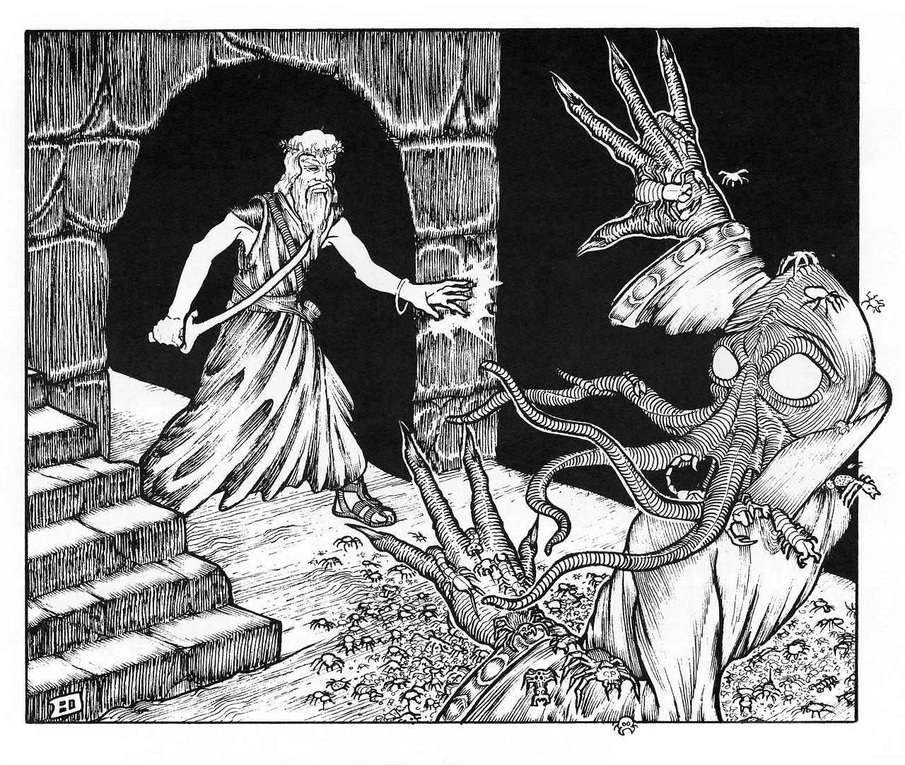
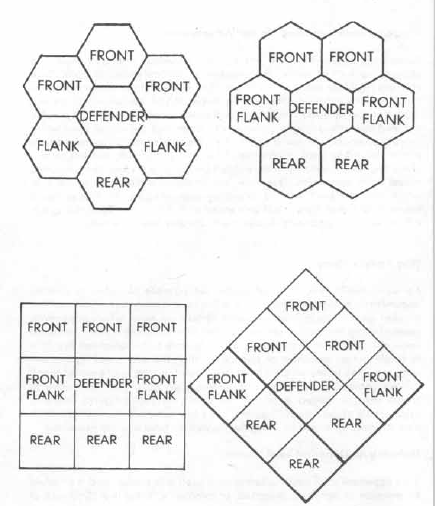
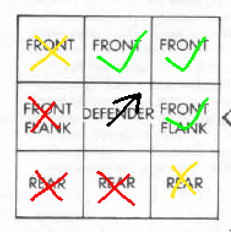

#  Quick Creation Reference 

**(1) Race**

- Note your character race as Human. You know the language of Draeneria and your size is Medium.

**(2) Determine your character's [<u>age</u>](#age)**

- Pick an appropriate starting age and roll for any additional years based on class. Apply age modifiers.

**(3) Determine [<u>ability scores</u>](#ability-scores)**

- Roll 4d6 and drop the lowest for each ability score in order: Strength, Dexterity, Constitution, Intelligence, Wisdom and Charisma.

**(4) Swap one pair of ability scores**

- You can swap any two ability scores with each other once.

**(5) Select a [<u>class</u>](#classes)**

- Pick a class and make sure you meet the minimum ability score requirements.

**(6) Roll starting hit points**

- Roll your starting hit die to determine starting HP. Modify depending on the [<u>constitution</u>](#constitution) modifier. You may reroll results of 1 once.

**(7) Determine equipment**

- Roll on the general [<u>starting equipment</u>](#starting-equipment) table and the class equipment table that is found on the class page. You are also granted the noted items above the general starting equipment table.

**(8) Determine Background**

- Roll a [<u>background</u>](#backgrounds) that provides a relevant skill.

**(9) Note [<u>spells</u>](#spells) (if applicable)**

- If a spellcaster, choose 10 spells (if [<u>chaos mage</u>](#chaos-mage), also pick two [<u>cantrips</u>](#cantrips) at level 1 that you learn automatically) or 5 (if [<u>law mage</u>](#law-mage)). Roll the percentile dice to determine which ones you know, remove the rest.

**(10) Determine miscellaneous information**

- Armor class 
- [<u>Encumbrance</u>](#encumbrance-&-movement)
- [<u>Languages</u>](#languages)
- [<u>Psionics</u>](#psionics)
- [<u>Weapon Proficiencies</u>](#weapon-proficiencies) (Initial number on class page)

**(11) Roll for [<u>special abilities</u>](#special-abilities)**

- After all the previous steps are completed, roll on the [<u>special abilities</u>](#special-abilities) table and let the DM roll to determine the specific sort of effect it has on the character.

#  Character Creation 

## Rolling Ability Scores 

4d6 drop lowest (remove the lowest). Roll each stat in order: Strength,
Dexterity, Constitution, Intelligence, Wisdom and Charisma. After rolling for stats, you
may swap two ability scores with each other, once.

## Starting Hit Points

At level 1 you roll the corresponding hit die as your HP. Add or
subtract with your constitution constitution. A
player may reroll a die with the result in a 1.

##  Age 

The table below determines the ability score bonuses or penalties your character
is given based on life stage.

The effects of aging below indicate the total amount of ability score changes given for each age. When age category is established, modify ability scores accordingly, making each change progressively from young adulthood, all aditions and subtractions being cumulative.

| **Result (1d100)** | **Age**     | **Strength** | **Dexterity** | **Constitution** | **Intelligence** | **Wisdom** | **Charisma** |
|--------------------|-------------|--------------|---------------|------------------|------------------|------------|--------------|
| 1 - 30             | Young Adult |     +0       |     +0        |       +1         |    +0            | -1         | +0           |
| 31 - 70            | Mature      |     +1       |     +0        |       +0         |    +0            | +1         | +0           |
| 71 - 95            | Middle Aged |     -1       |     +0        |       -1         |    +1            | +1         | +0           |
| 96 - 98            | Old         |     -2       |     -2        |       -1         |    +0            | +1         | +0           |
| 99 - 100           | Venerable   |     -1       |     -1        |       -1         |    +1            | +1         | +0           |

## Age by Race

| **Race**  | **Young Adult** | **Mature** | **Middle Aged** | **Old**   | **Venerable** |
|-----------|-----------------|------------|-----------------|-----------|---------------|
| Human     | 15 - 20         | 21 - 40    | 41 - 60         | 61 - 90   | 91 - 120      |
| Elf       | 50 - 125        | 126 - 400  | 401 - 600       | 601 - 800 | 801 - 1000    |
| Dwarf     | 35 - 50         | 51 - 150   | 151 - 250       | 251 - 350 | 351 - 450     |
| Draconian | 24 - 40         | 41 - 100   | 101 - 175       | 176 - 250 | 251 - 325     |
| Gnome     | 50 - 90         | 91 - 300   | 301 - 450       | 451 - 600 | 601 - 750     |
| Solarian  | 40 - 60         | 61 - 175   | 176 - 260       | 261 - 300 | 301 - 400     |
| Halfling  | 22 - 33         | 34 - 70    | 71 - 101        | 102 - 144 | 145 - 200     |
| Goblin    | 10 - 15         | 16 - 35    | 36 - 45         | 46 - 60   | 61 - 80       |
| Radigen   | 14 - 20         | 21 - 30    | 31 - 50         | 51 - 80   | 80 - 100      |
| Kobold    | 6 - 30          | 31 - 60    | 61 - 85         | 86 - 100  | 101 - 125     |
| Avian     | 20 - 35         | 36 - 50    | 51 - 75         | 76 - 100  | 101 - 130     |
| Orc       | 15 - 20         | 21 - 35    | 36 - 55         | 56 - 80   | 81 - 100      |

## Starting Age

When determining the starting age of your character, first choose the life stage most appropriate for your character's backstory and personality. Refer to the base age range specified for the race in the table above. From this base, an optional rule is to add additional years based on the chosen class, reflecting the time the character has spent training or studying in that particular vocation. To determine these additional years, roll the dice corresponding to the character's class.

| **Race**  | **Fighter** | **Specialist** | **Law Mage** | **Chaos Mage** |
|-----------|-------------|----------------|--------------|----------------|
| Human     | 1d4         | 1d4            | 3d6          | 2d10           |
| Elf       | 3d20        | 2d10           | 4d20         | 1d100 + 3d10   |
| Dwarf     | 2d8         | 2d6            | 2d20 + 1d10  | 3d20           |
| Draconian | 3d6         | 4d4            | 3d20         | 4d12           |
| Gnome     | 6d6         | 4d8            | 1d100        | 1d100 + 2d12   |
| Solarian  | 2d10        | 3d6            | 5d8          | 2d20 + 2d10    |
| Halfling  | 2d4 + 1d6   | 2d6            | 2d20         | 4d8            |
| Goblin    | 1d4         | 1d4            | 2d10         | 1d20           |
| Radigen   | 1d6         | 1d4            | 3d6          | 1d20           |
| Kobold    | 2d8         | 3d4            | 2d20 + 2d6   | 3d12 + 2d8     |
| Avian     | 3d4 + 1d6   | 1d12 + 1d6     | 3d10         | 1d20 + 2d8     |
| Orc       | 1d4         | 1d4            | 3d6          | 2d8            |

## Starting Height & Weight

| **Race**  | **Height**   | **Modifier** | **Weight (lbs)** | **Modifier (lbs)** |
|-----------|--------------|--------------|------------------|--------------------|
| Human     | 4'9” or 4'6” | \+ 2d10”     | 120 or 90        | \+ 12d6            |
| Elf       | 5'3” or 5'0” | \+ 2d12”     | 140 or 110       | \+ 10d8            |
| Dwarf     | 3'9” or 3'6” | \+ 2d4”      | 130 or 100       | \+ 8d6             |
| Draconian | 5'0” or 4'8” | \+ 3d6”      | 130 or 100       | \+ 6d12            |
| Gnome     | 3' or 2'10”  | \+ 2d4”      | 50 or 45         | \+ 5d6             |
| Solarian  | 5'2” or 4'9” | \+ 3d8”      | 140 or 110       | \+ 8d12            |
| Halfling  | 2'9” or 2'6” | \+ 3d4”      | 50 or 45         | \+ 5d6             |
| Goblin    | 3' or 2'10”  | \+ 2d4”      | 45 or 40         | \+ 4d6             |
| Radigen   | 4'9” or 4'6” | \+ 2d10”     | 120 or 90        | \+ 12d6            |
| Kobold    | 3' or 2'10”  | \+ 2d4”      | 50 or 45         | \+ 4d6             |
| Avian     | 4'8” or 4'5” | \+ 2d10”     | 120 or 90        | \+ 11d6            |
| Orc       | 4'0” or 3'7” | \+ 2d6”      | 90 or 75         | \+ 8d8             |

##  Backgrounds 

Assign a skill randomly, or select according to the background of your
character.

| **Result (1d100)** | **Background**                         | 
|--------------------|----------------------------------------|
| 01 - 02            | Animal husbander                       | 
| 03 - 04            | Blacksmith                             | 
| 05 - 07            | Bowyer/fletcher                        | 
| 08 - 10            | Carpenter                              | 
| 11 - 16            | Farmer/gardner                         | 
| 17 - 20            | Fisher                                 | 
| 21 - 26            | Forester                               | 
| 27 - 29            |Gambler                                 | 
| 30 - 33            | Hunter/trapper                         | 
| 34 - 35            | Jeweler                                | 
| 36 - 38            | Leather worker/tanner                  | 
| 39 - 40            | Limner/painter                         | 
| 41 - 43            | Mason                                  | 
| 44 - 45            | Mercenary                              | 
| 46 - 48            | Merchant                               | 
| 49 - 51            | Miner                                  | 
| 52 - 53            | Noble                                  | 
| 54 - 55            | Outlaw                                 | 
| 56 - 58            | Sailor                                 | 
| 59 - 61            | Scholar                                | 
| 62 - 64            | Soldier/guard                          | 
| 65 - 67            | Tailor/weaver                          | 
| 68 - 70            | Teamster/transporter                   | 
| 71 - 90            | No skill of measurable worth           | 
| 90 - 100           | Roll twice, ignoring this result after | 

##  Special Abilities 

*Initially from "Alarums & Excursions #1" in 1975 and "Arduin Grimoire #1" in 1977, these are mostly inspired by the former. Made by Attronarch from "Fight On! #15"*

Special Abilities are more like "special traits" that can both be positive and negative. Begin by noting what type your class is associated with on the initial table and tell this to your DM. 

| **Type** | **Class** | 
|------|-------| 
| Martial | Fighter, Inquisitor, Barbarian 
| Chaos | Chaos Mage, Illusionist 
| Law | Law Mage, Druid | 
| Clandestine | Specialist |

Then roll 1d8 to determine the amount of Boons and/or Banes you start with. The DM will then roll for each and tell you exactly what kind of trait(s) your character has received.

| 1d8   | Boons | Banes |
|-------|-------|-------|
| 1     |   0   |     1 |
| 2     |   1   |     2 |
| 3 - 6 |   1   |     1 |
| 7     |   2   |     1 |
| 8     |   1   |     0 |

#  Ability Scores 

## Strength

| **Score**  | **To-Hit Modifier\*** | **Damage Modifier\*** | **Minor Tests (open doors etc, chance on d6)** | **Major Tests (bending bars etc, chance on d%)** | **Climb** |
|------------|-----------------------|-----------------------|------------------------------------------------|--------------------------------------------------|-----------|
| 3          | -3                    | -1                    | 1 / 6                                          | 0%                                               | 30%       |
| 4 - 5      | -2                    | -1                    | 1 / 6                                          | 0%                                               | 40%       |
| 6 - 7      | -1                    | +0                    | 1 / 6                                          | 0%                                               | 50%       |
| 8 - 9      | +0                    | +0                    | 2 / 6                                          | 1%                                               | 60%       |
| 10 - 11    | +0                    | +0                    | 2 / 6                                          | 2%                                               | 70%       |
| 12 - 13    | +0                    | +0                    | 2 / 6                                          | 4%                                               | 80%       |
| 14 - 15    | +0                    | +0                    | 2 / 6                                          | 7%                                               | 90%       |
| 16         | +0                    | +1                    | 3 / 6                                          | 10%                                              | 91%       |
| 17         | +1                    | +1                    | 3 / 6                                          | 13%                                              | 92%       |
| 18         | +1                    | +2                    | 3 / 6                                          | 16%                                              | 93%       |
| 18 / 01 - 50 | +1                    | +3                    | 3 / 6                                          | 20%                                              | 94%       |
| 18 / 51 - 75 | +2                    | +3                    | 4 / 6                                          | 25%                                              | 95%       |
| 18 / 76 - 90 | +2                    | +4                    | 4 / 6                                          | 30%                                              | 96%       |
| 18 / 91 - 99 | +2                    | +5                    | 4 / 6                                          | 35%                                              | 97%       |
| 18 / 00      | +3                    | +6                    | 5 / 6                                          | 40%                                              | 98%       |

\*EXCEPTIONAL STRENGTH modifiers only applied to [<u>fighters.</u>](#fighter) (including [<u>subclasses</u>](#subclasses)).

## Dexterity

| **Score** | **Ranged Weapon To-Hit Bonus/Penalty\*** | **Surprise Modifier** | **Armor Class Modifier** |
|-----------|------------------------------------------|-----------------------|--------------------------|
| 3         | -3                                       | -3                    | -4                       |
| 4         | -2                                       | -2                    | -3                       |
| 5         | -1                                       | -1                    | -2                       |
| 6         | +0                                       | +0                    | -1                       |
| 7 - 14    | +0                                       | +0                    | +0                       |
| 15        | +0                                       | +0                    | +1                       |
| 16        | +1                                       | +1                    | +2                       |
| 17        | +2                                       | +2                    | +3                       |
| 18        | +3                                       | +3                    | +4                       |

## Constitution

| **Score** | **Hit Point Modifier (per hit die)** | **Raise Dead Survival** |
|-----------|--------------------------------------|-------------------------|
| 3         | -2                                   | 40%                     |
| 4         | -1                                   | 45%                     |
| 5         | -1                                   | 50%                     |
| 6         | -1                                   | 55%                     |
| 7         | +0                                   | 60%                     |
| 8         | +0                                   | 65%                     |
| 9         | +0                                   | 70%                     |
| 10        | +0                                   | 75%                     |
| 11        | +0                                   | 80%                     |
| 12        | +0                                   | 85%                     |
| 13        | +0                                   | 90%                     |
| 14        | +0                                   | 92%                     |
| 15        | +1                                   | 94%                     |
| 16        | +2                                   | 96%                     |
| 17        | +2 (+3)*                             | 98%                     |
| 18        | +2 (+4)*                             | 100%                    |

\*Only applied to [<u>fighters.</u>](#fighter) (including [<u>subclasses</u>](#subclasses)). All other classes may be given a maximum hit point bonus adjustment for constitution +2.

## Intelligence

| **Score** | **Spoken Languages**     | **Literacy** |**Search** | **Chance to Understand Chaos Spell\*** |
|-----------|--------------------------|--------------|-----------|--------------------------------------|
| 3 - 7     | Native (broken speech)   | Illiterate   | —         | 30%                                  |
| 8         | Native                   | Basic        | 1 / 6     | 40%                                  |
| 9         | Native                   | Literate     | 1 / 6     | 45%                                  |
| 10        | Native                   | Literate     | 1 / 6     | 50%                                  |
| 11        | Native                   | Literate     | 1 / 6     | 50%                                  |
| 12        | Native                   | Literate     | 1 / 6     | 55%                                  |
| 13        | Native + 1 additional    | Literate     | 1 / 6     | 65%                                  |
| 14        | Native + 1 additional    | Literate     | 1 / 6     | 65%                                  |
| 15        | Native + 1 additional    | Literate     | 2 / 6     | 75%                                  |
| 16        | Native + 2 additional    | Literate     | 2 / 6     | 75%                                  |
| 17        | Native + 2 additional    | Literate     | 3 / 6     | 85%                                  |
| 18        | Native + 3 additional    | Literate     | 4 / 6     | 95%                                  |

\*For [<u>chaos mages</u>](#chaos-mage)

## Wisdom

| **Score** | **Mental Saving Throw Bonus** | **Spell Bonus**** | **Chance of Spell Failure** | **Chance to Understand Law Spell\*** |
|-----------|-----------------|--------------------------|-----------------------------|-------------------------------------------
| 3 - 5     | -3              | -                        | 20%                         | 30%
| 6         | -2              | -                        | 10%                         | 30%
| 7         | -2              | -                        | 5%                          | 30%
| 8         | -1              | -                        | 1%                          | 40%
| 9         | -1              | -                        | 0%                          | 45%
| 10        | +0              | -                        | 0%                          | 50%
| 11        | +0              | -                        | 0%                          | 50%
| 12        | +0              | -                        | 0%                          | 55%
| 13        | +1              | -                        | 0%                          | 65%
| 14        | +1              | -                        | 0%                          | 65%
| 15        | +1              | One 1st level            | 0%                          | 75%
| 16        | +2              | One 2nd level            | 0%                          | 75%
| 17        | +2              | One 3rd level            | 0%                          | 85%
| 18        | +3              | One 4th level            | 0%                          | 95%

\*For [<u>law mages</u>](#law-mage)

\**For [<u>law mages</u>](#law-mage). The bonus spell is rolled up by the DM when the character reaches the level eligible be able to cast it. "Training" if you will. Choose and write down the the level of the bonus spell of your choice. This can be 1st all the way to 4th if you have 18 in wisdom.

## Charisma

| **Score** | **Maximum Number of Henchman** | **Reaction / Loyalty Modifier**       |
|-----------|--------------------------------|---------------------------------------|
| 3 - 4     | 1                              | -2                                    |
| 5 - 6     | 1                              | -1                                    |
| 7 - 8     | 1                              | -1                                    |
| 9 - 12    | 2                              | +0                                    |
| 13 - 15   | 3                              | +1                                    |
| 16 - 17   | 4                              | +1                                    |
| 18        | 5                              | +2                                    |

#  Classes 

##  Barbarian 

**Minimum Requirement:** 9+ Constitution.

**Prime Attribute:** 16+ Constitution (+10% experience bonus).

**Hit Dice:** 1d12/level (Gains 4 hp/level after 10th level).

**Armor/Shield Permitted**: Light armor, medium armor, shield.

**Weapons Permitted:** Any, except bows/crossbows.

**Saving Throws:** Barbarians receive a +2 bonus to all saving throws
made to resist spells and magical effects.

### Starting Equipment

Roll 1d6 for armor and 1d6 twice for weapons.

| **Result (1d6)** | **Armor** | **Weapons** |
|--------------|-------|---------|
| 1            | Hide | Club
| 2            | Hide + Buckler | Morningstar
| 3            | Padded | Dagger
| 4            | Studded Leather | 3 Spears, thrown
| 5            | Scale Mail + Medium Shield | Great Axe
| 6            | Splint Mail | Zweihänder

### Talents

**Alertness:** A Barbarian is unlikely to be surprised, 
with only a 1-in-6 chance under normal circumstances. 
This amount is decreased by 1 if the chance of surprise is higher. 
For example: A 3-in-6 chance of surprised is decreased to a 2-in-6.

**Hear Sound:** A Barbarian can hear well when concentrating; this
mainly includes listening at doors, but can also be used to hear un-
usual or discordant sounds in the wilderness. They are able to listen at doors
on a 1-3 on 1d6. 

**Keen Instincts:** Barbarians can detect and concealed doors easier
than others. They are able to discover secret and hidden doors on a 1-4
on 1d6.

**Savage Blows:** Barbarians gain an extra +2 to all damage rolls made in melee combat and from heavy thrown weapons such as javelins.

**Swift Runner:** Barbarians move quicker than other humans and have a base movement rate of 15 instead of the standard 12 (if unarmored).

**Wilderness Survival:** Barbarians are adept at surviving in the wild
places of the world and are always able to find food and water to
sustain themselves when in the wilderness.

**Multiple Attacks (7th):** At 7th level, a Barbarian may attack twice per round instead of once.

### Barbarian Advancement Table

| **Level** | **XP Required for Level** | **Hit Dice (d12)** | **Saving Throw** | **Weapon Proficiencies** | **Level Title**       |
|-----------|---------------------------|--------------------|------------------|--------------------------|-----------------------|
| 1         | 0                         | 1                  | 15               | 4                        | Bushwacker            |
| 2         | 2,500                     | 2                  | 14               | 4                        | Berserker             |
| 3         | 5,000                     | 3                  | 13               | 5                        | Ravager               |
| 4         | 10,000                    | 4                  | 12               | 5                        | Savage Commander      |
| 5         | 20,000                    | 5                  | 11               | 5                        | Chieftain             |
| 6         | 40,000                    | 6                  | 10               | 6                        | Berserker Chief       |
| 7         | 90,000                    | 7                  | 9                | 6                        | Hordechief            |
| 8         | 160,000                   | 8                  | 8                | 6                        | Conqueror             |
| 9         | 275,000                   | 9+4                | 7                | 7                        | High Conqueror        |
| 10        | 400,000                   | 9+8                | 6                | 7                        |                       |
| 11        | 530,000                   | 9+12               | 5                | 7                        |                       |
| 12        | 660,000                   | 9+16               | 5                | 8                        |                       |
| 13        | 790,000                   | 9+20               | 5                | 8                        |                       |
| 14        | 920,000                   | 9+24               | 5                | 8                        |                       |
| 15        | 1,050,000                 | 9+28               | 5                | 9                        |                       |
| 16        | 1,180,000                 | 9+32               | 5                | 9                        |                       |
| 17        | 1,310,000                 | 9+36               | 5                | 9                        |                       |
| 18        | 1,440,000                 | 9+40               | 5                | 10                       |                       |
| 19        | 1,570,000                 | 9+44               | 5                | 10                       |                       |
| 20        | 1,700,000                 | 9+48               | 5                | 10                       |                       |

##  Chaos Mage 

**Minimum Requirement:** 9+ Intelligence.

**Prime Attribute:** 16+ Intelligence (+10% experience bonus).

**Hit Dice:** 1d4/level (Gains 1 hp/level after 11th level).

**Armor/Shield Permitted**: None.

**Weapons Permitted:** Dagger, staff and darts.

**Alignment:** Chaos Mages are of Chaotic alignment.

**Saving Throw Bonus:** Chaos Mages gain a bonus of +2 on all saving
throw rolls against spells, including spells from magic wands and
staffs.

### Starting Equipment

Roll 1d6 for armor and 1d6 twice for weapons.

| **Result (1d6)** | **Armor** | **Weapons** |
|--------------|-------|---------|
| 1            | - | Dagger
| 2            | - | Dagger
| 3            | - | Dagger
| 4            | - | Quarterstaff
| 5            | - | Quarterstaff
| 6            | - | 10 Darts

**Class Items:** Spellbook containing the initial spells of Chaos.

### Talents

**Spellcasting:**

| **Intelligence Score** | **Max Spell Level** | **Min/Max Number of Basic Spells Understandable\*** | **Maximum Number of Cantrips** |
|----------------|---------------------|-----------------------------------------------------|--------------------------------|
| 3 - 7          | 4                   | 2/4                                                 | 2                              |
| 8              | 5                   | 3/5                                                 | 2                              |
| 9              | 5                   | 3/5                                                 | 2                              |
| 10             | 5                   | 4/6                                                 | 3                              |
| 11             | 6                   | 4/6                                                 | 3                              |
| 12             | 6                   | 4/6                                                 | 3                              |
| 13             | 7                   | 5/8                                                 | 4                              |
| 14             | 7                   | 5/8                                                 | 4                              |
| 15             | 8                   | 6/10                                                | 4                              |
| 16             | 8                   | 6/10                                                | 5                              |
| 17             | 9                   | 7/All                                               | 5                              |
| 18             | 9                   | 8/All                                               | 6                              |

\*Minimum is the least amount of spells learned at character creation
from the selected roster of spells. If the amount isn't met when rolling
through the list, simply repeat until it is.

**Known Spells:** Chaos Mages initially have access to ten 1st-level
spells and two Cantrips as well as “Read Chaos Magic”, a first level blue
spell. Refer to the spell table above to identify how many of the ten
spells are already inscribed and comprehended in the spellbook. Any
remaining spells out of the initial ten, which are not yet understood,
are not added to the spellbook until the Mage has successfully learned
the initial set.

**Cantrips:** Small magic tricks or simple utility spells that can be
cast without spending mana. These spells are often instantaneous and can
be used as many times as the Mage would like.

### Chaos Mage Advancement Table

| **Level** | **XP Required for Level** | **Hit Dice (d4)** | **Saving Throw** | **Weapon Proficiencies** | **Level Title**       |
|-----------|---------------------------|-------------------|------------------|--------------------------|-----------------------|
| 1         | 0                         | 1                 | 15               | 1                        | Prestidigitator       |
| 2         | 2,500                     | 2                 | 14               | 1                        | Evoker                |
| 3         | 5,000                     | 3                 | 13               | 1                        | Conjurer              |
| 4         | 10,000                    | 4                 | 12               | 1                        | Theurgist             |
| 5         | 20,000                    | 5                 | 11               | 1                        | Thaumaturgist         |
| 6         | 40,000                    | 6                 | 10               | 2                        | Magician              |
| 7         | 80,000                    | 7                 | 9                | 2                        | Enchanter             |
| 8         | 150,000                   | 8                 | 8                | 2                        | Warlock               |
| 9         | 300,000                   | 9                 | 7                | 2                        | Sorcerer              |
| 10        | 450,000                   | 10                | 6                | 2                        | Wizard                |
| 11        | 600,000                   | 11                | 5                | 3                        | Arch-Mage             |
| 12        | 750,000                   | 11+1              | 5                | 3                        |                       |
| 13        | 900,000                   | 11+2              | 5                | 3                        |                       |
| 14        | 1,050,000                 | 11+3              | 5                | 3                        |                       |
| 15        | 1,200,000                 | 11+4              | 5                | 3                        |                       |
| 16        | 1,350,000                 | 11+5              | 5                | 4                        |                       |
| 17        | 1,500,000                 | 11+6              | 5                | 4                        |                       |
| 18        | 1,650,000                 | 11+7              | 5                | 4                        |                       |
| 19        | 1,800,000                 | 11+8              | 5                | 4                        |                       |
| 20        | 1,950,000                 | 11+9              | 5                | 4                        |                       |

### Chaos Mage Spell Slots by Level
| Level | 1st | 2nd | 3rd | 4th | 5th | 6th | 7th | 8th | 9th |
|-------|-----|-----|-----|-----|-----|-----|-----|-----|-----|
| 1     | 1   | —   | —   | —   | —   | —   | —   | —   | —   |
| 2     | 2   | —   | —   | —   | —   | —   | —   | —   | —   |
| 3     | 3   | 1   | —   | —   | —   | —   | —   | —   | —   |
| 4     | 3   | 2   | —   | —   | —   | —   | —   | —   | —   |
| 5     | 4   | 2   | 1   | —   | —   | —   | —   | —   | —   |
| 6     | 4   | 2   | 2   | —   | —   | —   | —   | —   | —   |
| 7     | 4   | 3   | 2   | 1   | —   | —   | —   | —   | —   |
| 8     | 4   | 3   | 3   | 2   | —   | —   | —   | —   | —   |
| 9     | 4   | 3   | 3   | 2   | 1   | —   | —   | —   | —   |
| 10    | 4   | 4   | 3   | 2   | 2   | —   | —   | —   | —   |
| 11    | 4   | 4   | 4   | 3   | 3   | —   | —   | —   | —   |
| 12    | 4   | 4   | 4   | 4   | 4   | 1   | —   | —   | —   |
| 13    | 5   | 5   | 5   | 4   | 4   | 2   | —   | —   | —   |
| 14    | 5   | 5   | 5   | 4   | 4   | 3   | 1   | —   | —   |
| 15    | 5   | 5   | 5   | 5   | 4   | 4   | 2   | —   | —   |
| 16    | 5   | 5   | 5   | 5   | 5   | 5   | 2   | 1   | —   |
| 17    | 5   | 6   | 6   | 6   | 5   | 5   | 2   | 2   | —   |
| 18    | 5   | 6   | 6   | 6   | 6   | 5   | 2   | 2   | 1   |
| 19    | 5   | 7   | 7   | 7   | 6   | 6   | 3   | 2   | 2   |
| 20    | 5   | 7   | 7   | 7   | 7   | 7   | 3   | 3   | 2   |

##  Fighter 

**Minimum Requirement:** 9+ Strength.

**Prime Attribute:** 16+ Strength (+10% experience bonus).

**Hit Dice:** 1d10/level (Gains 3 hp/level after 9th level).

**Armor/Shield Permitted**: Any.

**Weapons Permitted:** Any.

**Saving Throw Bonuses:** Fighters gain a +1 bonus on all saving throws
except against magic.

### Starting Equipment

Roll 1d6 for armor and 1d6 twice for weapons.

| **Result (1d6)** | **Armor** | **Weapons** |
|--------------|-------|---------|
| 1            | Leather + Buckler | Crossbow (1d3) 1. Hand. 2. Light. 3. Heavy. + 20 quarrels
| 2            | Studded Leather | Dagger
| 3            | Ring Mail | Longsword
| 4            | Chain Mail + Medium shield | Mace
| 5            | Splint Mail + Medium shield | Shortsword
| 6            | Plate Mail | Spear (1d3) 1. Thrown. 2. One-handed. 3. Two-handed

### Talents

**Hit & Damage Bonuses:** Fighters gain a hit and damage bonus as seen
on the strength & dexterity ability score sections.

**Multiple Attacks (5th):** At 5th level, a Fighter may attack twice per round instead of once.

### Fighter Advancement Table

| **Level** | **XP Requirement for Level** | **Hit Dice (d8)** | **Saving Throws** | **Weapon Proficiencies** | **Level Title**       |
|-----------|------------------------------|-------------------|-------------------|--------------------------|-----------------------|
| 1         | 0                            | 1                 | 15                | 4                        | Veteran               |
| 2         | 2,000                        | 2                 | 14                | 4                        | Warrior               |
| 3         | 4,000                        | 3                 | 13                | 5                        | Swordsman             |
| 4         | 8,000                        | 4                 | 12                | 5                        | Hero                  |
| 5         | 16,000                       | 5                 | 11                | 5                        | Swashbuckler          |
| 6         | 32,000                       | 6                 | 10                | 6                        | Myrmidon              |
| 7         | 64,000                       | 7                 | 9                 | 6                        | Champion              |
| 8         | 120,000                      | 8                 | 8                 | 6                        | Superhero             |
| 9         | 240,000                      | 9                 | 7                 | 7                        | Lord                  |
| 10        | 360,000                      | 9+3               | 6                 | 7                        |                       |
| 11        | 480,000                      | 9+6               | 5                 | 7                        |                       |
| 12        | 600,000                      | 9+9               | 5                 | 8                        |                       |
| 13        | 720,000                      | 9+12              | 5                 | 8                        |                       |
| 14        | 840,000                      | 9+15              | 5                 | 8                        |                       |
| 15        | 960,000                      | 9+18              | 5                 | 9                        |                       |
| 16        | 1,080,000                    | 9+21              | 5                 | 9                        |                       |
| 17        | 1,200,000                    | 9+24              | 5                 | 9                        |                       |
| 18        | 1,320,000                    | 9+27              | 5                 | 10                       |                       |
| 19        | 1,440,000                    | 9+30              | 5                 | 10                       |                       |
| 20        | 1,560,000                    | 9+33              | 5                 | 10                       |                       |

##  Inquisitor 

**Minimum Requirement:** 13+ Strength, +9 Constitution, +9 Intelligence, +13 Wisdom, +17
Charisma.

**Prime Attribute:** 16+ Strength, 16+ Wisdom (+10% experience bonus).

**Hit Dice:** 1d10/level (Gains 3 hp/level after 9th level).

**Armor/Shield Permitted**: Any.

**Weapons Permitted:** Any.

**Alignment:** Inquisitors are of Lawful alignment.

**Saving Throw Bonuses:** Inquisitors gain a +2 to all saving throws.

### Starting Equipment

Roll 1d6 for armor and 1d6 twice for weapons.

| **Result (1d6)** | **Armor** | **Weapons** |
|--------------|-------|---------|
| 1            | Chain Mail + Buckler | Dagger
| 2            | Scale Mail | Shortsword
| 3            | Splint Mail | Longsword
| 4            | Banded Mail | Mace
| 5            | Plate Mail | Claymore
| 6            | Plate Mail + Medium Shield | Pole Arm

### Restrictions

**Unclouded:** Inquisitors may only equip no more than three magic items.

**Limited Possessions:** An Inquisitor may only keep wealth and possessions that can be kept on their person. Excess must be donated to worthy causes (not other PCs). This restriction is lifted when the character becomes a Paladin.

### Talents

**Detect Evil**: An Inquisitor can detect the presence of evil intent up
to 60 feet away by concentrating on locating evil in a particular
direction. They can do this as often as desired, but each attempt takes
one round. This ability detects evil monsters and characters.

**Disease immunity:** An Inquisitor is immune to all forms of disease.
(Note that certain magical afflictions—lycanthropy and mummy rot—are
curses and not diseases.)

**Hit & Damage Bonuses:** Inquisitors gain a hit and damage bonus as
seen on the strength & dexterity ability score sections.

**Lay on Hands:** An Inquisitor can “lay on hands” once per day to cure
others or one self of 2 hit points of damage per level of the Inquisitor, or to cure
disease. If the other person is afflicted by more than one disease, only
one of these will be affected per five levels the Inquisitor has
attained. This takes one round to cast.

**Protection from Evil Aura:**
The Inquisitor has a continious 10' emanation of a *protection from evil* spell.

**Strong Willed:** Whenever the Inquisitor is under the effects of a
spell that incapacitates the body or mind (sleep, hold, charm,
paralysis, etc.), they may make a new saving throw every round.

**Banishing Undead (3rd):** An Inquisitor gains the power to turn
undead and fiends when they reach 3rd level. They affect these monsters
the same as does a [<u>law mage</u>](#law-mage) two levels lower—for
example, at 3rd level they have the turning power of a 1st-level [<u>Law
Mage</u>](#law-mage).

**Multiple Attacks (7th):** At 7th level, an Inquisitor may attack twice per round instead of once.

**Dispel Evil (8th):** : Starting at 8th level, the Inquisitor can
dispel evil once per day, as per the Law Mage spell (see the description of the [<u>Law
Mage</u>](#law-mage-1) spell dispel evil).

### Inquisitor Advancement Table

| **Level** | **XP Requirement for Level** | **Hit Dice (d10)** | **Saving Throws** | **Weapon Proficiencies** | **Level Title**       |
|-----------|------------------------------|--------------------|-------------------|--------------------------|-----------------------|
| 1         | 0                            | 1                  | 15                | 4                        | Gallant               |
| 2         | 2,750                        | 2                  | 14                | 4                        | Keeper                |
| 3         | 5,500                        | 3                  | 13                | 5                        | Protector             |
| 4         | 12,000                       | 4                  | 12                | 5                        | Defender              |
| 5         | 24,000                       | 5                  | 11                | 5                        | Warder                |
| 6         | 45,000                       | 6                  | 10                | 6                        | Guardian              |
| 7         | 95,000                       | 7                  | 9                 | 6                        | Chevalier             |
| 8         | 175,000                      | 8                  | 8                 | 6                        | Justicar              |
| 9         | 350,000                      | 9                  | 7                 | 7                        | Paladin               |
| 10        | 500,000                      | 9+3 hp             | 6                 | 7                        |                       |
| 11        | 650,000                      | 9+6 hp             | 5                 | 7                        |                       |
| 12        | 800,000                      | 9+9 hp             | 5                 | 8                        |                       |
| 13        | 950,000                      | 9+12 hp            | 5                 | 8                        |                       |
| 14        | 1,100,000                    | 9+15 hp            | 5                 | 8                        |                       |
| 15        | 1,250,000                    | 9+18 hp            | 5                 | 9                        |                       |
| 16        | 1,400,000                    | 9+21 hp            | 5                 | 9                        |                       |
| 17        | 1,550,000                    | 9+24 hp            | 5                 | 9                        |                       |
| 18        | 1,700,000                    | 9+27 hp            | 5                 | 10                       |                       |
| 19        | 1,850,000                    | 9+30 hp            | 5                 | 10                       |                       |
| 20        | 2,000,000                    | 9+33 hp            | 5                 | 10                       |                       |

##  Ranger 

**Minimum Requirement:** 13+ Strength, 14+ Constitution, 13+ Intelligence, 14+ Wisdom.

**Prime Attribute:** 16+ Strength, 16+ Intelligence, 16+ Wisdom  (+10% experience bonus).

**Hit Dice:** 2d8 at 1st level, 1d8/level thereafter (Gains 2 hp/level after 10th level).

**Armor/Shield Permitted**: Light armor, medium armor, shield.

**Weapons Permitted:** Any.

**Saving Throw Bonuses:** Rangers gain a +2 bonus on saving throws against being paralyzed or poisoned.

| **Result (1d6)** | **Armor** | **Weapons** |
|--------------|-------|---------|
| 1            | Leather | Longbow + 20 Arrows
| 2            | Studded Leather | Silver Dagger
| 3            | Studded Leather + Medium Shield | Longsword
| 4            | Brigandine | Spear (1d3) 1. Thrown. 2. One-handed. 3. Two-handed
| 5            | Chain Mail | Shortsword
| 6            | Scale Mail | Light Crossbow + 20 light quarrels

### Ranger Advancement Table

| **Level** | **XP Requirement for Level** | **Hit Dice (d8)** | **Saving Throws** | **Weapon Proficiencies** | **Level Title**       |
|-----------|------------------------------|-------------------|-------------------|--------------------------|-----------------------|
| 1         | 0                            | 2                 | 15                | 4                        | Runner                |
| 2         | 2,250                        | 3                 | 14                | 4                        | Strider               |
| 3         | 4,500                        | 4                 | 13                | 5                        | Scout                 |
| 4         | 10,000                       | 5                 | 12                | 5                        | Courser               |
| 5         | 20,000                       | 6                 | 11                | 5                        | Tracker               |
| 6         | 40,000                       | 7                 | 10                | 6                        | Guide                 |
| 7         | 90,000                       | 8                 | 9                 | 6                        | Pathfinder            |
| 8         | 150,000                      | 9                 | 8                 | 6                        | Ranger                |
| 9         | 275,000                      | 10                | 7                 | 7                        | Ranger-Knight         |
| 10        | 400,000                      | 11                | 6                 | 7                        | Ranger Lord           |
| 11        | 525,000                      | 11+2              | 5                 | 7                        |                       |
| 12        | 650,000                      | 11+4              | 5                 | 8                        |                       |
| 13        | 725,000                      | 11+6              | 5                 | 8                        |                       |
| 14        | 850,000                      | 11+8              | 5                 | 8                        |                       |
| 15        | 975,000                      | 11+10             | 5                 | 9                        |                       |
| 16        | 1,100,000                    | 11+12             | 5                 | 9                        |                       |
| 17        | 1,225,000                    | 11+14             | 5                 | 9                        |                       |
| 18        | 1,350,000                    | 11+16             | 5                 | 10                       |                       |
| 19        | 1,475,000                    | 11+18             | 5                 | 10                       |                       |
| 20        | 1,600,000                    | 11+20             | 5                 | 10                       |                       |

### Restrictions:

**Limited Possessions:** A Ranger may only keep wealth and possessions that can be kept on their person. 
Excess must be donated to worthy causes (not other PCs). This restriction is lifted when the
character becomes a Ranger-Knight.

**Association with Other Rangers:** Until the character reaches
the status of a Ranger-Knight, a Ranger may not operate in
concert with more than one other Ranger. 

**Followers:** Until reaching the status of a Ranger-Knight, the
character may not hire or accept followers of any kind, not even
lantern-bearers or servants. They even prefer to fetch their own ale
at taverns rather than being waited upon.

### Talents

**Awareness:** A Ranger is unlikely to be surprised, 
with only a 1-in-6 chance under normal circumstances. 
This amount is decreased by 1 if the chance of surprise is higher. 
For example: A 3-in-6 chance of surprised is decreased to a 2-in-6.

**Giants and Goblin-types:** Rangers are well trained to deal with
giants, trolls, ogres, orcs, goblins, and kobolds. Against any of these
sorts of monsters, Rangers gain +1 damage per level with a successful
attack roll in melee.

**Hit & Damage Bonuses:** Rangers gain a hit and damage bonus as
seen on the strength & dexterity ability score sections.

**Pursuit:** When the Ranger's party pursues an opposing group in the wilderness, 
the chance of evasion is reduced by 10%.

**Stealth** In the wilderness, a Ranger has a 3-in-6 chance of hiding and moving silently.

**Tracking:**

Rangers can identify and follow tracks.
This skill improves as the character gains
levels (see the table to the right). Success
may be modified by the following factors:

- Soft/hard ground: +20% to –50%.
- Size of group being tracked: +2% per
creature beyond the first.
- Passing through an area where other
tracks mingle: –50%.
- Age of tracks: –5% per 12 hours.
- Rainfall: –25% per hour.
- Efforts made to hide tracks: –25%.

Ranger Tracking Chance of Success:

| **Level** | **Chance of Success** | 
|-----------|-----------------------|
| 1         | 20% | 
| 2         | 30% | 
| 3         | 40% | 
| 4         | 50% | 
| 5         | 60% | 
| 6         | 70% | 
| 7         | 80% |
| 8         | 90% |
| 9         | 100% |
| 10+       | 110% |

**Multiple Attacks (8th):** At 8th level, a Ranger may attack twice per round instead of once.

##  Illusionist 

**Minimum Requirement:** 13+ Intelligence, 16+ Dexterity.

**Prime Attribute:** 16+ Intelligence (+10% experience bonus).

**Hit Dice:** 1d4/level (Gains 1 hp/level after 11th level).

**Armor/Shield Permitted**: None.

**Weapons Permitted:** Dagger, staff and darts.

**Alignment:** Illusionists are of Chaotic alignment.

**Saving Throw Bonus:** Illusionists receive a +1 bonus to resist all
mind-influencing or illusionary magical effects and spells, like Charm
Person, Confusion, or Phantasmal Force. This includes when these effects
originate from a magic item or a monster's special abilities. 

Illusionists also gain a bonus of +2 on all saving throw rolls against spells, 
including spells from magic wands and staffs.

### Starting Equipment

Roll 1d6 for armor and 1d6 twice for weapons.

| **Result (1d6)** | **Armor** | **Weapons** |
|--------------|-------|---------|
| 1            | - | Dagger
| 2            | - | Dagger
| 3            | - | Dagger
| 4            | - | Quarterstaff
| 5            | - | Quarterstaff
| 6            | - | 10 Darts

**Class Items:** Spellbook containing the initial spells of Phantasm.

### Talents

**Spellcasting:**

| **Intelligence Score** | **Max Spell Level** | **Min/Max Number of Basic Spells Understandable\*** | **Maximum Number of Cantrips** |
|----------------|---------------------|-----------------------------------------------------|--------------------------------|
| 3 - 7          | 2                   | 2/4                                                 | 2                              |
| 8              | 3                   | 3/5                                                 | 2                              |
| 9              | 3                   | 3/5                                                 | 2                              |
| 10             | 3                   | 4/6                                                 | 3                              |
| 11             | 4                   | 4/6                                                 | 3                              |
| 12             | 4                   | 4/6                                                 | 3                              |
| 13             | 5                   | 5/8                                                 | 4                              |
| 14             | 5                   | 5/8                                                 | 4                              |
| 15             | 6                   | 6/10                                                | 4                              |
| 16             | 6                   | 6/10                                                | 5                              |
| 17             | 7                   | 7/All                                               | 5                              |
| 18             | 7                   | 8/All                                               | 6                              |

\*Minimum is the least amount of spells learned at character creation
from the selected roster of spells. If the amount isn't met when rolling
through the list, simply repeat until it is.

**Known Spells:** Illusionists initially have access to ten 1st-level
spells and two Cantrips as well as “Read Illusion Magic”, a first level blue
spell. Refer to the spell table above to identify how many of the ten
spells are already inscribed and comprehended in the spellbook. Any
remaining spells out of the initial ten, which are not yet understood,
are not added to the spellbook until the Mage has successfully learned
the initial set.

**Cantrips:** Small magic tricks or simple utility spells that can be
cast without spending mana. These spells are often instantaneous and can
be used as many times as the Mage would like.

### Illusionist Advancement Table

| **Level** | **XP Required for Level** | **Hit Dice (d4)** | **Saving Throw** | **Weapon Proficiencies** | **Level Title**       |
|-----------|---------------------------|-------------------|------------------|--------------------------|-----------------------|
| 1         | 0                         | 1                 | 15               | 1                        | Prestidigitator       |
| 2         | 2,250                     | 2                 | 14               | 1                        | Minor Trickster       |
| 3         | 4,500                     | 3                 | 13               | 1                        | Trickster             |
| 4         | 9,000                     | 4                 | 12               | 1                        | Master Trickster      |
| 5         | 18,000                    | 5                 | 11               | 1                        | Cabalist              |
| 6         | 35,000                    | 6                 | 10               | 2                        | Visionist             |
| 7         | 50,000                    | 7                 | 9                | 2                        | Phantasmist           |
| 8         | 75,000                    | 8                 | 8                | 2                        | Apparitionist         |
| 9         | 100,000                   | 9                 | 7                | 2                        | Spellbinder           |
| 10        | 200,000                   | 10                | 6                | 2                        | Illusionist           |
| 11        | 300,000                   | 11                | 5                | 3                        | Master Illusionist    |
| 12        | 400,000                   | 11+1              | 5                | 3                        |                       |
| 13        | 500,000                   | 11+2              | 5                | 3                        |                       |
| 14        | 600,000                   | 11+3              | 5                | 3                        |                       |
| 15        | 700,000                   | 11+4              | 5                | 3                        |                       |
| 16        | 800,000                   | 11+5              | 5                | 4                        |                       |
| 17        | 900,000                   | 11+6              | 5                | 4                        |                       |
| 18        | 1,000,000                 | 11+7              | 5                | 4                        |                       |
| 19        | 1,100,000                 | 11+8              | 5                | 4                        |                       |
| 20        | 1,200,000                 | 11+9              | 5                | 4                        |                       |

### Illusionist Spell Slots by Level
| Level | 1st | 2nd | 3rd | 4th | 5th | 6th | 7th |
|-------|-----|-----|-----|-----|-----|-----|-----|
| 1     | 1   | —   | —   | —   | —   | —   | —   |
| 2     | 2   | —   | —   | —   | —   | —   | —   |
| 3     | 2   | 1   | —   | —   | —   | —   | —   |
| 4     | 3   | 2   | —   | —   | —   | —   | —   |
| 5     | 4   | 2   | 1   | —   | —   | —   | —   |
| 6     | 4   | 3   | 1   | —   | —   | —   | —   |
| 7     | 4   | 3   | 2   | —   | —   | —   | —   |
| 8     | 4   | 3   | 2   | 1   | —   | —   | —   |
| 9     | 5   | 3   | 3   | 2   | —   | —   | —   |
| 10    | 5   | 4   | 3   | 2   | 1   | —   | —   |
| 11    | 5   | 4   | 3   | 3   | 2   | —   | —   |
| 12    | 5   | 5   | 4   | 3   | 2   | 1   | —   |
| 13    | 5   | 5   | 4   | 3   | 2   | 2   | —   |
| 14    | 5   | 5   | 4   | 3   | 2   | 2   | 1   |
| 15    | 5   | 5   | 4   | 4   | 2   | 2   | 2   |
| 16    | 5   | 5   | 5   | 4   | 3   | 2   | 2   |
| 17    | 5   | 5   | 5   | 5   | 3   | 2   | 2   |
| 18    | 5   | 5   | 5   | 5   | 3   | 3   | 2   |
| 19    | 5   | 5   | 5   | 5   | 4   | 3   | 2   |
| 20    | 5   | 5   | 5   | 5   | 4   | 3   | 3   |

##  Law Mage 

**Minimum Requirement:** 9+ Wisdom.

**Prime Attribute:** 16+ Wisdom (+10% experience bonus).

**Hit Dice:** 1d6/level (Gains 1 hp/level after 9th level).

**Armor/Shield Permitted**: Any.

**Weapons Permitted:** Any one handed weapon, no ranged weapons.

**Alignment:** Law Mages are of Lawful alignment.

**Saving Throw Bonus:** Law Mages gain a +2 bonus on saving throws against being paralyzed or poisoned.

### Starting Equipment

Roll 1d6 for armor and 1d6 twice for weapons.

| **Result (1d6)** | **Armor** | **Weapons** |
|--------------|-------|---------|
| 1            | Studded Leather | Dagger
| 2            | Leather + Medium Shield | Flail
| 3            | Brigandine | Longsword
| 4            | Chain Mail + Buckler | Mace
| 5            | Banded Mail | Shortsword
| 6            | Plate Mail | Warhammer

**Class Items:** Spellbook containing the initial spells of Law.

### Talents

**Spellcasting:**

| **Wisdom Score** | **Max Spell Level** | **Min/Max Number of Basic Spells Understandable\*** |
|----------------|---------------------|-----------------------------------------------------|
| 3 - 7          | 2                   | 2/4                                                 |
| 8              | 3                   | 2/4                                                 |
| 9              | 3                   | 2/4                                                 |
| 10             | 3                   | 2/4                                                 |
| 11             | 4                   | 3/5                                                 |
| 12             | 4                   | 3/5                                                 |
| 13             | 5                   | 3/5                                                 |
| 14             | 5                   | 3/5                                                 |
| 15             | 6                   | 4/5                                                 |
| 16             | 6                   | 4/5                                                 |
| 17             | 7                   | 4/5                                                 |
| 18             | 7                   | 4/5                                                 |

\*Minimum is the least amount of spells learned at character creation
from the selected roster of spells. If the amount isn't met when rolling
through the list, simply repeat until it is. Maximum is simply the limit
to how many spells are known at character creation.

**Known Spells:** Law Mages initially have access to five 1st-level
spells as well as “Read Law Magic”, a first level blue spell. Refer to the
spell table above to identify how many of the five spells are already
inscribed and comprehended in the spellbook. Any remaining spells out of
the initial five, which are not yet understood, are not added to the
spellbook until the Mage has successfully learned the initial set.

**Banishing Undead:** Law Mages can Turn Undead as seen below. If the number on the dice is equal to or greater than the number shown
on the table, 2d4 creatures of the targeted type are turned and depart.

| **Challenge Level of Undead** | **Specific Undead** | **Level 1** | **2** | **3** | **4** | **5** | **6** | **7** | **8** | **9** | **10-13** | **14-17** | **18+** |
|-------------------------------|---------------------|-------------|-------|-------|-------|-------|-------|-------|-------|-------|-----------|-----------|---------|
| 1                             | Skeleton            | 10          | 7     | 4     | T     | T     | D     | D     | D     | D     | D         | D         | D       |
| 2                             | Zombie              | 13          | 10    | 7     | 4     | T     | T     | D     | D     | D     | D         | D         | D       |
| 3                             | Ghoul               | 16          | 13    | 10    | 7     | 4     | T     | T     | D     | D     | D         | D         | D       |
| 4                             | Shadow              | 19          | 16    | 13    | 10    | 7     | 4     | T     | T     | D     | D         | D         | D       |
| 5                             |                     | 20          | 19    | 16    | 13    | 10    | 7     | 4     | T     | T     | D         | D         | D       |
| 6                             | Wight               | \-          | 20    | 19    | 16    | 13    | 10    | 7     | 4     | T     | T         | D         | D       |
| 7                             | Mummy               | \-          | \-    | 20    | 19    | 16    | 13    | 10    | 7     | 4     | T         | T         | D       |
| 8                             | Wraith              | \-          | \-    | \-    | 20    | 19    | 16    | 13    | 10    | 7     | 4         | T         | T       |
| 9                             | Spectre             | \-          | \-    | \-    | \-    | 20    | 19    | 16    | 13    | 10    | 7         | 4         | T       |
| 10                            | Vampire\*           | \-          | \-    | \-    | \-    | \-    | 20    | 19    | 16    | 13    | 10        | 7         | 4       |
| 11                            | Vampire\*           | \-          | \-    | \-    | \-    | \-    | \-    | 20    | 19    | 16    | 13        | 10        | 7       |
| 12                            |                     | \-          | \-    | \-    | \-    | \-    | \-    | 20    | 19    | 16    | 13        | 10        | 10      |
| 15+                           | Lich                | \-          | \-    | \-    | \-    | \-    | \-    | \-    | \-    | 20    | 19        | 16        | 13      |

### Law Mage Advancement Table

| **Level** | **XP Required for Level** | **Hit Dice (d6)** | **Saving Throw** | **Weapon Proficiencies** | **Level Title**       |
|-----------|---------------------------|-------------------|------------------|--------------------------|-----------------------|
| 1         | 0                         | 1                 | 15               | 2                        | Pupil                |
| 2         | 1,500                     | 2                 | 14               | 2                        | Acolyte              |
| 3         | 3,000                     | 3                 | 13               | 2                        | Adept                |
| 4         | 6,000                     | 4                 | 12               | 3                        | Priest               |
| 5         | 12,000                    | 5                 | 11               | 3                        | Curate               |
| 6         | 25,000                    | 6                 | 10               | 3                        | Canon                |
| 7         | 50,000                    | 7                 | 9                | 3                        | Lama                 |
| 8         | 100,000                   | 8                 | 8                | 4                        | Patriarch            |
| 9         | 200,000                   | 9                 | 7                | 4                        | High Priest          |
| 10        | 300,000                   | 9+1               | 6                | 4                        |                      |
| 11        | 400,000                   | 9+2               | 5                | 4                        |                      |
| 12        | 500,000                   | 9+3               | 4                | 5                        |                      |
| 13        | 600,000                   | 9+4               | 4                | 5                        |                      |
| 14        | 700,000                   | 9+5               | 4                | 5                        |                      |
| 15        | 800,000                   | 9+6               | 4                | 5                        |                      |
| 16        | 900,000                   | 9+7               | 4                | 6                        |                      |
| 17        | 1,000,000                 | 9+8               | 4                | 6                        |                      |
| 18        | 1,100,000                 | 9+9               | 4                | 6                        |                      |
| 19        | 1,200,000                 | 9+10              | 4                | 6                        |                      |
| 20        | 1,300,000                 | 9+11              | 4                | 7                        |                      |

### Law Mage Spell Slots by Level
| Level | 1st | 2nd | 3rd | 4th | 5th | 6th | 7th |
|-------|-----|-----|-----|-----|-----|-----|-----|
| 1     | 1   | —   | —   | —   | —   | —   | —   |
| 2     | 1   | —   | —   | —   | —   | —   | —   |
| 3     | 2   | —   | —   | —   | —   | —   | —   |
| 4     | 2   | 1   | —   | —   | —   | —   | —   |
| 5     | 2   | 2   | —   | —   | —   | —   | —   |
| 6     | 2   | 2   | 1   | 1   | —   | —   | —   |
| 7     | 2   | 2   | 2   | 1   | 1   | —   | —   |
| 8     | 2   | 2   | 2   | 2   | 2   | —   | —   |
| 9     | 3   | 3   | 3   | 2   | 2   | —   | —   |
| 10    | 3   | 3   | 3   | 3   | 3   | —   | —   |
| 11    | 4   | 4   | 4   | 3   | 3   | —   | —   |
| 12    | 4   | 4   | 4   | 4   | 4   | 1   | —   |
| 13    | 5   | 5   | 5   | 4   | 4   | 1   | —   |
| 14    | 5   | 5   | 5   | 5   | 5   | 2   | —   |
| 15    | 6   | 6   | 6   | 5   | 5   | 2   | —   |
| 16    | 6   | 6   | 6   | 6   | 6   | 3   | —   |
| 17    | 7   | 7   | 7   | 6   | 6   | 3   | 1   |
| 18    | 7   | 7   | 7   | 7   | 7   | 4   | 1   |
| 19    | 8   | 8   | 8   | 7   | 7   | 4   | 2   |
| 20    | 8   | 8   | 8   | 8   | 8   | 5   | 2   |

##  Druid 

**Minimum Requirement:** 12+ Wisdom, 15+ Charisma.

**Prime Attribute:** 16+ Wisdom, 16+ Charisma. (+10% experience bonus).

**Hit Dice:** 1d6/level (Gains 1 hp/level after 9th level).

**Armor/Shield Permitted**: Leather armor, wooden
shield.

**Weapons Permitted:** Dagger, sickle-shaped sword (treat
as short sword), spear, sling, oil

**Alignment:** Druids are of Lawful alignment.

**Saving Throw Bonus:** Druids gain a +2 bonus on saving throw rolls against fire.

### Starting Equipment

Roll 1d6 for armor and 1d6 twice for weapons.

| **Result (1d6)** | **Armor** | **Weapons** |
|--------------|-------|---------|
| 1            | None | None
| 2            | None | Dagger
| 3            | Hide | Sickle-shaped sword
| 4            | Hide | Spear (1d3) 1. Thrown. 2. One-handed. 3. Two-handed
| 5            | Leather | Sling
| 6            | Leather | Oil flask

### Talents

**Spellcasting:**

| **Wisdom Score** | **Max Spell Level** | **Min/Max Number of Basic Spells Understandable\*** |
|----------------|---------------------|-----------------------------------------------------|
| 3 - 7          | 2                   | 2/4                                                 |
| 8              | 2                   | 2/4                                                 |
| 9              | 2                   | 2/4                                                 |
| 10             | 3                   | 2/4                                                 |
| 11             | 3                   | 3/5                                                 |
| 12             | 3                   | 3/5                                                 |
| 13             | 4                   | 3/5                                                 |
| 14             | 4                   | 3/5                                                 |
| 15             | 4                   | 4/5                                                 |
| 16             | 5                   | 4/5                                                 |
| 17             | 5                   | 4/5                                                 |
| 18             | 5                   | 4/5                                                 |

\*Minimum is the least amount of spells learned at character creation
from the selected roster of spells. If the amount isn't met when rolling
through the list, simply repeat until it is. Maximum is simply the limit
to how many spells are known at character creation.

**Known Spells:** Law Mages initially have access to five 1st-level
spells as well as “Read Law Magic”, a first level blue spell. Refer to the
spell table above to identify how many of the five spells are already
inscribed and comprehended in the spellbook. Any remaining spells out of
the initial five, which are not yet understood, are not added to the
spellbook until the Mage has successfully learned the initial set.

**Path-Finding:** A party with a druid has only a 1-in-6 chance of getting lost in woodlands.

**Identification:** The 2nd-level Druid can determine whether water is pure; identify
any type of normal plant by sight, smell, or taste; and move easily
through non-magical undergrowth, including thorns or heavy vines.

**Charm Immunity:** At 5th level, the Druid becomes completely immune to the charms of dryads, naiads, satyrs,
and other such fey creatures of the wild woods and rivers.

**Shapechange:** At 7th level, the Druid can change shape
into the form of an animal. The animal’s size can range from
that of a crow to that of a black bear (but not a huge bear such
as a grizzly or polar bear). The druid can change into as many as
three different animal forms per day — one from each category of
reptile, mammal, and bird — but only once for each form within a
single day. When the Druid shapeshifts, 1d4 per level of any lost hit
points are cured in the transformation.

| **Level** | **XP Required for Level** | **Hit Dice (d6)** | **Saving Throw** | **Weapon Proficiencies** | **Level Title**             |
|-----------|---------------------------|-------------------|------------------|--------------------------|-----------------------------|
| 1         | 0                         | 1                 | 15               | 2                        | Aspiran                     |
| 2         | 2,000                     | 2                 | 14               | 2                        | Ovate                       |
| 3         | 4,000                     | 3                 | 13               | 2                        | Initiate of the 1st Circle  |
| 4         | 7,500                     | 4                 | 12               | 3                        | Initiate of the 2nd Circle  |
| 5         | 12,500                    | 5                 | 11               | 3                        | Initiate of the 3rd Circle  |
| 6         | 20,000                    | 6                 | 10               | 3                        | Initiate of the 4th Circle  |
| 7         | 60,000                    | 7                 | 9                | 3                        | Initiate of the 5th Circle  |
| 8         | 60,000                    | 8                 | 8                | 4                        | Initiate of the 6th Circle  |
| 9         | 90,000                    | 9                 | 7                | 4                        | Initiate of the 7th Circle  |
| 10        | 125,000                   | 9+1               | 6                | 4                        | Initiate of the 8th Circle  |
| 11        | 200,000                   | 9+2               | 5                | 4                        | Initiate of the 9th Circle  |
| 12        | 300,000                   | 9+3               | 4                | 5                        | Druid                       |
| 13        | 750,000                   | 9+4               | 4                | 5                        | Great Druid                 |
| 14        | 1,500,000                 | 9+5               | 4                | 5                        | Archdruid                   |

**Reaching 12th Level and Above:**
There can only be nine druids of 12th level. When a druid has enough experience to reach 12th level, they must challenge and defeat an existing 12lth level druid to advance.
Likewise, there can only be three 13th level druids and a single 14th level druid, known as the archdruid.

Druids who attain 12th level or above may build a stronghold integrated into a natural setting.

### Druid Spell Slots by Level
| Level | 1st | 2nd | 3rd | 4th | 5th |
|-------|-----|-----|-----|-----|-----|
| 1     | 1   | —   | —   | —   | —   | 
| 2     | 2   | —   | —   | —   | —   | 
| 3     | 2   | 1   | —   | —   | —   | 
| 4     | 2   | 2   | —   | —   | —   | 
| 5     | 2   | 2   | 1   | 1   | —   | 
| 6     | 2   | 2   | 2   | 1   | 1   | 
| 7     | 3   | 3   | 2   | 2   | 1   | 
| 8     | 3   | 3   | 3   | 2   | 2   |
| 9     | 4   | 4   | 3   | 3   | 2   |
| 10    | 4   | 4   | 4   | 3   | 3   |
| 11    | 5   | 5   | 4   | 4   | 3   | 
| 12    | 5   | 5   | 5   | 4   | 4   |
| 13    | 6   | 5   | 5   | 5   | 4   | 
| 14    | 6   | 6   | 5   | 5   | 5   |

##  Specialist 

**Minimum Requirement:** 9+ Dexterity.

**Prime Attribute: Dexterity,** 16+ Dexterity (+10% experience bonus).

**Hit Dice: 1d4/level** (Gains 1 hp/level after 10th level).

**Armor/Shield Permitted:** Light armor, no shield.

**Weapons Permitted:** Any one handed weapons including ranged weapons.

**Saving Throw Bonus:** Specialists gain a +2 bonus on saving throws
against devices, including traps and other magical devices.

### Starting Equipment

Roll 1d6 for armor and 1d6 twice for weapons.

| **Result (1d6)** | **Armor** | **Weapons** |
|--------------|-------|---------|
| 1            | None | Club
| 2            | None | 3 Daggers
| 3            | Hide  | Shortsword
| 4            | Leather | Shortbow + 20 arrows
| 5            | Leather | Whip
| 6            | Studded Leather | Sling + 20 stones

**Class Items:** Starts play with Thieves' Tools. 

### Talents

**Climbing walls or cliffs:** In general, if a normal person has a
chance to climb a wall, a Specialist can most likely do it
automatically.

**Evasiveness:** Specialists gain a +1 bonus to AC when
[<u>unencumbered</u>](#encumbrance-&-movement).

**Moving quietly:** Specialists can move quietly without being heard.

### Skills

The Specialist begins at the same default level in these activities as
other characters, but receives “points” which can be allocated to
improve the ability in the chosen skills. For skills that are “x in 6”,
allocating a point increases the chance by one. For example, Lockpicking
begins at 1 in 6. A Specialist allocating a point to this skill
increases the chance to 2 in 6. Every class has the following skills as
a 1 in 6. A skill cannot be increased further than a 5 in 6.

**Architecture:** Clues, warning and rewards can be built into
structures of a character's surroundings. Determining if a passage
shifts or slopes gradually, detecting if a structure is unsafe to travel
in/on, as well as any history found in the structure can be noted.

**Foraging** (See Foraging)

**Lockpicking:** Specialists can pick locks with Thieves' tools; some
locks might be unusually difficult, in which case the game master might
reduce the chance as appropriate.

**Search:** Finding features of interest, hidden doors or compartments.
Note that finding secret doors does not grant the character an
understanding of how it works.

**Sleight of Hand:** Picking the pockets of an unaware person, hiding a
small object from a search, readying a weapon without any observers
noticing, swappingout an object on a weight-sensitive plate with a
similarly-weighted bag of sand, these and more are examples of Sleight
of Hand.

**Sneak Attack:** Sneak Attacks are merely attacks made by surprise. A
Specialist can multiply the damage done by a Sneak Attack by allocating
points to this skill. Assume that the damage multiplier is x1 for all
characters, but for every point allocated to the skill by a Specialist,
the damage multiplier is increased by one. If a Specialist has any
points in Sneak Attack, then they also get a +2 bonus to hit above any
other bonuses they already have when performing a Sneak Attack.

**Stealth:** Stealth allows a character to sneak around and hide. In
order to use the Stealth skill, those that the character wishes to hide
from must not already be aware of the character's presence, and there
must be somewhere to hide. If a character attacks after successfully
using Stealth, that attack greatly increases the chance of a
[<u>Surprise</u>](#surprise) attack, even if the enemy is already
engaged in battle.

**Tinker:** Disarming traps, disabling pressure plates, manipulating
small impromptu devices or even creating objects from mechanical parts
would be considered Tinkering.

### Specialist Advancement Table

| **Level** | **XP Required for Level** | **Hit Dice (d4)** | **Saving Throw** | **Skill Points** | **Weapon Proficiencies** | **Level Title**       |
|-----------|---------------------------|-------------------|------------------|------------------|--------------------------|-----------------------|
| 1         | 0                         | 1                 | 15               | 4                | 2                        | Apprentice           |
| 2         | 1,250                     | 2                 | 14               | 6                | 2                        | Footpad              |
| 3         | 2,500                     | 3                 | 13               | 8                | 2                        | Rogue                |
| 4         | 5,000                     | 4                 | 12               | 10               | 3                        | Treasure Hunter      |
| 5         | 10,000                    | 5                 | 11               | 12               | 3                        | Raconteur            |
| 6         | 20,000                    | 6                 | 10               | 14               | 3                        | Tomb Robber          |
| 7         | 40,000                    | 7                 | 9                | 16               | 4                        | Sharper              |
| 8         | 60,000                    | 8                 | 8                | 18               | 4                        | Magsman              |
| 9         | 90,000                    | 9                 | 7                | 20               | 4                        | Thief                |
| 10        | 120,000                   | 10                | 6                | 22               | 5                        | Expert               |
| 11        | 240,000                   | 10+1              | 5                | 24               | 5                        | Arch Rogue           |
| 12        | 370,000                   | 10+2              | 5                | 26               | 5                        |                      |
| 13        | 500,000                   | 10+3              | 5                | 28               | 6                        |                      |
| 14        | 630,000                   | 10+4              | 5                | 30               | 6                        |                      |
| 15        | 760,000                   | 10+5              | 5                | 32               | 6                        |                      |
| 16        | 890,000                   | 10+6              | 5                | 34               | 7                        |                      |
| 17        | 1,020,000                 | 10+7              | 5                | 36               | 7                        |                      |
| 18        | 1,150,000                 | 10+8              | 5                | 38               | 7                        |                      |
| 19        | 1,280,000                 | 10+9              | 5                | 40               | 8                        |                      |
| 20        | 1,410,000                 | 10+10             | 5                | 42               | 8                        |                      |

**Disciplines**

(Below are examples, either pick one or build your own with the four skill points given at level 1)

| **Dice Score (d8)** | **Discipline** | **Architecture** | **Foraging** | **Lockpicking** | **Search** | **Sleight of Hand** | **Sneak Attack** | **Stealth** | **Tinker** |
|---------------------|----------------|------------------|--------------|-----------------|------------|---------------------|------------------|-------------|------------|
| 1                   | Artificer      | 2 / 6            | 1 / 6        | 2 / 6           | 1 / 6      | 1 / 6               | 1 / 6            | 1 / 6       | 3 / 6      |
| 2                   | Assassin       | 1 / 6            | 1 / 6        | 1 / 6           | 1 / 6      | 1 / 6               | 3 / 6            | 3 / 6       | 1 / 6      |
| 3                   | Explorer       | 1 / 6            | 2 / 6        | 1 / 6           | 3 / 6      | 2 / 6               | 1 / 6            | 1 / 6       | 1 / 6      |
| 4                   | Ranger         | 1 / 6            | 3 / 6        | 1 / 6           | 1 / 6      | 1 / 6               | 2 / 6            | 2 / 6       | 1 / 6      |
| 5                   | Rogue          | 1 / 6            | 1 / 6        | 2 / 6           | 1 / 6      | 1 / 6               | 2 / 6            | 3 / 6       | 1 / 6      |
| 6                   | Scholar        | 3 / 6            | 1 / 6        | 1 / 6           | 3 / 6      | 1 / 6               | 1 / 6            | 1 / 6       | 1 / 6      |
| 7                   | Spy            | 1 / 6            | 1 / 6        | 3 / 6           | 1 / 6      | 1 / 6               | 1 / 6            | 3 / 6       | 1 / 6      |
| 8                   | Thief          | 1 / 6            | 1 / 6        | 2 / 6           | 1 / 6      | 2 / 6               | 2 / 6            | 2 / 6       | 1 / 6      |

#  Languages 

Common, Elvish, Dwarvish, Draconic, Gnomish, Infernal, Halfling, Goblin,
Orcish, Avian, and Undercommon / Nomad

Law (Spellcasting) and Chaos (Spellcasting)

#  Alignment  

Alignments are Law, Chaos, and Neutral. Law and Chaos are terms used to
refer to the underlying workings within the universe and the world, not
on behavior or ethics. Law is associated with Lawful Magic, Chaos is
associated with Chaos Magic. Characters who do not practice magic are
neutral in the theory of alignment.

## Magical Language

Alignment languages (Law and Chaos) are used to cast spells from the
warp; spellcasters borrow words of power which channels into magic for
them to use. “Clerical magic” is now changed to Lawful Magic, to
contrast with conventional Mage lists which is Chaos Magic. Magic Users
are either [<u>chaos mages</u>](#chaos-mage) or [<u>Law
Mages.</u>](#law-mage)

#  General Gameplay 

## Experience Points

XP is earned through the acquisition of coinage and encounters. For each Silver Piece (SP) safely collected, players will earn 1 XP. All experience is shared between the party.

##  Training 

Training reflects the time and effort spent mastering new skills, techniques, or spells.
When a player character or retainer gains enough experience points to level up, that character needs to train to gain the benefits of the level. 
Coinage and time must then be spent under tutelage for a number of weeks equal to the performance of the player character from the previous sessions. 

**Silver cost per day = 2% of total class XP.**

*Multiclassed characters train one class at a time. The cost per week equals to the separated XP of the chosen class and not all of them combined. For example, a Fighter 1, Specialist 2 would pay 200 SP for the 2nd level Fighter level (2000 xp).*

### Training Time

Roll 3d6 to determine the number of days it takes to train and gain a level.

##  Subclasses 

Subclasses are specialized or adjacent classes of its main class. Examples of this is the [<u>inquisitor</u>](#inquisitor) and [<u>ranger</u>](#ranger), 
which are both [<u>fighter</u>](#fighter) subclasses, as well as the [<u>illusionist</u>](#illusionist) which is a [<u>chaos mage</u>](#chaos-mage) subclass.
The only restriction this has on character creation is that you cannot [<u>multiclass</u>](#multiclassing) subclasses with each other, or combine a subclass with a main class. 

#  Spellcasting 

## The Five Colors Magic Paradigm

The standard schools of magic are replaced by five colors, inspired by
Magic: The Gathering's color system. Each color represents specific
magic themes and effects (referred to as aspects):

**White (W):** Bind, Disrupt, Enhance, Light, Protect, Radiance,
Suppress *(Peace, law, structure, selflessness, equality)*

**Blue (U):** Communication, Dimensions, Illusion, Knowledge, Reveal,
Time, Voyages *(Knowledge, deceit, caution, deliberation, perfection)*

**Black (B):** Acid, Coerce, Cold, Darkness, Fear, Necrotic *(Power,
self-interest, death, sacrifice, uninhibitedness)*

**Red (R):** Alter, Creation, Fire, Force, Freedom, Kinetics, Lightning
*(Freedom, emotion, action, impulse, destruction, change)*

**Green (G):** Creatures, Earth, Healing, Plants, Water, Wind *(Nature,
wildlife, connection, spirituality, tradition)*

## Learning Spells

All mages possess a spellbook from which they learn and mentally prepare
spells. This spell also contains “Read Magic” , a first level blue
spell. As they progress in level, mages may encounter or research new
spells which they can add to their spellbook. Not all spells can be
learned instantaneously – the complexity of a spell and the mage's
current level affect their ability to comprehend and learn new magic.
When gaining a new level, a spellcaster may reroll previously not
[<u>understood</u>](#intelligence) spells from their spellbook.

##  Spell Copying 

Copying spells from a scroll runs the cost of an essential magical ink 
that is suited for the spell book at hand. After successfully understanding 
a spell, the mage may decide to rewrite the spell in the book. This costs 100
SP worth of ink and one day of downtime per spell level. A lightning bolt in
this case would cost 300 silver and three days' worth of downtime.

##  Spell Research 

Chaos and Law Mages may research new spells (by different methods, of course). This process, and the spell to be created, requires
the approval of the Referee. Research also requires coinage. If the character has access to a wizard's laboratory or an appropriate place to study, the cost of research is 100 - 2,000 SP per spell level. 

Below are the steps to spell researching.

#### 1. **Prerequisites** 

- Ensure access to a library or lab appropriate to the spell's alignment and type. Verify that the spell is of a level that the caster is capable of learning.

#### 2. **Cost Calculation**

- Roll 2d10, multiply the result by 100, and then multiply the total by the spell level to determine the total cost of research.

> - This accounts for materials, texts, and other necessary resources, with higher-level spells requiring more significant investment.

> **Example:** For a Level 2 spell, if you roll a total of 8 on 2d10, the cost would be 8 × 100 × 2 = 1,600 SP.

> - Record the cost, as it will affect subsequent rolls if additional weeks are required.

#### 3. **Time Requirement**

- Research requires 1 week per spell level.

#### 4. **Success Determination**

- At the end of the research, calculate the chance of success: 

> - 10% +INT/WIS + Character Level − (2 × Spell Level)

> **Example:**  A Level 5 caster with 16 INT researching a Level 2 spell: 10% + 16 + 5 − (2 × 2) = 27%

- Roll 1d100:

> - Success: The spell is learned.

> - Failure: If the score rolled is greater than the percentage the caster must continue research for another week.

#### 5. **Continuing Failed Research**

- For each additional week:

> - Add +10% to the success chance.

> - Pay an additional cost equal to half the initial cost.

> **Example:**

> - For a Level 2 spell with an initial cost of 1,600 SP, the extra week costs: 1,600÷2=800 SP.

Continue this process until the spell is successfully researched, or cancel.

## Innate Magic

There are some exceptions to the typical rules of spellcasting. Certain
beings might be born with innate magical powers, such as the Dwarves.
For these unique cases, spellcasting might not adhere to the same rules
as described above. Always consult the specific race or class
descriptions for these unique magical users.

##  Memorizing Spells 

Mages can hold only a certain quantity of magical power in
mental, memorized reserve to be released later in the form of a spell.
Indeed, it is the first warning taught to apprentice mages: that to successfully memorize a 
spell beyond one’s training and mental powers
is the last action one will ever take as a sane human being. The mind
will be utterly broken, and the vitriol of Chaos will seep into that
broken vessel (if the fool is even left alive), turning the mindless husk
into a thing far less, and far worse, than human.

Some **spells beyond 6th level** are treated as magical projects that would require casting in a proper space.
They require research, experimentation, training, and perhaps even ingredients to cast. 

#  Combat 

## Order of Combat

1. Determine Surprise (d6)
2. Declare Spells and Melee actions (Fighting Retreat, Charge, Magic Missiel etc)
3. Determine Initiative (d6)
4. Winning side acts:
  - Movement
  - Spells/Abilities
  - Missile attacks
  - Melee attacks
5. Other sides act: In initiative order.
6. Spells with casting time of 1 round are cast.

## Initiative

After any surprise segments are resolved and actions are declared, the first combat round begins. At the beginning of a combat round, each side rolls initiative on a d6. The roll represents the six second segment of the round in which the OTHER group will be able to act; hence, the higher roll is the better roll (as the other party will act later). If the party rolls a 6 for initiative, and the monsters roll a 1, this means that the party will be acting in segment 1, and the monsters will not act until the sixth segment of the 10-segment round. Since a combat round is 10 segments long, and the initiative roll only covers the first six segments of the round, there are four remaining segments in the round after the two sides have already taken their actions: these remaining four segments are still important because spells may take effect during this time, and some combatants might “hold” (choose to delay) their actions, waiting to act until these later segments. 

## Armor Class

A character's Armor Class (AC) represents their ability to avoid being
hit in combat, starting with a base of 10 and potentially increasing
with factors such as worn armor, carried shields, and
[<u>dexterity</u>](#dexterity) modifiers. To successfully strike a
target, the final result must equal or surpass the defender's AC.

##  Surprise 

Surprise is checked only once per combat, at the beginning of an encounter. Each character rolls a d6. If the result is a 1, the character is surprised for one segment. If the result is a 2, the character is surprised for two segments. If the result is a 3-6, the character is not surprised. In some cases, monsters or particular character classes may have special rules for surprise (e.g. some monsters cannot be surprised, others are stealthy enough that the party may be surprised on a roll of higher than 2). If a party of adventurers has alerted monsters to its presence (by hammering away at a door for a round or two, for example), the monsters will not need to make a surprise roll at all; however, merely being alert to the possibility of danger is not enough to avoid making a surprise roll. If neither of the opposing forces is surprised, play moves on to the regular combat round. 

## Critical Hits

Rolling a 20 on a d20 attack roll is called a “critical hit”. This guarantees that the character's attack hits the target, regardless of the target's Armor Class (AC). However, it does not double the damage or dice. Similarly, rolling a 1 means the attack automatically fails, regardless of the target's AC. This is also applied to saving throws and works in the same way.

##  Combat Actions 

### Melee Attack

A melee attack is an attack with a hand-held weapon such as a sword, halberd, or dagger. A character's strength bonuses "to hit" and on damage are added to melee attacks. It is only possible to make a melee attack when the two combatants are within 10-ft of each other. Two combatants within 10-ft of each other are considered to be "engaged." When faced with more than one opponent, it is not possible to pick which opponent will be the one receiving the attack; in the rapid give and take of melee, any one of the opponents might be the one to let down his guard for a moment. 

When a character is in melee with multiple opponents, the target of an attack roll must be determined randomly, but note that characters or creatures with multiple attacks that are part of the same routine (such as a character wielding a sword and dagger) must make all attacks against the same opponent.

### Closing into Combat

When two groups of combatants are not within the 10-ft melee range, the attackers may choose either to charge into combat or to advance more cautiously, closing into combat. Closing into combat does not allow the character to make an attack roll that round; the cautious advance does not generate the opening to make a significant attack. However, neither may the character's opponent attack until the round after closing. When closing into combat, the character may advance the full amount of his or her movement. 

### Charge

Charging into combat allows the attacker to move and then attack in the same round. A charge is made at twice the normal movement rate (and must terminate within the 10-ft melee range of the target). The target must be in line of sight and can either be in a straight line or diagonally. If the defender has a longer weapon than the attacker, the defender attacks first (unless the defender has already acted in this round). The attacker gains no dexterity bonus against such an attack (and characters with no dexterity bonus receive a -1 AC penalty). Additionally, if the defender has a weapon set against the charge (see below), he or she will inflict additional damage with a successful hit against the charging attacker. 

Assuming that the charging character survives, he or she gains +2 “to hit” on his or her attack. Characters may only perform a charge once every 10 rounds (i.e. once per turn). Characters who are at the maximum encumbrance category may not charge unless they are mounted and the mount is below the maximum encumbrance category. If the character who is charging has multiple attacks, these all gain +2 to-hit.

### Set Weapon Against Charge 

Certain weapons can be “set” against a charge, which is a simple matter of bracing the weapon against the floor or some other stationary object. A character choosing to set his or her weapon against a charge cannot attack unless an opponent charges, but the weapon will inflict double damage against a charging opponent. A charge is any attack that allows the attacker to move and attack, and thus includes leaping attacks that may be made by some monsters. 

Weapons that may be set against a charge include spears, lances (when used dismounted), most pole arms, and tridents. 

###  Leaving Melee 

Where two or more creatures are engaged in a melee, either may break off from the engagement during their turn. The creature leaving the melee has two choices:

- **Retreating:** You spend an action to run away and forfeit your shield bonus. You may retreat up to your movement. Doing so allows the opponent a free attack with an added +2 To-Hit once during the round (this is not an action however so multiple attacks do not apply).

- **Fighting Withdrawal:** A Fighting Withdrawal may be used in combat if the defender wants to back up slowly. Movement backwards is limited to ½ the normal movement per round (or less). This manoeuvre may be used to “switch places” with another party member who is in combat, the first party member joining battle with the enemy to prevent the enemy's pursuit while the second character makes a fighting retreat. If the enemy isn't blocked, they can choose to follow the withdrawing creature.

## Two-Weapon Fighting and Two-Handed Weapons

Just as shields improve armor class by 1, fighting two-handed grants a
+1 to damage rolls (except for weapons that can only be used two-handed,
where this is already taken into account in the weapon's damage), and
fighting with a weapon in each hand gives a +1 to hit. Note that
fighting with two weapons does not actually give two separate attacks;
it just increases the likelihood of landing a successful blow.

##  Flanking 

Facing and positioning makes it easier to get certain hits in from the flank and rear. 

**Attack from Front Flank:** Negates Shield & Dex bonus

**Attack from Rear:** Negates Shield & Dex and gives an extra +2 for attacker

  

Visualization of flanking and diagonal grid facing. Green arrows being front, yellow arrows front flank and red arrows being rear flank.

##  Movement and Missile Combat 

A character can move up to one-half his normal movement rate and engage in missile fire at half his normal rate of fire. Thus, a man capable of moving 120 feet and armed with a long bow (two shots per round, under normal circumstances) could move 60 feet and still fire one shot. 
The same man, armed with a heavy crossbow (one shot every other round) would be able to shoot only once every four rounds while on the move.

### Missile Weapon Ranges

Missile weapons have different ranges for short, medium, and long range. 

**Short range attacks:** Suffer no range modifier below the number in feet.

**Medium-range attacks:** Suffer a -2 penalty to the attack roll. 

**Long-range attacks suffer:** a -5 penalty (or disadvantage).

See [<u>ranged weapons</u>](#ranged-weapons) to note the ranges.

##  Calculating Hits per Level 

Level 1 to 10

| **Class**  | Level 1 |  2  |  3  |  4  |  5  |  6  |  7  |  8  |  9  |  10  |
|------------|---------|-----|-----|-----|-----|-----|-----|-----|-----|------|
| Law Mage   | +0      | +0  | +1  | +1  | +2  | +2  | +3  | +3  | +4  | +5   |
| Fighter\*  | +0      | +0  | +1  | +2  | +2  | +3  | +4  | +5  | +6  | +7   |
| Chaos Mage | +0      | +0  | +0  | +1  | +1  | +2  | +2  | +3  | +3  | +4   |
| Specialist | +0      | +0  | +0  | +1  | +1  | +2  | +2  | +3  | +3  | +4   |

Level 11 to 20

| **Class**  | 11 | 12 | 13 | 14 | 15 |  16  |  17  |  18  | 19  | 20  |
|------------|----|----|----|----|-----|-----|-----|-----|-----|-----|
| Law Mage   | +5 | +6 | +7 | +7 | +8  | +8  | +9  | +10 | +10 | +11 |
| Fighter\*  | +7 | +8 | +9 | +9 | +10 | +11 | +12 | +12 | +13 | +13 |
| Chaos Mage | +5 | +5 | +5 | +6 | +6  | +7  | +7  | +7  | +7  | +8  |
| Specialist | +5 | +5 | +5 | +6 | +6  | +7  | +7  | +7  | +7  | +8  |

*Includes Inquisitors

##  Weapon Proficiencies 

Weapon proficiencies determine which weapons a player character can use effectively. Characters gain an initial amount of proficiency slots based on their class and can allocate these slots to different weapons. Each slot allows the character to use a specific weapon without penalties. More slots mean more weapons can be used proficiently. When a character chooses a proficiency, it is assumed that he had been studying it in his spare time and once a proficiency slot is filled, it can never be changed or reassigned. 

If a character is not proficient when using a weapon, a penalty modifier is applied to the To-Hit roll. However, it is assumed that some skill is transfered within categories. If a character uses a weapon within the same category but is not proficient with it, the penality is halved to a minimum of -1.  Note the table below.

| **Class**  | **To-Hit Penalty** |
|------------|--------------------|
| Fighter*   | -2                 |
| Specialist | -3                 | 
| Law Mage   | -3                 | 
| Chaos Mage | -5                 | 
| Barbarian  | -2                 | 

*Includes Inquisitors

#  Injury and Death 

When a character is hit, the amount of damage is deducted from hit points (HP). When the total hit points reach 0, the character is unconscious, and if their HP are brought down to -10 or lower, the character dies. 

Henchmen have a lower threshold than player characters and die at -5 HP.

An unconscious character bleeds continuously without aid from others at a rate of 1 hp/round until death at -10 (or -5 if henchmen). Stopping a character from bleeding requires an intelligence check to be made (1d20 roll under intelligence). If successful, the character is stable.

Sometimes when badly struck down, characters are affected with grievous wounds. All grievous wounds need to be removed in the same fashion as bleeding does but within 3 rounds. The player in control of the afflicted character may roll 1d6 at the start of each round; on a 1, they remove one grievous wound.

Bleeding and grievous wounds are separate from one another and each require a separate intelligence check to remove. In the case of multiple grievous wounds, each successful check only removes one. Healing spells such as Cure Light Wounds can be used to stop bleeding in place of a bandage without regaining hit points but still require the intelligence check. 

##  Healing 

A character regain 1 hp for each day of rest during downtime, up to and including 7 days. Any combat, spell using, 
or similar activity does not constitute rest, so no hit points can be regained. However a character with a constitution penalty 
must deduct the 7 day penalty score from his or her days of healing, i.e., a -1 for a character means that 6 hit points healing per 7 days is maximum, and the first day of rest will restore no hit points.

After the first week of continuous rest, characters with a bonus for high constitution add the bonus score to the number of hit points they recover due to resting, i.e., the second set of seven days of rest will restore 8 (7 + 1) hit points to a character with a bonus to constitution. Regardless of the number of hit points a character has, 30 days of continuous rest will restore any character to full strength.

Characters who rest during adventuring do not regain hp. Successfully getting a good nights rest remove all levels of exhaustion however.

#  Creature Size 

Medium sized creatures can use Large (L) weapons with both hands; small
(S) or Medium (M) weapons with one hand. Smaller creatures like goblins
can't use large weapons. They must wield medium weapons with both hands.

#  Time 

## Travel Time

Distance traveled per day is based on base movement rates, modified by
terrain and encumbrance. A party can usually navigate 2 hexes (12 miles
or 20 km) on foot over flat clear land per day. (6 miles or 10 km on
rougher terrain)

Forced marches at higher speeds are possible but require a [<u>
constitution check</u>](#strength) to avoid exhaustion.

## Dungeon Time

Delving into dungeons is measured in turns, equal to 10 minutes of
in-game time. Most actions like searching, spell durations, and ambushes
happen in turn increments.

Light sources like torches and lanterns burn for a specific number of
turns before being consumed. Spells are timed in turns. Events,
wandering monsters, and resting also transpire in turn units. Important
decisions are also considered turn by turn. For example, lockpicking a
door or checking for traps. Some other actions like searching a room can
both be a simple noted action or described in detail by players, if
described then it won't cost a turn most of the time.

## Combat Time

Combat occurs in rounds, with each round lasting 1 minute of in-game
time. Turn structure defines the sequence of actions and events during a
round.

Spell casting times are measured in segments, and spell effects often last
a certain number of rounds.

#  Currency 

Silver is the standard trading currency in the world. There are exceptions of course however. Some nobles may prefer to keep gold on themselves, whereas silver and copper is most common for normal townsfolk. 

- 1 Platinum (pp) = 5 Gold (gp)

- 1 Gold (gp) = 2 Electrum (ep) = 10 Silver (sp) = 50 Copper (cp)

- 1 Electrum (ep) = 5 Silver (sp)

- 1 Silver (sp) = 5 Copper (cp)

#  Retainers 

Followers of any kind are separated in two categories, Henchmen and
Hirelings.

## Henchmen

Henchmen are leveled and classed followers that are willing to delve into dungeons and fight alongside the player characters. They are both meant as a suitable backup incase of sudden demise of the player character where the player can continue on as them, as well as offering a helping hand in combat scenarios. Henchmen (and hirelings) are individuals with different goals and personalities, and can act both in a helping manner and sometimes against the wishes of the PC. 

Recruiting a henchmen requires the PC to be at least one level above the henchmen. To recruit a level 1 henchmen means that the PC needs to be at least level 2. However, first level henchmen can recruit level 0 henchmen, detailed below. If the henchmen becomes one level higher than the PC, they might demand a better share of treasure, or even leave.

Henchmen need to be given suitable equipment and half a share of treasure after any successful heist, or else risk their departure. Their loyalty is dependent on the [<u>charisma</u>](#charisma) score of the PC they work for. And because Henchmen act similar to a normal PC, morale is not taken into account, but loyalty checks might be rolled in case of questionable or dangerous commands given to them. Henchmen gain half of the XP as the PC receives at the end of the session.

## Hiring Henchmen

| **Method**                   | **Cost**   |
|------------------------------|------------|
| Hiring a crier               | 10 SP      |
| Posting notices              | 50 SP      |
| Hiring agents                | 300 SP     |
| Frequenting inns and taverns | 10 SP (repeatable up to 5 times)|

## Level 0 Henchmen

Level 0 henchmen can be recruited at first level. Below are rules for creation:

- Roll age.
- Roll attribute scores 3d6 down the line, without switching place between attributes.
- Roll 1d4 HP.
- Roll general equipment and class equipment of your choice.
- Begin at -500 XP.
- Roll background.
- Roll Psionics.
- Choose 2 weapon proficiencies. Any armor permissable.
- The character can attempt any non-magical special talents at a lower success. Such as lockpicking, tracking etc.
- Choose one category type from special abilities / "boons and banes".

When the henchmen reaches 0 XP, you may assign the character a class. The henchmen will then gain attribute bonuses depending on the choice. 

## Hirelings

Hirelings are specialized NPCs that provide services for the party.
Anything from laborers to torch bearers fit in this category. Hirelings
can be fighters as well, such as mercenaries or soldiers, but they never
gain XP or levels. They expect a salary as any worker would, which
obviously depends on what their profession is. Which in the case of
mercenaries could be a flat cost for a trip into a dungeon, or if
traveling for longer might be a day-to-day salary. This completely
depends on the situation of the job. Hirelings given a work opportunity
in advance do not require rations or similar if they get extra payment.

#  Encumbrance & Movement 

Characters have a total number of slots (or unique items carried) equal
to their Strength Score. Each item carried takes up one slot unless
noted otherwise. Some items such as torches, bandages, or daggers are
stackable. Meaning that multiple of the same type can be carried (up to
10). Mundane items that are small enough to fit in your hand do not
require a slot. On the other hand, items that require two hands take up
two slots. Coins are treated as mundane until a hundred of any type are
carried. After which they take up one slot per a hundred coins. Mundane
clothing does not count towards encumbrance.

Player characters can carry items such as backpacks, sacks and belts
which can function as containers for other smaller items. These items
and their contents should be labeled accordingly in case the character
loses the container. Generally, all containers that are in use and worn
etc, does not count towards the total encumbrance.

Three slots should be labled as the “quick draw” slots. Items stored in
these can be taken out during combat without the use of an action. Any
other item requires an action to be taken out from the inventory. The
exception would be stackable items, multiple items of the same type such
as potions cannot be automatically replaced after they've been used in
the quick draw slots. But mundane items can be replaced, like rocks or
coin inside of a pouch.

# Movement Speed

| **Armor**                     | **Base Movement**  |  **Exploration Speed** | **Encounter Speed** |
|-------------------------------|--------------------|------------------------|---------------------|
| Light Armor / Unarmored       | 12                 | 240'                   | 120'                |
| Medium Armor                  | 9                  | 180'                   | 90'                 |
| Heavy Armor                   | 6                  | 120'                   | 60'                 |

## Indoor, Underground & City Movement

**Exploring the unknown:** When exploring unknown areas of a dungeon, characters can move their base movement rate in feet per turn. This very slow rate of movement accounts for PCs exploring in a dark, unknown environment, moving carefully and stealthily, and mapping their progress. 

**In familiar areas:** When PCs are moving through dungeon areas with which they are familiar, the referee may allow them to move at a faster rate. For example, the referee might allow PCs to move at three times their base movement rate per turn, when moving through familiar areas. 

## Outdoor Movement

|**Description** | **Speed** |
|----------------|-----------|
| Hiking         | Base movement rate in miles/day No forced march checks required | Base movement rate in miles/day. No checks required |
| Forced March   | Double base movement rate in miles/day. Forced march checks required after traveling (roll under constitution), characters that fail this check gain one level of exhaustion. Exhausted characters cannot force march. |

## Foraging

Characters journeying through the wilderness have the option to forage
or hunt for food, either to supplement their existing supplies or stave
off hunger. Food foraging can be done even while traveling.

[<u>Specialists</u>](#specialist) are the only class able to improve the
chances of foraging. Refer to the [<u>specialist skills</u>](#skills)
and use that chance for each character's roll. The Specialist is
regarded as the “scouting leader” when foraging. A successful day of
foraging provides a day's worth of rations. The foraged food will likely
be a combination of nuts, berries, and possibly small game.

If characters wish to hunt, they must dedicate a whole day to the task,
during which they can't travel. Again, use the character with the
highest foraging [<u>skill</u>](#skills). If successful, the DM will
roll an additional encounter from the Animal Subtable found in the
Wilderness Wandering Monster Tables. This encounter is separate from any
regular encounter rolls for the day. It's important to note that hunting
cannot occur during days allocated for resting.

#  Multiclassing 

## Choosing Multiple Classes

A character may be of up to three classes,
which are selected at character creation.

## Level and Experience Points

The character has a separately tracked
count of experience points per class.
When earning XP, the total earned is split
evenly between the per-class XP counts.

### Prime Requisite XP Adjustments
The character’s prime requisite XP
adjustment is calculated separately for each class, 
based on the prime requisite(s) of the class. The
per-class adjustment only applies to XP
added to that class’ XP count.

### Leveling

The character has a separately tracked
experience level per class. When the
character has gained enough XP in one of
their classes, that class increases in level.

A multiclassed character is limited to a maximum amount of levels. 
A character with two classes are limited to a maximum level of 11 in each and a character with three 
classes are limited to 9.

## Hit Points
When determining hit points at character
creation or upon gaining a level, any hit
points gained are divided by the number
of classes. Fractions are tracked and may
add up to a whole number later on.

For example, a fighter/thief character
gains a thief level and the player rolls 1d4
for hit points. The result is a 3, meaning
that the character gains 1½ hit points.
Upon gaining a fighter level, the player
rolls 1d8 for hit points. The result is a 5,
meaning that the character gains 2½ hit
points. The half hit points gained for the
thief and fighter levels add up to a whole
hit point.

## Saving Throws and To-Hit Bonus
The character uses the best saving throw
value in each category and the best
hit bonus and damage bonus from all of their classes.

## Class Abilities

### Allowed Armor
The character may use the best armor
options allowed to any of their classes.

### Allowed Weapons
The character may use the best weapon
options allowed to any of their classes.

### Spell Casting
The character may use the magical abilities of each class without restriction.

### Stealth Skills

Class abilities such as Stealth or Sleight of Hand may only be used when
wearing armor that is allowed to the class that grants the ability.

#  Psionics 

Every character with a high enough Intelligence and or Charisma gets to roll to
see if they possess Intelligence powers known as psionics. The table columns are
cumulative. A character with a score of 18 in both abilities would have
a 12% chance of being psionic. Any number of powers available can be
used in combination each day.

Consult the following table:

| **Ability Score** | **% for Intelligence** | **% for Charisma** | **Amount of Powers** |
|-------------------|----------------|--------------------|----------------------|
| 15                | 1.5%           | 1.5%               | 1d3                  |
| 16                | 3%             | 3%                 | 1d4                  |
| 17                | 4.5%           | 4.5%               | 1d6                  |
| 18                | 6%             | 6%                 | 1d8                  |

| **Level** | **Uses/day** |
|-----------|--------------|
| 1st - 2nd | 1            |
| 3rd - 4th | 2            |
| 5th - 6th | 3            |
| 7th - 8th | 4            |
| 9th +     | 5            |

From the table below, roll a 1d12 a number of times equal to the
character's “Amount of Powers” as seen earlier. Reroll any duplicate
numbers.

| **Dice Score** | **Result (1d12)** |
|----------------|-------------------|
| Army of One    | 1                 |
| Clairaudience  | 2                 |
| Clairvoyance   | 3                 |
| ESP            | 4                 |
| Mental Barrier | 5                 |
| Mental Blast   | 6                 |
| Mind Control   | 7                 |
| Precognition   | 8                 |
| Sleep          | 9                 |
| Suspend Life   | 10                |
| Telepathy      | 11                |
| Telekinesis    | 12                |

## Psionic Powers

### Army of One

**Range: Self**

**Duration: 1 round**

The user becomes a peerless warrior, able to move in battle with inhuman
reflexes in order to attack enemies within immediate melee range. The
user is able to make one melee attack for every opponent already
engaging them. Each attack must be against a different opponent, and the
extra attacks are not gained if the user must move to engage a foe.

### Clairaudience

**Range: 60'**

**Duration: 2 hours**

The user can hear through solid obstacles. A 2' thickness of stone
blocks the effect, as does the thinnest layer of lead.

### Clairvoyance

**Range: 60'**

**Duration: 2 hours.**

The user can see through solid obstacles. A 2' thickness of stone blocks
the effect, as does the thinnest layer of lead.

### ESP

**Range: 60'**

**Duration: 2 hours.**

The user can detect the thoughts of other beings. A 2' thickness of
stone blocks the effect, as does the thinnest layer of lead.

### Mental Barrier

**Range: 60'**

**Duration: 1 round**

When activated, any attack against a creature with this power recieve a
-5 penalty to their attack roll for the duration.

### Mental Blast

**Range: 60'**

**Duration: 1 round**

This attack of pure mental energy causes 3d8 damage on a target.
Intelligent creatures can save vs. magic to avoid the damage. Other
creatures possessing psionic powers gain a +5 on the save.

### Mind Control

**Range: 120'**

**Duration: Special**

The unfortunate victim of this power falls under the user's influence.
This psionic power can work on any intelligent creature for as long as
the user intensely concentrates (no fighting or even walking). A saving
throw vs magic negates the effect. Animals are immune, as are the Old
Ones.

### Precognition

**Range: Self**

**Duration: 1 round**

This allows the user to tell what will happen to only themselves if they
were to do something. No more than 1 minute into the future can be seen.

### Sleep

**Range: 60'**

**Duration: 1d4 turns**

Affects up to 2d4 Hit Dice of creatures or a single target within 60 feet to sleep. 

- **Single Target:** A single creature with up to 4+3 Hit Dice

- **Multiple Targets:** A total of up to 2d4 Hit Dice worth of creatures of 4 Hit Dice or lower within a 20'x20' square. 

The targets are unconscious for 1d4 turns unless awoken. 

Some beings such as undead are immune to this effect as they would be with magical sleep.

### Suspend Life

**Range: Self**

**Duration: Special**

A being with this power may place themselves into a trance that nears
suspended animation. They feel the passage of one day for every 10 years
that actually pass. Though on a slower schedule, the being grows hungry
after a “day” without food (though 10 years pass in actuality) and
begins to suffer the effects of thirst and starvation as appropriate. It
takes four rounds to draw oneself out of this trance.

### Telekinesis

**Range: 120'**

**Duration: 1 hour**

The user can move objects using mental power alone. The amount of weight
they can lift and move is 20 pounds per level.

### Telepathy

**Range: 120'**

**Duration: 1 turn**

Direct mind-to-mind communication with intelligent beings, transcending
language. Telepathic contact with an Old One is foolish, and the Referee
will most likely require a saving throw to avoid madness and/or horror.

#  Items 

##  Starting Equipment 

General items: Common clothes. A backpack containing 2 preserved rations, a waterskin, and a tinder box/flint & steel. A belt pouch containing 3d6 silver pieces.

Roll four times on the table below.

| **Result (1d20)** | **Item** | **Result (1d20)** | **Item** |
|---------------|------|---------------|------|
| 1 | Bedroll | 11 | Oil, flask           
| 2 | Chalk (10 sticks) | 12 | Rope, hemp (50 feet) 
| 3 | Chisel | 13 | Sack, small
| 4 | Cooking pots | 14 | Shovel 
| 5 | Crowbar | 15 | Quiver 
| 6 | Grappling hook  | 16 | Tent, small (one man) 
| 7 | Ink, quill, 5 sheets paper | 17 | Torches (3)
| 8 | Spike, iron (10) | 18 | Twine (100' ball) 
| 9 | Lantern (hooded) | 19 | Holy water, vial 
| 10 | Marbles (bag of 20) | 20 | Pole, 10 feet |

##  General Equipment 

| **Item**                  | **Cost**       | **Description**                                              | **Weight**                     | **Stack** |
|-----------------------|------------|-----------------------------------------------------------|----------------------------|-----------|
| Backpack | 5 SP | A sturdy canvas sack with straps, designed to comfortably carry up to 8 slots of gear.  | —  | — |
|Bandage  | 2 SP | A length of clean cloth used to wrap wounds and halt bleeding. | 1 | 3 |      
|Barrel  | 5 SP | Can be filled with water or any other type of liquid. Up to 20 units of the chosen kind. | 2 (+2 per 10 units) | — | 
|Bedroll  | 2 SP | A rolled-up mattress and blanket, providing basic comfort. | 1 | — |   
|Bell  | 1 SP | A small metal instrument that chimes when struck, useful for signaling or attracting attention. | — | — |   
|Belt  | 1 SP | A belt that can hold useful equipment such as lanterns or belt pouches. | 1 | — |   
|Belt pouch  | 1 SP | A compact pouch that can hold up to 100 coins, or quick draw slots for items such as potions. | 1 | — |   
|Block & tackle  | 5 SP | A combination of a rope threaded between two pulleys. Used to lift heavy weight when fastened to a ceiling. | 1 | — |   
|Bottle of wine, glass  | 2 SP | This standard wine bottle, crafted from clear glass. Holds a generous 25 ounces of wine, or 750ml. | 1 | — | 
|Candle  | 1 SP | Can be used to light up a 5' radius. A normal candle will burn about 3 turns per inch of height. | 1 | 10 |  
|Case (map or scroll)  | 1 SP | A tubular oiled leather case used to carry maps, scrolls, or other paper items. The case will have a water-resistant (but not waterproof) cap which slides over the end. A standard scroll case can hold up to 10 sheets of paper, or a single scroll of up to seven spells. | 1 | — |  
|Chalk piece  | 2 SP | A single piece of chalk. Useful for "blazing a trail" through a dungeon or ruin. | 1 | 10 |  
|Cloak  | 2 SP | A traveler's cloak made out of silk. Often in black, gray or brown. | 1 | — |
|Cooking Pots  | 3 SP | Small pots for cooking food. | 1 | — |
|Firewood  | 1 SP | Dry wood in log or branch form. | 1 | 3 |  
|Flint & steel | 1 SP | Flint and fire steel, used to light small fires. Quick to light a torch - or anything else with abundant, exposed fuel. Lighting any other fire takes 1 minute. | 1 | — |  
|Garlic, charmed  | 10 SP | A head of garlic with hexes and blessings on it. Normal garlic has a minor effect on undead, but charmed garlic works much better. | 1 | 3 |  
|Glass bottle or vial  | 1 SP | A small empty vial bottle. Can be filled with 4 ounces of liquid. | 1 | — |  
|Grappling hook  | 3 SP | A grappling hook, when tied to a rope, can anchor the rope to various protrusions such as battlements, window ledges, tree limbs, and more. | 1 | — |  
|Hammer | 1 SP | A one-handed hammer with an iron head. | 1 | — |  
|Holy water, vial  | 10 SP | Holy water, lethal to undead, can be thrown like a grenade or splashed on incorporeal entities when adjacent. Each flask deals 1d6+1 damage to the direct target and 2 damage to any additional undead within a radius. | 1 | — |  
|Ink, vial  | 8 SP | Mostly used to write down spell transcriptions into spellbooks. One vial of ink is enough for one spell. | 1 | 3 |  
|Ladder, 10 ft. | 1 SP | A wooden ladder, 10 feet in length, used for scaling walls or reaching high places. | 2 | — |  
|Lantern  | 5 SP | A lantern will provide light covering a 30' radius; dim light will extend about 20' further. A lantern will consume a flask of oil in 24 turns. | 1 | — |  
|Lantern, bullseye  | 14 SP | These shine a beam of light 60 feet long but only 10 feet wide through a hole in the lantern's metal cylinder. They have a hinged cover that allows the light to be hidden. | 1 | — |  
|Lantern, hooded  | 8 SP | A hooded lantern allows the light to be hidden or revealed as the user pleases; in all other ways it performs as an ordinary lantern. | 1 | — |  
|Lockpick  | 1 SP | Lockpicks, used alongside Thieves' Tools, are essential for unlocking locks or similar mechanisms. If an attempt to pick a lock fails, the lockpick will snap on a roll of 1-6. | 1 | 10 |  
|Oil, flask  | 1 SP | An oil flask can be hurled as a fiery grenade. When ignited, a direct hit inflicts 1d8 fire damage, and an additional 1d3 splash damage is inflicted to anything within 3 feet. | 1 | — | 
|Ration  | 2 SP | A packaged meal providing the necessary sustenance for an adventurer for one day. | 1 | 10 | 
|Rope, hemp (50 feet) | 2 SP | Standard hemp rope. | 2 | — |  
|Rope, silk (50 feet) | 10 SP | Silk rope, lighter than hemp but just as sturdy. | 1 | — |   
|Piton  | 1 SP | Similar to an iron spike, but with an eye which can be used to loop a rope. Can also be hammered into stone. | 1 | 10 |  
|Pole, 10 feet  | 1 SP | A wooden pole, similar to a spear without a spearhead. | 1 | — |  
|Quiver  | 2 SP | Granting easy access to arrows and bolts. A typical quiver is made out of leather or thick canvas and can hold around 20 of either type of ammunition. | — | — |  
|Sack, large  | 2 SP | A sturdy canvas sack ideal for holding various goods. It can contain up to 10 slots or 4 cubic feet of items, approximately 1,000 coins. Requires two hands to carry if filled. | 1 | — |  
|Sack, small  | 1 SP | A durable, smaller canvas sack suitable for lighter loads. It can accommodate up to 5 slots or 2 cubic feet, roughly equivalent to 500 coins. Requires one hand to carry if filled. | 1 | — |  
|Spike, iron  | 1 SP | A standard iron spike, typically used with a hammer. Softer than a piton, cannot be hammered into a wall but holds doors up. | 1 | 10 |  
|Tent, large (ten man)  | 25 SP | An expansive shelter, this large tent can comfortably accommodate up to ten people. It stands tall with reinforced wooden poles and is anchored firmly by robust stakes. Multiple flaps offer ventilation, while a centralized opening provides easy access. Its interior is spacious, allowing for both sleep and communal gatherings. This tent is suited for large adventuring parties or those setting up a semi-permanent camp. | 2 | — |  
|Tent, small (one man)  | 5 SP | A compact and portable shelter, this small tent is designed to comfortably house a single individual. Made from durable canvas, its beige coloration blends naturally with most terrains. The tent's design is suited for travelers who prioritize mobility and speed of setup. | 1 | — |  
|Thieves' tools  | 20 SP | Required for the use of Thief abilities such as opening locks and removing traps. These abilities may not be usable without appropriate tools. | 1 | — |  
|Torch  | 2 SP | Sheds light over a 30' radius, with dim light extending about 20' further, and burns for six turns. Of course, a torch is also useful for setting flammable materials (such as cobwebs or oil) alight. | 1 | 3 |  
|Waterskin  | 1 SP | A container for drinking water or wine; though generally water is taken into a dungeon or wilderness environment. The standard waterskin holds one quart of liquid, which is the minimum amount required by a normal character in a single day. Note that the given 2 pound weight is for a full skin; an empty skin has negligible weight. | +1 when filled | — |  

##  Armor 

| **Armor Type**    | **Armor Class** | **Cost** | **Description**                                                                   | **Weight** | **Type** |
|-------------------|-----------------|----------|-----------------------------------------------------------------------------------|------------|----------|
| Unarmored         | 10               | —        | Flesh and bone.                                                                   | —          | —        |
| Leather or Padded | 11              | 10 SP    | Soft fabric layered for minimal protection.                                       | 1          | Light    |
| Hide              | 12              | 20 SP    | Rough animal skins offering rudimentary defense.                                  | 2          | Light    |
| Studded Leather   | 12              | 30 SP    | Leather reinforced with metal studs for added strength.                           | 1          | Light    |
| Ring Mail         | 13              | 25 SP    | A base of leather interwoven with metal rings.                                    | 2          | Medium   |
| Brigandine        | 14              | 80 SP    | A cloth garment with small metal plates riveted to the inside.                    | 2          | Medium   |
| Chain Mail        | 14              | 60 SP    | Interlocking metal rings forming a flexible mesh.                                 | 3          | Medium   |
| Scale Mail        | 15              | 80 SP    | Overlapping metal scales sewn onto a leather base.                                | 3          | Medium   |
| Splint Mail       | 15              | 100 SP   | Vertical strips of metal riveted to a backing of leather or cloth.                | 2          | Medium   |
| Banded Mail       | 16              | 150 SP   | Horizontal overlapping metal bands covering key body areas.                       | 4          | Heavy    |
| Plate Mail        | 16              | 300 SP   | Large metal plates covering vital areas, with chain or leather in between.        | 3          | Heavy    |

### Shields

| **Shield Type** | **AC Bonus vs Melee/Missiles** | **Cost** | **Description**                                                                      | **Weight** |
|-----------------|---------------------------|----------|--------------------------------------------------------------------------------------|------------|
| Buckler         | +1/+0                     | 5 SP     | A small, round shield with a wooden handle allowing for quick movements and parries. | 1          |
| Medium Shield   | +1/+1                     | 7 SP     | A versatile shield offering balanced protection and mobility.                        | 1          |
| Tower Shield    | +1/+3                     | 15 SP    | A large, imposing shield providing maximum coverage.                                 | 2          |

##  Weapon Keywords 

- **Reach**: This weapon can be used at a range of 10 feet. However, when a creature enters melee combat at a distance at 5 feet or closer this weapon is ineffective. Weapons with a pommel can be used at close range, but this only does half damage.

- **Heavy**: This weapon requires 10+ Strength to wield properly. If a character under 10 Strength uses it to attack, both the To-Hit and damage roll is penalized equal to the difference. For example, a character with 8 strength would get -2 to damage and To-Hit.

##  Melee Weapons 

**Axes**

| **Weapon**| **Size** | **Damage** | **Cost** |**Description**| **Weight** | **Type** | **Speed Factor** |
|-----------|----------|------------|----------|---------------|------------|----------|------------------|
| Hand Axe  | S        | 1d6        | 4 SP     | A single-bladed axe designed around its balanced weight, making it ideal to be thrown short distances.| 1 | Slashing | 4 |
| Battle Axe | M | 1d8        | 7 SP     | A large, double-edged axe crafted for combat. | 1 | Slashing | 7 |
| Great Axe | L  | 1d10       | 14 SP    | A massive two-handed axe boasting a broad blade that can bring devastating blows. Can cleave through minor obstacles. **Heavy** | 2 | Slashing | 9 |
| Pickaxe (Military Pick)  | S        | 1d6        | 6 SP     | A more dangerous version of the tool, its pointed end optimized for penetrating armor. | 1 | Piercing | 5 |
| Mattock (Footman's Pick) | M        | 1d8        | 8 SP     | A versatile battlefield tool with a blade on one side and a pick on the other. Can be utilized for basic excavation tasks.                                       | 1          | Piercing | 7 |

**Daggers**

| **Weapon**  | **Size** | **Damage** | **Cost** | **Description** | **Weight** | **Stack** | **Type** | **Speed Factor** |
|-------------|----------|------------|----------|-----------------|------------|---------------|----------|------------------|
| Dagger           | S        | 1d4        | 4 SP     | A lightweight, pointed blade. Easily concealed for stealthy strikes. | 1          | 3            | Piercing | 2 |
| Defending Dagger | S        | 1d4        | 7 SP     | A dagger specially designed with a broader guard.                    | 1          | 3            | Piercing | 2 |
| Silver Dagger    | S        | 1d4        | 14 SP    | A dagger with a silver blade.                                        | 1          | 3            | Piercing | 2 |

**Swords**

| **Weapon** | **Size** | **Damage** | **Cost** | **Description** | **Weight** | **Type** | **Speed Factor** |
|------------|----------|------------|----------|-----------------|------------|----------|------------------|
| Shortsword / Cutlass | S | 1d6   | 6 SP     | A versatile one-handed blade, with the shortsword being straight-edged and the cutlass boasting a slight curve.   | 1 | Slashing | 3 |
| Longsword / Scimitar | M | 1d8   | 10 SP    | A balanced, medium sized and versatile weapon. | 1 | Slashing | 5 |
| Claymore             | L | 1d10  | 25 SP    | A large sword, designed for powerful swings and longer reach. Its size demands respect. | 1  | Slashing | 8 |
| Zweihänder           | L | 1d12  | 50 SP    | A colossal two-handed sword with a lengthy grip and imposing blade. Requires both hands and significant strength to wield  effectively. **Heavy** | 1 | Slashing | 10 |

**Hammers & Maces**

| **Weapon**   | **Size** | **Damage** | **Cost** | **Description**                                                                                                                                                                      | **Weight** | **Type** | **Speed Factor** |
|-------------------|----------|------------|----------|--------------------------------------------------------------------------------------------------------------------------------------------------------------------------------------|------------|-----------------|------------------|
| Warhammer         | S        | 1d6        | 4 SP     | A balanced one-handed weapon, featuring a hammerhead on one side and often a spike on the other, ideal for crushing armor.                                                           | 1          | Bludgeoning | 4 
| Light Mace        | S        | 1d6        | 4 SP     | Shorter and more maneuverable than a normal mace, designed for swift strikes.                                                                                                        | 1          | Bludgeoning | 4
| Mace              | M        | 1d8        | 6 SP     | A sturdy, blunt weapon with a flanged or rounded head, designed to deliver concussive blows.                                                                                         | 1          | Bludgeoning | 6 
| Morningstar       | M        | 1d8        | 6 SP     | A mace augmented with spikes, combining blunt force with piercing capabilities for versatile damage.                                                                                 | 1          | Piercing | 7 
| Maul / Great Mace | L        | 1d10       | 10 SP    | Requiring two hands, the massive mace head can easily shatter shields and armor. **Heavy**                                                                                                     | 2          | Bludgeoning | 9 |
| Greathammer       | L        | 1d12       | 35 SP    | This two-handed weapon combines a lengthy grip with a daunting, oversized hammerhead which can easily destroy wooden barricades or doors. **Heavy** | 2          | Bludgeoning | 11 |

**Spears & Polearms**

| **Weapon**   | **Size** | **Damage** | **Cost** | **Description** | **Weight** | **Type** | **Speed Factor** |
|--------------|----------|------------|----------|-----------------|------------|----------|------------------|
| Spear, One-handed | M        | 1d6        | 5 SP     | Balanced for close combat, its sharp point excels for multiple quick stabs.                                                                              | 1          | Piercing        | 3 |
| Spear, Two-handed | L        | 1d6        | 5 SP     | Longer and often with a wider blade, this spear provides reach and leverage, allowing for powerful thrusts. **Reach**                                    | 1          | Piercing        | 6 |
| Lance             | L        | 1d8        | 10 SP    | Crafted for mounted combat, its length and stout tip make it a knight's favored weapon during a charge.                                                  | 2          | Piercing        | 7 |
| Quarterstaff      | M        | 1d6        | 2 SP     | A long, sturdy wooden staff. Double-ended use provides versatility in combat.                                                                            | 1          | Bludgeoning     | 4 |
| Pole Arm          | L        | 1d8       | 9 SP     | A combination of blade, hook, and thrusting point on a long shaft, it's the Swiss army knife of medieval weapons, allowing for varied combat techniques. **Reach** | 2          | Piercing/Slashing | 9 |

**Flails**

| **Weapon** | **Size** | **Damage** | **Cost** | **Description**| **Weight** | **Type** | **Speed Factor** |
|------------|----------|------------|----------|----------------|------------|----------|------------------|
| Flail           | M        | 1d8        | 8 SP     | Comprising a handle and a metal ball connected by a chain, its movement can catch foes off guard. **Ignores shields**                                                   | 1          | Bludgeoning     | 7 |
| Great Flail     | L        | 1d10       | 12 SP    | A larger, two-handed version of the flail, its swings are more powerful and its impact more devastating. **Heavy**, **Ignores shields** | 2          | Bludgeoning     | 9 |

**Other Melee Weapons**

| **Weapon**           | **Size** | **Damage** | **Cost** | **Description** | **Weight** | **Type** | **Speed Factor** |
|---------------------------|----------|------------|----------|------------|------------|----------|------------------|
| Whip                      | M        | 1d3/1d6    | 3 SP     | Made of braided leather or cord, its long reach can disarm or inflict stinging pain. Does more damage against unarmored foes. **Reach**             | 1          | Slashing | 7 |
| Club / Walking Staff      | M        | 1d4        | 2 CP     | Simple yet effective, this wooden weapon can deliver solid blows in combat.                                                                | 1          | Bludgeoning | 2 |
| Silver Walking Staff      | M        | 1d4        | 4 SP     | A walking staff adorned with silver details.                                                                                               | 1          | Bludgeoning | 2 |
| Greatclub                 | L        | 1d8        | 3 SP     | An oversized, heavy wooden weapon, it demands strength to wield but promises a crushing impact. **Heavy** | 2          | Bludgeoning | 8 |
| Hook                      | S        | 1d4        | 6 SP     | Curved and sharp, this tool can be wielded offensively to snag and pull foes, or defensively to parry and control if skillful.             | 1          | Piercing | 3 |
| Sickle                    | S        | 1d6        | 2 SP     | A curved blade attached to a short handle, its original purpose was harvesting but can be deadly if sharpened.                             | 1          | Slashing | 3 |
| Scythe                    | L        | 1d8        | 5 SP     | A long wooden shaft with a curved blade at one end, it reaps grain as easily as it can enemies when wielded with intent.                   | 2          | Slashing |
| Crowbar                   | M        | 1d6        | 2 SP     | This metal tool is indispensable for prying open objects and can serve as a makeshift weapon.                                              | 1          | Bludgeoning | 5 |
| Shovel                    | M        | 1d6        | 2 SP     | Primarily a digging tool, its broad blade can also be employed as a weapon.                                                                | 1          | Bludgeoning | 6 |
| Pitchfork                 | M        | 1d6        | 1 SP     | With its long handle and sharp tines, it's designed for farming but can become a formidable weapon in desperate hands.                     | 1          | Piercing | 4 |
| Frying Pan                | S        | 1d4        | 8 SP     | Cast iron and heavy, it's meant for cooking but can deliver a surprisingly effective smack.                                                | 1          | Bludgeoning | 4 |
| Torch                     | S        | 1d3        | 2 SP     | While its primary purpose is to illuminate, its burning end can be a deterrent to foes.                                                    | 1          | - | 3 |
| Caestus / Spiked Gauntlet | S        | 1d3        | 1 SP     | A leather glove reinforced with metal and sometimes spikes, it transforms a fist into a weapon of its own. **Wielding two gauntlets grants 2d3 damage instead** | 1          | Bludgeoning | 2 |

##  Ranged Weapons 

| **Weapon Type**            | **Size** | **Damage** | **Cost** | **Description**| **Weight** | **Stack** | **RoF** | **Range** | **Type** |
|----------------------------|----------|------------|----------|------------|---------------|----------|----------------|----------|----------|
| Shortbow |  | M | 25 SP    | A small bow made of wood or horn used by those requiring short range archery attacks.                                                                          | 1          | —             | 2        | 50, 100, 150ft|
| Shortbow Arrow             |          | 1d6        | 1 SP     | Arrows with metal points designed as ammunition for shortbows, optimizing balance for short flights.                                                           | 1          | 20            |          |                | Piercing
| Silver Shortbow Arrow      |          | 1d6        | 2 SP     | Shortbow arrows specially crafted with silver arrowheads.                                                                                                      | 1          | 20            |          |                | Piercing
| Longbow                    | L        |            | 60 SP    | A tall wooden longbow requiring significant strength that launches arrows at high speeds for long range attacks. **Heavy**.                                    | 1          | —             | 1        | 70, 140, 210ft|
| Longbow Arrow              |          | 1d8        | 2 SP     | Long wooden shafts fletched with feathers serving as ammunition for longbows, providing accuracy at range.                                                     | 1          | 20            |          |                | Piercing
| Silver Longbow Arrow       |          | 1d8        | 4 SP     | Longbow arrows with silver arrowheads .                                                                                                                        | 1          | 20            |          |                | Piercing
| Light Crossbow             | M        |            | 30 SP    | A medieval ranged weapon using a horizontal bow mounted on a stock for spanning that fires short bolts.                                                        | 1          | —             | 1        | 60, 120, 180ft|
| Light Crossbow Bolt        |          | 1d6        | 2 SP     | Short bolts for light crossbows.                                                                                                                               | 1          | 20            |          |                | Piercing
| Silver Light Crossbow Bolt |          | 1d6        | 5 SP     | Light crossbow bolts crafted with silvered heads.                                                                                                              | 1          | 20            |          |                | Piercing
| Heavy Crossbow             | L        |            | 50 SP    | A lumbering but forceful ranged weapon requiring strength and a loading tool, firing heavy bolts at high impact. **Heavy**                                     | 2          | —             | 1/2      | 80, 160, 240ft|
| Heavy Crossbow Bolt        |          | 1d10       | 4 SP     | Thick bolts made as ammunition for heavy crossbows, delivering forceful blows.                                                                                 | 1          | 10            |          |                | Piercing
| Silver Heavy Crossbow Bolt |          | 1d10       | 10 SP    | Heavy crossbow bolts with heads of pure silver.                                                                                                                | 1          | 10            |          |                | Piercing
| Hand Crossbow              | S        |            | 150 SP   | A small crossbow held in one hand, fires short bolts.                                                                                                          | 1          | —             | 1        | 20, 40, 60ft  |
| Hand Crossbow Bolt         |          | 1d3        | 2 SP     | Diminutive bolts used as ammunition for hand crossbows.                                                                                                        | 1          | 20            |          |                | Piercing
| Silver Hand Crossbow Bolt  |          | 1d3        | 5 SP     | Small hand crossbow bolts with silver heads.                                                                                                                   | 1          | 20            |          |                | Piercing
| Dart                       | S        | 1d3        | 2 SP     | A small and lightweight dart with a leather grip | 1 | 10 | 1 | 10, 20 , 30 | Piercing |                                 
| Hand Axe                   | S        | 1d6        | 4 SP     | A single-bladed axe designed around its balanced weight, making it ideal to be thrown short distances. | 1 | — | 1 | 10, 20 , 30 | Slashing |                                                                   | 1          | 3            | 3        | 10, 20, 40ft   | Piercing
| Spear, Thrown              | M        | 1d6        | 5 SP     | Lightweight and aerodynamic, this spear is crafted for distance and can simply be hurled at enemies. | 1 | 3 | 1 | 20, 40, 60, | Piercing |

#  Sources 

[<u>Swords & Wizardry</u>](https://www.drivethrurpg.com/product/438315/Swords--Wizardry-Complete-Rulebook-Revised?src=hottest_filtered&filters=0_0_45583_0_0)

Dungeons & Dragons (AD&D)

[<u>Tap Untap Burn</u>](https://www.dmsguild.com/product/314196/Tap-Untap-Burn-5-Color-Mana-Spell-Point-Variant-Rules-Core-Mechanics?filters=0_0_0_0_45759_0_0_0)

Carcosa and Specialist, [<u>Lamentations of the Flame Princess</u>](https://www.lotfp.com/RPG/)

Insanity/Madness, [<u>Silent Legions</u>](https://www.drivethrurpg.com/en/product/145769/silent-legions)

OSRIC

OSE