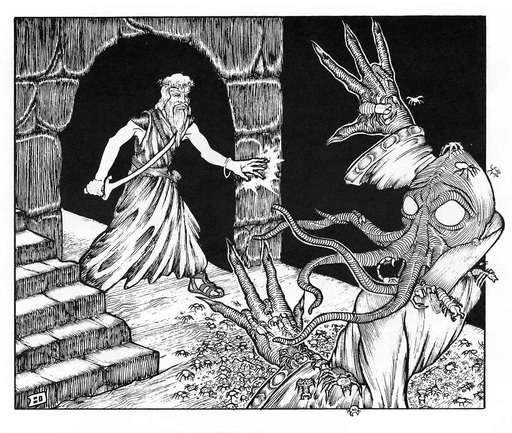

#  Quick Creation Reference 

**(1) Race**

- Note your character race as Human. You know the common language and your size is Medium.

**(2) Determine your character's [<u>age</u>](#Age)**

- Pick an appropriate starting age and roll for any additional years based on class. Apply age modifiers.

**(3) Determine ability scores**

- Roll 4d6 and drop the lowest for each ability score in order: Strength, Dexterity, Constitution, Intelligence, Wisdom and Charisma.

**(4) Swap one pair of ability scores**

- You can swap any two ability scores with each other once.

**(5) Select a [<u>class</u>](#Classes)**

- Pick a class and make sure you meet the minimum ability score requirements.

**(6) Roll starting hit points**

- Roll or choose the average value of your class' hit die rounded down to determine starting HP. Modify depending on the [<u>Constitution</u>](#Rules/#Constitution) modifier. You may reroll results of 1 once.

**(7) Roll [<u>starting gold</u>](#Starting-Gold)**

- Consult the table and roll for your starting gold depending on the class.

**(8) Purchase [<u>gear</u>](#Rules/#General-Equipment)**

- Spend any gold on additional weapons, armor, equipment as desired.

**(9) Determine Background**

- Roll or pick a [<u>background</u>](#Backgrounds) that provides a relevant skill.

**(10) Note [<u>starting spells</u>](#level-1-spells) (if applicable)**

- If a spellcaster, choose 10 spells (if [<u>Chaos Mage</u>](#chaos-mage), also pick two [<u>cantrips</u>](#cantrips) at level 1 that you learn automatically) or 5 (if [<u>Law Mage</u>](#law-mage)). Roll the percentile dice to determine which ones you know, remove the rest.

**(11) Determine miscellaneous information**

- Armor class 
- [<u>Encumbrance</u>](#Encumbrance-&-Movement)
- [<u>Insanity</u>](#Insanity)
- [<u>Languages</u>](#Languages)
- [<u>Psionics</u>](#Psionics)
- [<u>Weapon Proficiencies</u>](#Weapon-Proficiencies) (Initial number on class page)

**(12) Roll for [<u>Special Abilities</u>](#Special-Abilities)**

- After all the previous steps are completed, roll on the [<u>Special Abilities</u>](#Special-Abilities) table and let the DM roll to determine the specific sort of effect it has on the character.

#  Character Creation 

## Rolling Ability Scores 

4d6 drop lowest (remove the lowest). Roll each stat in order: Strength,
Dexterity, Constitution, Intelligence, Wisdom and Charisma. After rolling for stats, you
may swap two ability scores with each other, once.

## Starting Hit Points

At level 1 you roll the corresponding hit die as your HP. Add or
subtract with your constitution constitution. A
player may reroll a die with the result in a 1.

## Age

The starting age of your character is determined up to you. The table
below determines the ability score bonuses or penalties your character
is given based on life stage.

The effects of aging below indicate the total amount of ability score changes given for each age. When age category is established, modifidy ability scores accordingly, making each change progressively from young adulthood, all aditions and subtractions being cumulative.

| **Result (1d100)** | **Age**     | **Strength** | **Dexterity** | **Constitution** | **Intelligence** | **Wisdom** | **Charisma** |
|--------------------|-------------|--------------|---------------|------------------|------------------|------------|--------------|
| 1 - 30             | Young Adult |     +0       |     +0        |       +1         |    +0            | -1         | +0           |
| 31 - 70            | Mature      |     +1       |     +0        |       +0         |    +0            | +1         | +0           |
| 71 - 90            | Middle Aged |     -1       |     +0        |       -1         |    +1            | +1         | +0           |
| 91 - 96            | Old         |     -2       |     -2        |       -1         |    +0            | +1         | +0           |
| 97 - 100           | Venerable   |     -1       |     -1        |       -1         |    +1            | +1         | +0           |

## Age by Race

| **Race**  | **Young Adult** | **Mature** | **Middle Aged** | **Old**   | **Venerable** |
|-----------|-----------------|------------|-----------------|-----------|---------------|
| Human     | 15 - 20         | 21 - 40    | 41 - 60         | 61 - 90   | 91 - 120      |
| Elf       | 50 - 125        | 126 - 400  | 401 - 600       | 601 - 800 | 801 - 1000    |
| Dwarf     | 35 - 50         | 51 - 150   | 151 - 250       | 251 - 350 | 351 - 450     |
| Draconian | 24 - 40         | 41 - 100   | 101 - 175       | 176 - 250 | 251 - 325     |
| Gnome     | 50 - 90         | 91 - 300   | 301 - 450       | 451 - 600 | 601 - 750     |
| Solarian  | 40 - 60         | 61 - 175   | 176 - 260       | 261 - 300 | 301 - 400     |
| Halfling  | 22 - 33         | 34 - 70    | 71 - 101        | 102 - 144 | 145 - 200     |
| Goblin    | 10 - 15         | 16 - 35    | 36 - 45         | 46 - 60   | 61 - 80       |
| Radigen   | 14 - 20         | 21 - 30    | 31 - 50         | 51 - 80   | 80 - 100      |
| Kobold    | 6 - 30          | 31 - 60    | 61 - 85         | 86 - 100  | 101 - 125     |
| Avian     | 20 - 35         | 36 - 50    | 51 - 75         | 76 - 100  | 101 - 130     |
| Orc       | 15 - 20         | 21 - 35    | 36 - 55         | 56 - 80   | 81 - 100      |

## Starting Age

When determining the starting age of your character, first choose the life stage most appropriate for your character's backstory and personality. Refer to the base age range specified for the race in the table above. From this base, an optional rule is to add additional years based on the chosen class, reflecting the time the character has spent training or studying in that particular vocation. To determine these additional years, roll the dice corresponding to the character's class.

| **Race**  | **Fighter** | **Specialist** | **Law Mage** | **Chaos Mage** |
|-----------|-------------|----------------|--------------|----------------|
| Human     | 1d4         | 1d4            | 3d6          | 2d10           |
| Elf       | 3d20        | 2d10           | 4d20         | 1d100 + 3d10   |
| Dwarf     | 2d8         | 2d6            | 2d20 + 1d10  | 3d20           |
| Draconian | 3d6         | 4d4            | 3d20         | 4d12           |
| Gnome     | 6d6         | 4d8            | 1d100        | 1d100 + 2d12   |
| Solarian  | 2d10        | 3d6            | 5d8          | 2d20 + 2d10    |
| Halfling  | 2d4 + 1d6   | 2d6            | 2d20         | 4d8            |
| Goblin    | 1d4         | 1d4            | 2d10         | 1d20           |
| Radigen   | 1d6         | 1d4            | 3d6          | 1d20           |
| Kobold    | 2d8         | 3d4            | 2d20 + 2d6   | 3d12 + 2d8     |
| Avian     | 3d4 + 1d6   | 1d12 + 1d6     | 3d10         | 1d20 + 2d8     |
| Orc       | 1d4         | 1d4            | 3d6          | 2d8            |

## Starting Height & Weight

| **Race**  | **Height**   | **Modifier** | **Weight (lbs)** | **Modifier (lbs)** |
|-----------|--------------|--------------|------------------|--------------------|
| Human     | 4'9” or 4'6” | \+ 2d10”     | 120 or 90        | \+ 12d6            |
| Elf       | 5'3” or 5'0” | \+ 2d12”     | 140 or 110       | \+ 10d8            |
| Dwarf     | 3'9” or 3'6” | \+ 2d4”      | 130 or 100       | \+ 8d6             |
| Draconian | 5'0” or 4'8” | \+ 3d6”      | 130 or 100       | \+ 6d12            |
| Gnome     | 3' or 2'10”  | \+ 2d4”      | 50 or 45         | \+ 5d6             |
| Solarian  | 5'2” or 4'9” | \+ 3d8”      | 140 or 110       | \+ 8d12            |
| Halfling  | 2'9” or 2'6” | \+ 3d4”      | 50 or 45         | \+ 5d6             |
| Goblin    | 3' or 2'10”  | \+ 2d4”      | 45 or 40         | \+ 4d6             |
| Radigen   | 4'9” or 4'6” | \+ 2d10”     | 120 or 90        | \+ 12d6            |
| Kobold    | 3' or 2'10”  | \+ 2d4”      | 50 or 45         | \+ 4d6             |
| Avian     | 4'8” or 4'5” | \+ 2d10”     | 120 or 90        | \+ 11d6            |
| Orc       | 4'0” or 3'7” | \+ 2d6”      | 90 or 75         | \+ 8d8             |

##  Backgrounds 

Assign a skill randomly, or select according to the background of your
character.

| **Result (1d100)** | **Background**                         | 
|--------------------|----------------------------------------|
| 01 - 02            | Animal husbander                       | 
| 03 - 04            | Blacksmith                             | 
| 05 - 07            | Bowyer/fletcher                        | 
| 08 - 10            | Carpenter                              | 
| 11 - 16            | Farmer/gardner                         | 
| 17 - 20            | Fisher                                 | 
| 21 - 26            | Forester                               | 
| 27 - 29            |Gambler                                 | 
| 30 - 33            | Hunter/trapper                         | 
| 34 - 35            | Jeweler                                | 
| 36 - 38            | Leather worker/tanner                  | 
| 39 - 40            | Limner/painter                         | 
| 41 - 43            | Mason                                  | 
| 44 - 45            | Mercenary                              | 
| 46 - 48            | Merchant                               | 
| 49 - 51            | Miner                                  | 
| 52 - 53            | Noble                                  | 
| 54 - 55            | Outlaw                                 | 
| 56 - 58            | Sailor                                 | 
| 59 - 61            | Scholar                                | 
| 62 - 64            | Soldier/guard                          | 
| 65 - 67            | Tailor/weaver                          | 
| 68 - 70            | Teamster/transporter                   | 
| 71 - 90            | No skill of measurable worth           | 
| 90 - 100           | Roll twice, ignoring this result after | 

##  Special Abilities 

*Initially from "Alarums & Excursions #1" in 1975 and "Arduin Grimoire #1" in 1977, these are mostly inspired by the former. Made by Attronarch from "Fight On! #15"*

Special Abilities are more like "special traits" that can both be positive and negative. Begin by noting what type your class is associated with on the initial table and tell this to your DM. 

| **Type** | **Class** | 
|------|-------| 
| Martial | Fighter, Inquisitor, Barbarian 
| Chaos | Chaos Mage, Illusionist 
| Law | Law Mage | 
| Clandestine | Specialist |

Then roll 1d8 to determine the amount of Boons and/or Banes you start with. The DM will then roll for each and tell you exactly what kind of trait(s) your character has received.

| 1d8   | Boons | Banes |
|-------|-------|-------|
| 1     |   0   |     1 |
| 2     |   1   |     2 |
| 3 - 6 |   1   |     1 |
| 7     |   2   |     1 |
| 8     |   1   |     0 |

#  Ability Scores 

## Strength

| **Score** | **To-Hit Modifier\*** | **Damage Modifier\*** | **Minor Tests (open doors etc, chance on d6)** | **Major Tests (bending bars etc, chance on d%)** | **Climb** |
|-----------|-----------------------|-----------------------|------------------------------------------------|--------------------------------------------------|-----------|
| 3 - 4     | -2                    | -1                    | 1 / 6                                          | 0%                                               | 50%       |
| 5 - 6     | -1                    | +0                    | 1 / 6                                          | 0%                                               | 65%       |
| 7 - 8     | +0                    | +0                    | 2 / 6                                          | 0%                                               | 75%       |
| 9 - 12    | +0                    | +0                    | 2 / 6                                          | 4%                                               | 85%       |
| 13 - 15   | +1                    | +0                    | 2 / 6                                          | 7%                                               | 90%       |
| 16        | +1                    | +1                    | 3 / 6                                          | 10%                                              | 91%       |
| 17        | +2                    | +2                    | 4 / 6                                          | 15%                                              | 92%       |
| 18        | +2                    | +3                    | 5 / 6                                          | 25%                                              | 93%       |

\*Penalties still apply to all characters, but modifiers are only
applied to [<u>Fighters.</u>](#Fighter)

## Dexterity

| **Score** | **Ranged Weapon To-Hit Bonus/Penalty\*** | **Armor Class Modifier** | **Surprise Modifier** |
|-----------|------------------------------------------|--------------------------|-----------------------|
| 3 - 8     | -1                                       | -1                       | -1                    |
| 9 - 12    | +0                                       | +0                       | +0                    |
| 13 - 15   | +1                                       | +1                       | +1                    |

\*For [<u>Fighters</u>](#Fighter), this bonus is in addition to any
bonuses for Strength when using heavy thrown weapons, such as javelins.
Bows only grant dexterity bonuses.

## Constitution

| **Score** | **Hit Point Modifier (per hit die)** | **Raise Dead Survival** |
|-----------|--------------------------------------|-------------------------|
| 3 - 8     | -1                                   | 50%                     |
| 9 - 12    | +0                                   | 75%                     |
| 13 - 18   | +1                                   | 95%                     |

## Intelligence

| **Score** | **Spoken Languages**     | **Literacy** |**Search** | **Chance to Understand Chaos Spell\*** |
|-----------|--------------------------|--------------|-----------|--------------------------------------|
| 3 - 7     | Native (broken speech)   | Illiterate   | —         | 30%                                  |
| 8         | Native                   | Basic        | 1 / 6     | 40%                                  |
| 9         | Native                   | Literate     | 1 / 6     | 45%                                  |
| 10        | Native                   | Literate     | 1 / 6     | 50%                                  |
| 11        | Native                   | Literate     | 1 / 6     | 50%                                  |
| 12        | Native                   | Literate     | 1 / 6     | 55%                                  |
| 13        | Native + 1 additional    | Literate     | 1 / 6     | 65%                                  |
| 14        | Native + 1 additional    | Literate     | 1 / 6     | 65%                                  |
| 15        | Native + 1 additional    | Literate     | 2 / 6     | 75%                                  |
| 16        | Native + 2 additional    | Literate     | 2 / 6     | 75%                                  |
| 17        | Native + 2 additional    | Literate     | 2 / 6     | 85%                                  |
| 18        | Native + 3 additional    | Literate     | 2 / 6     | 95%                                  |

\*For [<u>Chaos Mages</u>](#Chaos-Mage)

Any character with a Intelligence score of 13 or more receives a bonus of 5%
more XP.

## Wisdom

| **Score** | **Mental Saving Throw Bonus** | **Spell Bonus**          | **Chance of Spell Failure** | **Chance to Understand Law Spell\*** |
|-----------|-----------------|--------------------------|-----------------------------|-------------------------------------------
| 3 - 5     | -3              | -                        | 20%                         | 30%
| 6         | -2              | -                        | 10%                         | 30%
| 7         | -2              | -                        | 5%                          | 30%
| 8         | -1              | -                        | 1%                          | 40%
| 9         | -1              | -                        | 0%                          | 45%
| 10        | +0              | -                        | 0%                          | 50%
| 11        | +0              | -                        | 0%                          | 50%
| 12        | +0              | -                        | 0%                          | 55%
| 13        | +1              | -                        | 0%                          | 65%
| 14        | +1              | -                        | 0%                          | 65%
| 15        | +1              | One 1st level            | 0%                          | 75%
| 16        | +2              | One 1st level            | 0%                          | 75%
| 17        | +2              | One 2nd level            | 0%                          | 85%
| 18        | +3              | One 2nd level            | 0%                          | 95%

\*For [<u>Law Mages</u>](#Law-Mage)

## Charisma

| **Score** | **Maximum Number of Henchman** | **Retainer Loyalty** | **Reaction Modifier** |
|-----------|--------------------------------|----------------------|-----------------------|
| 3 - 4     | 1                              | 4                    | -2
| 5 - 6     | 1                              | 5                    | -1
| 7 - 8     | 1                              | 6                    | -1
| 9 - 12    | 2                              | 7                    | +0
| 13 - 15   | 3                              | 8                    | +1
| 16 - 17   | 4                              | 9                    | +1
| 18        | 5                              | 10                   | +2

Any character with a Charisma score of 13 or more receives a bonus of 5%
more XP.

#  Classes 

##  Fighter 

**Minimum Requirement:** 9+ Strength

**Prime Attribute:** Strength, 13+ (+5% experience bonus)

**Hit Dice:** 1d8/level (Gains 2 hp/level after 9th level)

**Armor/Shield Permitted**: Any

**Weapons Permitted:** Any

**Parry:** Fighters with a Dexterity score of 14 or better can fight on
the defensive, parrying enemy blows, as shown on the
table below. The Fighter can parry enemy attacks in the direction they are facing
without giving up the ability to attack themselves in the same round.
Parrying is not effective against ranged weapons, but is effective
against claws, bites and touch attacks.

| **Dexterity Score** | **Penalty to Enemy Attacks** |
|---------------------|------------------------------|
| 14                  | -1                           |
| 15                  | -2                           |
| 16                  | -3                           |
| 17                  | -4                           |
| 18                  | -5                           |

**Hit & Damage Bonuses:** Fighters gain a hit and damage bonus as seen
on the strength & dexterity ability score sections.

**Saving Throw Bonuses:** Fighters gain a +1 bonus on all saving throws
except against magic.

**Multiple Attacks (5th):** At 5th level, a Fighter may attack twice
when taking an attack action instead of once.

**Fighter Advancement Table**

| **Level** | **XP Requirement for Level** | **Hit Dice (d8)** | **Saving Throws** | **Weapon Proficiencies** |
|-----------|------------------------------|-------------------|-------------------|--------------------------|
| 1         | 0                            | 1                 | 15                | 4
| 2         | 2,000                        | 2                 | 14                | 4
| 3         | 4,000                        | 3                 | 13                | 5
| 4         | 8,000                        | 4                 | 12                | 5
| 5         | 16,000                       | 5                 | 11                | 5
| 6         | 32,000                       | 6                 | 10                | 6
| 7         | 64,000                       | 7                 | 9                 | 6
| 8         | 120,000                      | 8                 | 8                 | 6
| 9         | 240,000                      | 9                 | 7                 | 7
| 10        | 360,000                      | 9+2 hp            | 6                 | 7
| 11        | 480,000                      | 9+4 hp            | 5                 | 7
| 12        | 600,000                      | 9+6 hp            | 5                 | 8
| 13        | 720,000                      | 9+8 hp            | 5                 | 8
| 14        | 840,000                      | 9+10 hp           | 5                 | 8
| 15        | 960,000                      | 9+12 hp           | 5                 | 9
| 16        | 1,080,000                    | 9+14 hp           | 5                 | 9
| 17        | 1,200,000                    | 9+16 hp           | 5                 | 9
| 18        | 1,320,000                    | 9+18 hp           | 5                 | 10
| 19        | 1,440,000                    | 9+20 hp           | 5                 | 10
| 20        | 1,560,000                    | 9+22 hp           | 5                 | 10

##  Inquisitor 

**Minimum Requirement:** 13+ Strength, +9 Constitution, +9 Intelligence, +13 Wisdom, +17
Charisma

**Prime Attribute:** Strength, 16+ (+5% experience bonus)

**Hit Dice:** 1d10/level (Gains 3 hp/level after 9th level)

**Armor/Shield Permitted**: Any

**Weapons Permitted:** Any

**Alignment:** Inquisitors are of Lawful alignment.

**Magic Items** Inquisitors may only own no more than three magic items.

**Parry:** Inquisitors with a Dexterity score of 14 or better can fight on
the defensive, parrying enemy blows, as shown on the
table below. The Inquisitor can parry one enemy attack
without giving up the ability to attack themselves in the same round.
Parrying is not effective against ranged weapons, but is effective
against claws, bites and touch attacks.

| **Dexterity Score** | **Penalty to Enemy Attacks** |
|---------------------|------------------------------|
| 14                  | -1                           |
| 15                  | -2                           |
| 16                  | -3                           |
| 17                  | -4                           |
| 18                  | -5                           |

**Hit & Damage Bonuses:** Inquisitors gain a hit and damage bonus as
seen on the strength & dexterity ability score sections.

**Saving Throw Bonuses:** Inquisitors gain a +2 to all saving throws.

**Detect Evil**: An Inquisitor can detect the presence of evil intent up
to 60 feet away by concentrating on locating evil in a particular
direction. They can do this as often as desired, but each attempt takes
one round. This ability detects evil monsters and characters.

**Disease immunity:** An Inquisitor is immune to all forms of disease.
(Note that certain magical afflictions—lycanthropy and mummy rot—are
curses and not diseases.)

**Lay on Hands:** An Inquisitor can “lay on hands” once per day to cure
others of 2 hit points of damage per level of the Inquisitor, or to cure
disease. If the other person is afflicted by more than one disease, only
one of these will be affected per five levels the Inquisitor has
attained. This functions the same way as any spell would and takes one
round to cast.

**Strong Willed:** Whenever the Inquisitor is under the effects of a
spell that incapacitates the body or mind (sleep, hold, charm,
paralysis, etc.), they may make a new saving throw every round

**Banishing Undead (3rd) :** An Inquisitor gains the power to turn
undead and fiends when they reach 3rd level. They affect these monsters
the same as does a [<u>Law Mage</u>](#law-mage) two levels lower—for
example, at 3rd level they have the turning power of a 1st-level [<u>Law
Mage</u>](#law-mage).

**Dispel Evil (8th):** : Starting at 8th level, the Inquisitor can
dispel evil once per day, as per the Law Mage spell (see the description of the [<u>Law
Mage</u>](#law-mage-1) spell dispel evil).

**Inquisitor Advancement Table**

| **Level** | **XP Requirement for Level** | **Hit Dice (d10)** | **Saving Throws** | **Weapon Proficiencies** |
|-----------|------------------------------|--------------------|-------------------|--------------------------|
| 1         | 0                            | 1                  | 15                | 4
| 2         | 2,250                        | 2                  | 14                | 4
| 3         | 4,500                        | 3                  | 13                | 5
| 4         | 9,000                        | 4                  | 12                | 5
| 5         | 20,000                       | 5                  | 11                | 5
| 6         | 40,000                       | 6                  | 10                | 6
| 7         | 80,000                       | 7                  | 9                 | 6
| 8         | 150,000                      | 8                  | 8                 | 6
| 9         | 280,000                      | 9                  | 7                 | 7
| 10        | 410,000                      | 9+3 hp             | 6                 | 7
| 11        | 540,000                      | 9+6 hp             | 5                 | 7 
| 12        | 670,000                      | 9+9 hp             | 5                 | 8
| 13        | 800,000                      | 9+12 hp            | 5                 | 8
| 14        | 930,000                      | 9+15 hp            | 5                 | 8
| 15        | 1,060,000                    | 9+18 hp            | 5                 | 9
| 16        | 1,190,000                    | 9+21 hp            | 5                 | 9
| 17        | 1,320,000                    | 9+24 hp            | 5                 | 9
| 18        | 1,450,000                    | 9+27 hp            | 5                 | 10
| 19        | 1,580,000                    | 9+30 hp            | 5                 | 10
| 20        | 1,710,000                    | 9+33 hp            | 5                 | 10

##  Specialist 

**Minimum Requirement:** 9+ Dexterity

**Prime Attribute: Dexterity,** 13+ (+5% experience bonus)

**Hit Dice: 1d4/level** (Gains 1 hp/level after 10th level)

**Armor/Shield Permitted:** Light armor, no shield

**Weapons Permitted:** Any one handed weapons, ranged weapons.

**Saving Throw Bonus:** Specialists gain a +2 bonus on saving throws
against devices, including traps and other magical devices.

**Evasiveness:** Specialists gain a +1 bonus to AC when
[<u>unencumbered</u>](#_25dl12dlsxgn).

**Moving quietly:** Specialists can move quietly without being heard.

**Climbing walls or cliffs:** In general, if a normal person has a
chance to climb a wall, a Specialist can most likely do it
automatically.

### Skills

The Specialist begins at the same default level in these activities as
other characters, but receives “points” which can be allocated to
improve the ability in the chosen skills. For skills that are “x in 6”,
allocating a point increases the chance by one. For example, Lockpicking
begins at 1 in 6. A Specialist allocating a point to this skill
increases the chance to 2 in 6. Every class has the following skills as
a 1 in 6. A skill cannot be increased further than a 5 in 6.

**Architecture:** Clues, warning and rewards can be built into
structures of a character's surroundings. Determining if a passage
shifts or slopes gradually, detecting if a structure is unsafe to travel
in/on, as well as any history found in the structure can be noted.

**Foraging** (See Foraging)

**Lockpicking:** Specialists can pick locks with Thieves' tools; some
locks might be unusually difficult, in which case the game master might
reduce the chance as appropriate.

**Search:** Finding features of interest, hidden doors or compartments.
Note that finding secret doors does not grant the character an
understanding of how it works.

**Sleight of Hand:** Picking the pockets of an unaware person, hiding a
small object from a search, readying a weapon without any observers
noticing, swappingout an object on a weight-sensitive plate with a
similarly-weighted bag of sand, these and more are examples of Sleight
of Hand.

**Sneak Attack:** Sneak Attacks are merely attacks made by surprise. A
Specialist can multiply the damage done by a Sneak Attack by allocating
points to this skill. Assume that the damage multiplier is x1 for all
characters, but for every point allocated to the skill by a Specialist,
the damage multiplier is increased by one. If a Specialist has any
points in Sneak Attack, then they also get a +2 bonus to hit above any
other bonuses they already have when performing a Sneak Attack.

**Stealth:** Stealth allows a character to sneak around and hide. In
order to use the Stealth skill, those that the character wishes to hide
from must not already be aware of the character's presence, and there
must be somewhere to hide. If a character attacks after successfully
using Stealth, that attack greatly increases the chance of a
[<u>Surprise</u>](#surprise) attack, even if the enemy is already
engaged in battle.

**Tinker:** Disarming traps, disabling pressure plates, manipulating
small impromptu devices or even creating objects from mechanical parts
would be considered Tinkering.

**Specialist Advancement Table**

| **Level** | **XP Required for Level** | **Hit Dice (d4)** | **Saving Throw** | **Skill Points** | **Weapon Proficiencies** |
|-----------|---------------------------|-------------------|------------------|------------------|--------------------------|
| 1         | 0                         | 1                 | 15               | 4                | 2                        |
| 2         | 1,250                     | 2                 | 14               | 6                | 2                        |
| 3         | 2,500                     | 3                 | 13               | 8                | 2                        |
| 4         | 5,000                     | 4                 | 12               | 10               | 3                        |
| 5         | 10,000                    | 5                 | 11               | 12               | 3                        |
| 6         | 25,000                    | 6                 | 10               | 14               | 3                        |
| 7         | 45,000                    | 7                 | 9                | 16               | 3                        |
| 8         | 90,000                    | 8                 | 8                | 18               | 4                        |
| 9         | 200,000                   | 9                 | 7                | 20               | 4                        |
| 10        | 310,000                   | 10                | 6                | 22               | 4                        |
| 11        | 420,000                   | 10+1              | 5                | 24               | 4                        |
| 12        | 530,000                   | 10+2              | 5                | 26               | 5                        |
| 13        | 640,000                   | 10+3              | 5                | 28               | 5                        |
| 14        | 750,000                   | 10+4              | 5                | 30               | 5                        |
| 15        | 860,000                   | 10+5              | 5                | 32               | 5                        |
| 16        | 970,000                   | 10+6              | 5                | 34               | 6                        |
| 17        | 1,080,000                 | 10+7              | 5                | 36               | 6                        |
| 18        | 1,190,000                 | 10+8              | 5                | 38               | 6                        |
| 19        | 1,300,000                 | 10+9              | 5                | 40               | 6                        |
| 20        | 1,410,000                 | 10+10             | 5                | 42               | 7                        |

**Disciplines**

(Examples, either pick one or build your own with the four skill points given at level 1)

| **Dice Score (d8)** | **Discipline** | **Architecture** | **Foraging** | **Lockpicking** | **Search** | **Sleight of Hand** | **Sneak Attack** | **Stealth** | **Tinker** |
|---------------------|----------------|------------------|--------------|-----------------|------------|---------------------|------------------|-------------|------------|
| 1                   | Artificer      | 2 / 6            | 1 / 6        | 2 / 6           | 1 / 6      | 1 / 6               | 1 / 6            | 1 / 6       | 3 / 6      |
| 2                   | Assassin       | 1 / 6            | 1 / 6        | 1 / 6           | 1 / 6      | 1 / 6               | 3 / 6            | 3 / 6       | 1 / 6      |
| 3                   | Explorer       | 1 / 6            | 2 / 6        | 1 / 6           | 3 / 6      | 2 / 6               | 1 / 6            | 1 / 6       | 1 / 6      |
| 4                   | Ranger         | 1 / 6            | 3 / 6        | 1 / 6           | 1 / 6      | 1 / 6               | 2 / 6            | 2 / 6       | 1 / 6      |
| 5                   | Rogue          | 1 / 6            | 1 / 6        | 2 / 6           | 1 / 6      | 1 / 6               | 2 / 6            | 3 / 6       | 1 / 6      |
| 6                   | Scholar        | 3 / 6            | 1 / 6        | 1 / 6           | 3 / 6      | 1 / 6               | 1 / 6            | 1 / 6       | 1 / 6      |
| 7                   | Spy            | 1 / 6            | 1 / 6        | 3 / 6           | 1 / 6      | 1 / 6               | 1 / 6            | 3 / 6       | 1 / 6      |
| 8                   | Thief          | 1 / 6            | 1 / 6        | 2 / 6           | 1 / 6      | 2 / 6               | 2 / 6            | 2 / 6       | 1 / 6      |

##  Law Mage 

**Minimum Requirement:** 9+ Wisdom

**Prime Attribute:** Wisdom, 13+ (+5% experience bonus)

**Hit Dice:** 1d6/level (Gains 1 hp/level after 9th level)

**Armor/Shield Permitted**: Any

**Weapons Permitted:** Any one handed weapon, no ranged weapons

**Alignment:** Law Mages are of Lawful alignment.

| **Wisdom Score** | **Max Spell Level** | **Min/Max Number of Basic Spells Understandable\*** |
|----------------|---------------------|-----------------------------------------------------|
| 3 - 7          | 2                   | 2/4                                                 |
| 8              | 3                   | 2/4                                                 |
| 9              | 3                   | 2/4                                                 |
| 10             | 3                   | 2/4                                                 |
| 11             | 4                   | 3/5                                                 |
| 12             | 4                   | 3/5                                                 |
| 13             | 5                   | 3/5                                                 |
| 14             | 5                   | 3/5                                                 |
| 15             | 6                   | 4/5                                                 |
| 16             | 6                   | 4/5                                                 |
| 17             | 7                   | 4/5                                                 |
| 18             | 7                   | 4/5                                                 |

\*Minimum is the least amount of spells learned at character creation
from the selected roster of spells. If the amount isn't met when rolling
through the list, simply repeat until it is. Maximum is simply the limit
to how many spells are known at character creation.

**Saving Throw Bonus:** Law Mages gain a +2 bonus on saving throws
against being paralyzed or poisoned.

**Known Spells:** Law Mages initially have access to five 1st-level
spells as well as “Read Law Magic”, a first level blue spell. Refer to the
spell table above to identify how many of the five spells are already
inscribed and comprehended in the spellbook. Any remaining spells out of
the initial ten, which are not yet understood, are not added to the
spellbook until the Mage has successfully learned the initial set.

**Banishing Undead:** Law Mages can Turn Undead as seen below. If the number on the dice is equal to or greater than the number shown
on the table, 2d6 creatures of the targeted type are turned and depart.

| **Challenge Level of Undead** | **Specific Undead** | **Level 1** | **2** | **3** | **4** | **5** | **6** | **7** | **8** | **9** | **10-13** | **14-17** | **18+** |
|-------------------------------|---------------------|-------------|-------|-------|-------|-------|-------|-------|-------|-------|-----------|-----------|---------|
| 1                             | Skeleton            | 10          | 7     | 4     | T     | T     | D     | D     | D     | D     | D         | D         | D       |
| 2                             | Zombie              | 13          | 10    | 7     | 4     | T     | T     | D     | D     | D     | D         | D         | D       |
| 3                             | Ghoul               | 16          | 13    | 10    | 7     | 4     | T     | T     | D     | D     | D         | D         | D       |
| 4                             | Shadow              | 19          | 16    | 13    | 10    | 7     | 4     | T     | T     | D     | D         | D         | D       |
| 5                             |                     | 20          | 19    | 16    | 13    | 10    | 7     | 4     | T     | T     | D         | D         | D       |
| 6                             | Wight               | \-          | 20    | 19    | 16    | 13    | 10    | 7     | 4     | T     | T         | D         | D       |
| 7                             | Mummy               | \-          | \-    | 20    | 19    | 16    | 13    | 10    | 7     | 4     | T         | T         | D       |
| 8                             | Wraith              | \-          | \-    | \-    | 20    | 19    | 16    | 13    | 10    | 7     | 4         | T         | T       |
| 9                             | Spectre             | \-          | \-    | \-    | \-    | 20    | 19    | 16    | 13    | 10    | 7         | 4         | T       |
| 10                            | Vampire\*           | \-          | \-    | \-    | \-    | \-    | 20    | 19    | 16    | 13    | 10        | 7         | 4       |
| 11                            | Vampire\*           | \-          | \-    | \-    | \-    | \-    | \-    | 20    | 19    | 16    | 13        | 10        | 7       |
| 12                            |                     | \-          | \-    | \-    | \-    | \-    | \-    | 20    | 19    | 16    | 13        | 10        | 10      |
| 15+                           | Lich                | \-          | \-    | \-    | \-    | \-    | \-    | \-    | \-    | 20    | 19        | 16        | 13      |

**Law Mage Advancement Table**

| **Level** | **XP Required for Level** | **Hit Dice (d6)** | **Saving Throw** | **Weapon Proficiencies** |
|-----------|---------------------------|-------------------|------------------|--------------------------|
| 1         | 0                         | 1                 | 15               | 2
| 2         | 1,500                     | 2                 | 14               | 2
| 3         | 3,000                     | 3                 | 13               | 2
| 4         | 6,000                     | 4                 | 12               | 3
| 5         | 12,000                    | 5                 | 11               | 3
| 6         | 25,000                    | 6                 | 10               | 3
| 7         | 50,000                    | 7                 | 9                | 3
| 8         | 100,000                   | 8                 | 8                | 4
| 9         | 200,000                   | 9                 | 7                | 4
| 10        | 300,000                   | 9+1               | 6                | 4
| 11        | 400,000                   | 9+2               | 5                | 4
| 12        | 500,000                   | 9+3               | 4                | 5
| 13        | 600,000                   | 9+4               | 4                | 5
| 14        | 700,000                   | 9+5               | 4                | 5
| 15        | 800,000                   | 9+6               | 4                | 5
| 16        | 900,000                   | 9+7               | 4                | 6
| 17        | 1,000,000                 | 9+8               | 4                | 6
| 18        | 1,100,000                 | 9+9               | 4                | 6
| 19        | 1,200,000                 | 9+10              | 4                | 6
| 20        | 1,300,000                 | 9+11              | 4                | 7

##  Chaos Mage 

**Minimum Requirement:** 9+ Intelligence

**Prime Attribute:** Intelligence, 13+ (+5% experience bonus)

**Hit Dice:** 1d4/level (Gains 1 hp/level after 11th level)

**Armor/Shield Permitted**: None

**Weapons Permitted:** Dagger, staff and darts

**Alignment:** Chaos Mages are of Chaotic alignment.

| **Intelligence Score** | **Max Spell Level** | **Min/Max Number of Basic Spells Understandable\*** | **Maximum Number of Cantrips** |
|----------------|---------------------|-----------------------------------------------------|--------------------------------|
| 3 - 7          | 4                   | 2/4                                                 | 2                              |
| 8              | 5                   | 3/5                                                 | 2                              |
| 9              | 5                   | 3/5                                                 | 2                              |
| 10             | 5                   | 4/6                                                 | 3                              |
| 11             | 6                   | 4/6                                                 | 3                              |
| 12             | 6                   | 4/6                                                 | 3                              |
| 13             | 7                   | 5/8                                                 | 4                              |
| 14             | 7                   | 5/8                                                 | 4                              |
| 15             | 8                   | 6/10                                                | 4                              |
| 16             | 8                   | 6/10                                                | 5                              |
| 17             | 9                   | 7/All                                               | 5                              |
| 18             | 9                   | 8/All                                               | 6                              |

\*Minimum is the least amount of spells learned at character creation
from the selected roster of spells. If the amount isn't met when rolling
through the list, simply repeat until it is.

**Known Spells:** Chaos Mages initially have access to ten 1st-level
spells and two Cantrips as well as “Read Chaos Magic”, a first level blue
spell. Refer to the spell table above to identify how many of the ten
spells are already inscribed and comprehended in the spellbook. Any
remaining spells out of the initial ten, which are not yet understood,
are not added to the spellbook until the Mage has successfully learned
the initial set.

**Saving Throw Bonus:** Chaos Mages gain a bonus of +2 on all saving
throw rolls against spells, including spells from magic wands and
staffs.

**Cantrips:** Small magic tricks or simple utility spells that can be
cast without spending mana. These spells are often instantaneous and can
be used as many times as the Mage would like.

**Chaos Mage Advancement Table**

| **Level** | **XP Required for Level** | **Hit Dice (d4)** | **Saving Throw** | **Weapon Proficiencies** |
|-----------|---------------------------|-------------------|------------------|--------------------------|
| 1         | 0                         | 1                 | 15               | 1
| 2         | 2,500                     | 2                 | 14               | 1
| 3         | 5,000                     | 3                 | 13               | 1
| 4         | 10,000                    | 4                 | 12               | 1
| 5         | 20,000                    | 5                 | 11               | 1
| 6         | 40,000                    | 6                 | 10               | 2
| 7         | 80,000                    | 7                 | 9                | 2
| 8         | 150,000                   | 8                 | 8                | 2
| 9         | 300,000                   | 9                 | 7                | 2
| 10        | 450,000                   | 10                | 6                | 2
| 11        | 600,000                   | 11                | 5                | 2
| 12        | 750,000                   | 11+4              | 5                | 3
| 13        | 900,000                   | 11+8              | 5                | 3
| 14        | 1,050,000                 | 11+12             | 5                | 3
| 15        | 1,200,000                 | 11+16             | 5                | 3
| 16        | 1,350,000                 | 11+20             | 5                | 3
| 17        | 1,500,000                 | 11+24             | 5                | 3
| 18        | 1,650,000                 | 11+28             | 5                | 4
| 19        | 1,800,000                 | 11+32             | 5                | 4
| 20        | 1,950,000                 | 11+36             | 5                | 4

##  Illusionist 

**Minimum Requirement:** 13+ Intelligence, 16+ Dex

**Prime Attribute:** Intelligence, 16+ (+5% experience bonus)  

**Hit Dice:** 1d4/level (Gains 1 hp/level after 11th level)

**Armor/Shield Permitted**: None

**Weapons Permitted:** Dagger, staff and darts

**Alignment:** Illusionists are of Chaotic alignment.

| **Intelligence Score** | **Max Spell Level** | **Min/Max Number of Basic Spells Understandable\*** | **Maximum Number of Cantrips** |
|----------------|---------------------|-----------------------------------------------------|--------------------------------|
| 3 - 7          | 2                   | 2/4                                                 | 2                              |
| 8              | 3                   | 3/5                                                 | 2                              |
| 9              | 3                   | 3/5                                                 | 2                              |
| 10             | 3                   | 4/6                                                 | 3                              |
| 11             | 4                   | 4/6                                                 | 3                              |
| 12             | 4                   | 4/6                                                 | 3                              |
| 13             | 5                   | 5/8                                                 | 4                              |
| 14             | 5                   | 5/8                                                 | 4                              |
| 15             | 6                   | 6/10                                                | 4                              |
| 16             | 6                   | 6/10                                                | 5                              |
| 17             | 7                   | 7/All                                               | 5                              |
| 18             | 7                   | 8/All                                               | 6                              |

\*Minimum is the least amount of spells learned at character creation
from the selected roster of spells. If the amount isn't met when rolling
through the list, simply repeat until it is.

**Known Spells:** Illusionists initially have access to ten 1st-level
spells and two Cantrips as well as “Read Illusion Magic”, a first level blue
spell. Refer to the spell table above to identify how many of the ten
spells are already inscribed and comprehended in the spellbook. Any
remaining spells out of the initial ten, which are not yet understood,
are not added to the spellbook until the Mage has successfully learned
the initial set.

**Saving Throw Bonus:** Illusionists receive a +1 bonus to resist all
mind-influencing or illusionary magical effects and spells, like Charm
Person, Confusion, or Phantasmal Force. This includes when these effects
originate from a magic item or a monster's special abilities. 

Illusionists gain a bonus of +2 on all saving throw rolls against spells, 
including spells from magic wands and staffs.<>

**Cantrips:** Small magic tricks or simple utility spells that can be
cast without spending mana. These spells are often instantaneous and can
be used as many times as the Mage would like.

**Illusionist Advancement Table**

| **Level** | **XP Required for Level** | **Hit Dice (d4)** | **Saving Throw** | **Weapon Proficiencies** |
|-----------|---------------------------|-------------------|------------------|--------------------------|
| 1         | 0                         | 1                 | 15               | 1
| 2         | 2,500                     | 2                 | 14               | 1
| 3         | 5,000                     | 3                 | 13               | 1
| 4         | 10,000                    | 4                 | 12               | 1
| 5         | 20,000                    | 5                 | 11               | 1
| 6         | 40,000                    | 6                 | 10               | 2
| 7         | 80,000                    | 7                 | 9                | 2
| 8         | 150,000                   | 8                 | 8                | 2
| 9         | 300,000                   | 9                 | 7                | 2
| 10        | 450,000                   | 10                | 6                | 2
| 11        | 600,000                   | 11                | 5                | 2
| 12        | 750,000                   | 11+4              | 5                | 3
| 13        | 900,000                   | 11+8              | 5                | 3
| 14        | 1,050,000                 | 11+12             | 5                | 3
| 15        | 1,200,000                 | 11+16             | 5                | 3
| 16        | 1,350,000                 | 11+20             | 5                | 3
| 17        | 1,500,000                 | 11+24             | 5                | 3
| 18        | 1,650,000                 | 11+28             | 5                | 4
| 19        | 1,800,000                 | 11+32             | 5                | 4
| 20        | 1,950,000                 | 11+36             | 5                | 4

##  Barbarian 

**Minimum Requirement:** 9+ Con

**Prime Attribute:** Con, 13+ (+5% experience bonus)  

**Hit Dice:** 1d12/level (Gains 4 hp/level after 10th level)

**Armor/Shield Permitted**: Light armor, medium armor, shield

**Weapons Permitted:** Any, except ranged

**Keen Instincts:** Barbarians can detect and concealed doors easier
than others. They are able to discover secret and hidden doors on a 1-4
on 1d6 and may even notice such a door simply by passing near it if they
roll 1 - 2 on 1d6.

**Alertness:** A party containing a Barbarian is unlikely to be surprised, with only a 1-in-6 chance.

**Savage Blows:** Barbarians gain an extra +2 to all damage rolls made
in melee combat.

**Swift Runner:** Barbarians move quicker than other humans and have an
unencumbered movement rate of 150' instead of the standard 120' (if unarmored) See [<u>Encumbrance & Movement</u>](#Encumbrance-&-Movement)

**Wilderness Survival:** Barbarians are adept at surviving in the wild
places of the world and are always able to find food and water to
sustain themselves when in the wilderness.

**Saving Throws:** Barbarians receive a +2 bonus to all saving throws
made to resist spells and magical effects.

**Barbarian Advancement Table**

| **Level** | **XP Required for Level** | **Hit Dice (d12)** | **Saving Throw** | **Weapon Proficiencies** |
|-----------|---------------------------|--------------------|------------------|--------------------------|
| 1         | 0                         | 1                  | 15               | 4
| 2         | 2,000                     | 2                  | 14               | 4
| 3         | 4,500                     | 3                  | 13               | 5
| 4         | 9,000                     | 4                  | 12               | 5
| 5         | 18,000                    | 5                  | 11               | 5
| 6         | 32,000                    | 6                  | 10               | 6
| 7         | 64,000                    | 7                  | 9                | 6
| 8         | 120,000                   | 8                  | 8                | 6
| 9         | 230,000                   | 9                  | 7                | 7
| 10        | 340,000                   | 10                 | 6                | 7
| 11        | 450,000                   | 11                 | 5                | 7
| 12        | 560,000                   | 11+2               | 5                | 8
| 13        | 670,000                   | 11+4               | 5                | 8
| 14        | 780,000                   | 11+6               | 5                | 8
| 15        | 890,000                   | 11+8               | 5                | 9
| 16        | 1,000,000                 | 11+10              | 5                | 9
| 17        | 1,110,000                 | 11+12              | 5                | 9
| 18        | 1,220,000                 | 11+14              | 5                | 10
| 19        | 1,330,000                 | 11+16              | 5                | 10
| 20        | 1,440,000                 | 11+18              | 5                | 10

#  Languages 

Common, Elvish, Dwarvish, Draconic, Gnomish, Infernal, Halfling, Goblin,
Orcish, Avian, and Undercommon / Nomad

Law (Spellcasting) and Chaos (Spellcasting)

#  Alignment  

Alignments are Law, Chaos, and Neutral. Law and Chaos are terms used to
refer to the underlying workings within the universe and the world, not
on behavior or ethics. Law is associated with Lawful Magic, Chaos is
associated with Chaos Magic. Characters who do not practice magic are
neutral in the theory of alignment.

## Magical Language

Alignment languages (Law and Chaos) are used to cast spells from the
warp; spellcasters borrow words of power which channels into magic for
them to use. “Clerical magic” is now changed to Lawful Magic, to
contrast with conventional Mage lists which is Chaos Magic. Magic Users
are either [<u>Chaos Mages</u>](#chaos-mage) or [<u>Law
Mages.</u>](#law-mage)

#  General Gameplay 

**The following mechanics are changed or specially noted.**

## Experience Points

XP is earned solely through the acquisition of gold. For each Gold Piece (GP) safely collected, players will earn 1 XP. All experience is shared between the party.

## Costs of Living

Player characters pay an amount of gold per month equal to 1% of their total XP. So for example, a 2nd level fighter that has garnered a total of 3000 XP pays 30 gold per month for the cost of living during a month of downtime.

#  Spellcasting 

## Learning Spells

All mages possess a spellbook from which they learn and mentally prepare
spells. This spell also contains “Read Magic” , a first level blue
spell. As they progress in level, mages may encounter or research new
spells which they can add to their spellbook. Not all spells can be
learned instantaneously – the complexity of a spell and the mage's
current level affect their ability to comprehend and learn new magic.
When gaining a new level, a spellcaster may reroll previously not
[<u>understood</u>](#Intelligence) spells from their spellbook.

##  Spell Copying 

Copying spells from a scroll runs the cost of an essential magical ink 
that is suited for the spell book at hand. After successfully understanding 
a spell, the mage may decide to rewrite the spell in the book. This costs 100
GP worth of ink and one day of downtime per spell level. A lightning bolt in
this case would cost 300 gold and three days' worth of downtime.

## Innate Magic

There are some exceptions to the typical rules of spellcasting. Certain
beings might be born with innate magical powers, such as the Dwarves.
For these unique cases, spellcasting might not adhere to the same rules
as described above. Always consult the specific race or class
descriptions for these unique magical users.

##  Memorizing Spells 

Mages can hold only a certain quantity of magical power in
mental, memorized reserve to be released later in the form of a spell.
Indeed, it is the first warning taught to apprentice mages: that to successfully memorize a 
spell beyond one’s training and mental powers
is the last action one will ever take as a sane human being. The mind
will be utterly broken, and the vitriol of Chaos will seep into that
broken vessel (if the fool is even left alive), turning the mindless husk
into a thing far less, and far worse, than human.

Some **spells beyond 6th level** are treated as magical projects that would require casting in a proper space.
They require research, experimentation, training, and perhaps even ingredients to cast. 

### Law Mage Spell Slots by Level
| Level | 1st | 2nd | 3rd | 4th | 5th | 6th | 7th |
|-------|-----|-----|-----|-----|-----|-----|-----|
| 1     | 1   | —   | —   | —   | —   | —   | —   |
| 2     | 1   | —   | —   | —   | —   | —   | —   |
| 3     | 2   | —   | —   | —   | —   | —   | —   |
| 4     | 2   | 1   | —   | —   | —   | —   | —   |
| 5     | 2   | 2   | —   | —   | —   | —   | —   |
| 6     | 2   | 2   | 1   | 1   | —   | —   | —   |
| 7     | 2   | 2   | 2   | 1   | 1   | —   | —   |
| 8     | 2   | 2   | 2   | 2   | 2   | —   | —   |
| 9     | 3   | 3   | 3   | 2   | 2   | —   | —   |
| 10    | 3   | 3   | 3   | 3   | 3   | —   | —   |
| 11    | 4   | 4   | 4   | 3   | 3   | —   | —   |
| 12    | 4   | 4   | 4   | 4   | 4   | 1   | —   |
| 13    | 5   | 5   | 5   | 4   | 4   | 1   | —   |
| 14    | 5   | 5   | 5   | 5   | 5   | 2   | —   |
| 15    | 6   | 6   | 6   | 5   | 5   | 2   | —   |
| 16    | 6   | 6   | 6   | 6   | 6   | 3   | —   |
| 17    | 7   | 7   | 7   | 6   | 6   | 3   | 1   |
| 18    | 7   | 7   | 7   | 7   | 7   | 4   | 1   |
| 19    | 8   | 8   | 8   | 7   | 7   | 4   | 2   |
| 20    | 8   | 8   | 8   | 8   | 8   | 5   | 2   |

### Chaos Mage Spell Slots by Level
| Level | 1st | 2nd | 3rd | 4th | 5th | 6th | 7th | 8th | 9th |
|-------|-----|-----|-----|-----|-----|-----|-----|-----|-----|
| 1     | 1   | —   | —   | —   | —   | —   | —   | —   | —   |
| 2     | 2   | —   | —   | —   | —   | —   | —   | —   | —   |
| 3     | 3   | 1   | —   | —   | —   | —   | —   | —   | —   |
| 4     | 3   | 2   | —   | —   | —   | —   | —   | —   | —   |
| 5     | 4   | 2   | 1   | —   | —   | —   | —   | —   | —   |
| 6     | 4   | 2   | 2   | —   | —   | —   | —   | —   | —   |
| 7     | 4   | 3   | 2   | 1   | —   | —   | —   | —   | —   |
| 8     | 4   | 3   | 3   | 2   | —   | —   | —   | —   | —   |
| 9     | 4   | 3   | 3   | 2   | 1   | —   | —   | —   | —   |
| 10    | 4   | 4   | 3   | 2   | 2   | —   | —   | —   | —   |
| 11    | 4   | 4   | 4   | 3   | 3   | —   | —   | —   | —   |
| 12    | 4   | 4   | 4   | 4   | 4   | 1   | —   | —   | —   |
| 13    | 5   | 5   | 5   | 4   | 4   | 2   | —   | —   | —   |
| 14    | 5   | 5   | 5   | 4   | 4   | 3   | 1   | —   | —   |
| 15    | 5   | 5   | 5   | 5   | 4   | 4   | 2   | —   | —   |
| 16    | 5   | 5   | 5   | 5   | 5   | 5   | 2   | 1   | —   |
| 17    | 5   | 6   | 6   | 6   | 5   | 5   | 2   | 2   | —   |
| 18    | 5   | 6   | 6   | 6   | 6   | 5   | 2   | 2   | 1   |
| 19    | 5   | 7   | 7   | 7   | 6   | 6   | 3   | 2   | 2   |
| 20    | 5   | 7   | 7   | 7   | 7   | 7   | 3   | 3   | 2   |

### Illusionist Spell Slots by Level
| Level | 1st | 2nd | 3rd | 4th | 5th | 6th | 7th |
|-------|-----|-----|-----|-----|-----|-----|-----|
| 1     | 1   | —   | —   | —   | —   | —   | —   |
| 2     | 2   | —   | —   | —   | —   | —   | —   |
| 3     | 2   | 1   | —   | —   | —   | —   | —   |
| 4     | 3   | 2   | —   | —   | —   | —   | —   |
| 5     | 4   | 2   | 1   | —   | —   | —   | —   |
| 6     | 4   | 3   | 1   | —   | —   | —   | —   |
| 7     | 4   | 3   | 2   | —   | —   | —   | —   |
| 8     | 4   | 3   | 2   | 1   | —   | —   | —   |
| 9     | 5   | 3   | 3   | 2   | —   | —   | —   |
| 10    | 5   | 4   | 3   | 2   | 1   | —   | —   |
| 11    | 5   | 4   | 3   | 3   | 2   | —   | —   |
| 12    | 5   | 5   | 4   | 3   | 2   | 1   | —   |
| 13    | 5   | 5   | 4   | 3   | 2   | 2   | —   |
| 14    | 5   | 5   | 4   | 3   | 2   | 2   | 1   |
| 15    | 5   | 5   | 4   | 4   | 2   | 2   | 2   |
| 16    | 5   | 5   | 5   | 4   | 3   | 2   | 2   |
| 17    | 5   | 5   | 5   | 5   | 3   | 2   | 2   |
| 18    | 5   | 5   | 5   | 5   | 3   | 3   | 2   |
| 19    | 5   | 5   | 5   | 5   | 4   | 3   | 2   |
| 20    | 5   | 5   | 5   | 5   | 4   | 3   | 3   |

#  Combat 

## Order of Combat

1. Determine Surprise (d6)
2. Declare Spells and Melee actions (Fighting Retreat, Charge, Parry etc)
3. Determine Initiative (d6)
4. Winning side acts:
  - Movement
  - Spells/Abilities
  - Missile attacks
  - Melee attacks
5. Other sides act: In initiative order.
6. Spells with casting time of 1 round are cast.

## Initiative

After any surprise segments are resolved and actions are declared, the first combat round begins. At the beginning of a combat round, each side rolls initiative on a d6. The roll represents the six second segment of the round in which the OTHER group will be able to act; hence, the higher roll is the better roll (as the other party will act later). If the party rolls a 6 for initiative, and the monsters roll a 1, this means that the party will be acting in segment 1, and the monsters will not act until the sixth segment of the 10-segment round. Since a combat round is 10 segments long, and the initiative roll only covers the first six segments of the round, there are four remaining segments in the round after the two sides have already taken their actions: these remaining four segments are still important because spells may take effect during this time, and some combatants might “hold” (choose to delay) their actions, waiting to act until these later segments. 

## Armor Class

A character's Armor Class (AC) represents their ability to avoid being
hit in combat, starting with a base of 10 and potentially increasing
with factors such as worn armor, carried shields, and
[<u>Dexterity</u>](#dexterity) modifiers. To successfully strike a
target, the final result must equal or surpass the defender's AC.

## Surprise

Surprise is checked only once per combat, at the beginning of an encounter. Each side rolls a d6. If the result is a 1, the group is surprised for one segment. If the result is a 2, the group is surprised for two segments. If the result is a 3-6, the group is not surprised. In some cases, monsters or particular character classes may have special rules for surprise (e.g. some monsters cannot be surprised, others are stealthy enough that the party may be surprised on a roll of higher than 2). If a party of adventurers has alerted monsters to its presence (by hammering away at a door for a round or two, for example), the monsters will not need to make a surprise roll at all; however, merely being alert to the possibility of danger is not enough to avoid making a surprise roll. If neither of the opposing forces is surprised, play moves on to the regular combat round. 

## Critical Hits

Rolling a 20 on a d20 attack roll is called a “critical hit”. This guarantees that the character's attack hits the target, regardless of the target's Armor Class (AC). However, it does not double the damage or dice. Similarly, rolling a 1 means the attack automatically fails, regardless of the target's AC. This is also applied to saving throws and works in the same way.

##  Combat Actions 

### Melee Attack

A melee attack is an attack with a hand-held weapon such as a sword, halberd, or dagger. A character's strength bonuses "to hit" and on damage are added to melee attacks. It is only possible to make a melee attack when the two combatants are within 10-ft of each other. Two combatants within 10-ft of each other are considered to be "engaged." When faced with more than one opponent, it is not possible to pick which opponent will be the one receiving the attack; in the rapid give and take of melee, any one of the opponents might be the one to let down his guard for a moment. 

When a character is in melee with multiple opponents, the target of an attack roll must be determined randomly, but note that characters or creatures with multiple attacks that are part of the same routine (such as a character wielding a sword and dagger) must make all attacks against the same opponent.

### Closing into Combat

When two groups of combatants are not within the 10-ft melee range, the attackers may choose either to charge into combat or to advance more cautiously, closing into combat. Closing into combat does not allow the character to make an attack roll that round; the cautious advance does not generate the opening to make a significant attack. However, neither may the character's opponent attack until the round after closing. When closing into combat, the character may advance the full amount of his or her movement. 

### Charge

Charging into combat allows the attacker to move and then attack in the same round. A charge is made at twice the normal movement rate (and must terminate within the 10-ft melee range of the target). If the defender has a longer weapon than the attacker, the defender attacks first (unless the defender has already acted in this round). The attacker gains no dexterity bonus against such an attack (and characters with no dexterity bonus receive a -1 AC penalty). Additionally, if the defender has a weapon set against the charge (see below), he or she will inflict additional damage with a successful hit against the charging attacker. 

Assuming that the charging character survives, he or she gains +2 “to hit” on his or her attack. Characters may only perform a charge once every 10 rounds (i.e. once per turn). Characters who are at the maximum encumbrance category may not charge unless they are mounted and the mount is below the maximum encumbrance category. 

### Parrying

A character who parries cannot move for the duration of the combat round. See [<u>Fighter Parry</u>](#Fighter)

### Set Weapon Against Charge 

Certain weapons can be “set” against a charge, which is a simple matter of bracing the weapon against the floor or some other stationary object. A character choosing to set his or her weapon against a charge cannot attack unless an opponent charges, but the weapon will inflict double damage against a charging opponent. A charge is any attack that allows the attacker to move and attack, and thus includes leaping attacks that may be made by some monsters. 

Weapons that may be set against a charge include spears, lances (when used dismounted), most pole arms, and tridents. 

###  Leaving Melee 

Where two or more creatures are engaged in a melee, either may break off from the engagement during their turn. The creature leaving the melee has two choices:

- **Retreating:** You spend an action to run away and forfeit your shield bonus. You may retreat up to your movement. Doing so allows the opponent a free attack with an added +2 To-Hit once during the round (this is not an action however so multiple attacks do not apply).

- **Fighting Withdrawal:** A Fighting Withdrawal may be used in combat if the defender wants to backup slowly. Movement backwards is limited to ½ the normal movement per round (or less). This manoeuvre may be used to “switch places” with another party member who is in combat, the first party member joining battle with the enemy to prevent the enemy's pursuit while the second character makes a fighting retreat. 

## Two-Weapon Fighting and Two-Handed Weapons

Just as shields improve armor class by 1, fighting two-handed grants a
+1 to damage rolls (except for weapons that can only be used two-handed,
where this is already taken into account in the weapon's damage), and
fighting with a weapon in each hand gives a +1 to hit. Note that
fighting with two weapons does not actually give two separate attacks;
it just increases the likelihood of landing a successful blow.

##  Movement and Missile Combat 

A character can move up to one-half his normal movement rate and engage in missile fire at half his normal rate of fire. Thus, a man capable of moving 120 feet and armed with a long bow (two shots per round, under normal circumstances) could move 60 feet and still fire one shot. 
The same man, armed with a heavy crossbow (one shot every other round) would be able to shoot only once every four rounds while on the move.

##  Calculating Hits per Level 

Level 1 to 10

| **Class**  | Level 1 |  2  |  3  |  4  |  5  |  6  |  7  |  8  |  9  |  10  |
|------------|---------|-----|-----|-----|-----|-----|-----|-----|-----|------|
| Law Mage   | +0      | +0  | +1  | +1  | +2  | +2  | +3  | +3  | +4  | +5   |
| Fighter\*  | +0      | +0  | +1  | +2  | +2  | +3  | +4  | +5  | +6  | +7   |
| Chaos Mage | +0      | +0  | +0  | +1  | +1  | +2  | +2  | +3  | +3  | +4   |
| Specialist | +0      | +0  | +0  | +1  | +1  | +2  | +2  | +3  | +3  | +4   |

Level 11 to 20

| **Class**  | 11 | 12 | 13 | 14 | 15 |  16  |  17  |  18  | 19  | 20  |
|------------|----|----|----|----|-----|-----|-----|-----|-----|-----|
| Law Mage   | +5 | +6 | +7 | +7 | +8  | +8  | +9  | +10 | +10 | +11 |
| Fighter\*  | +7 | +8 | +9 | +9 | +10 | +11 | +12 | +12 | +13 | +13 |
| Chaos Mage | +5 | +5 | +5 | +6 | +6  | +7  | +7  | +7  | +7  | +8  |
| Specialist | +5 | +5 | +5 | +6 | +6  | +7  | +7  | +7  | +7  | +8  |

*Includes Inquisitors

##  Weapon Proficiencies 

Weapon proficiencies determine which weapons a player character can use effectively. Characters gain an initial amount of proficiency slots based on their class and can allocate these slots to different weapons. Each slot allows the character to use a specific weapon without penalties. More slots mean more weapons can be used proficiently. When a character chooses a proficiency, it is assumed that he had been studying it in his spare time and once a proficiency slot is filled, it can never be changed or reassigned. 

If a character is not proficient when using a weapon, a penalty modifier is applied to the To-Hit roll. However, it is assumed that some skill is transfered within categories. If a character uses a weapon within the same category but is not proficient with it, the penality is halved to a minimum of -1.  Note the table below.

| **Class**  | **To-Hit Penalty** |
|------------|--------------------|
| Fighter*   | -2                 |
| Specialist | -3                 | 
| Law Mage   | -3                 | 
| Chaos Mage | -5                 | 
| Barbarian  | -2                 | 

*Includes Inquisitors

#  Injury and Death 

When a character (or creature) is hit, the amount of damage is deducted
from hit points (hp). When the total hit points reaches 0, the character
is unconscious, and if their hp are brought down to -10 or lower, the
character dies. An unconscious character bleeds continuously without aid
from others, at a rate of 1 hp/round until death at -10.

All characters regain 1 hp for each day of rest. Additionally, 
being treated by a physician would add an 1d3
extra hp per day. Characters that have been knocked unconscious from the
result of combat need to rest for at least five days, or until their hp
is back to full to be able to function in a fight again.

#  Creature Size 

Medium sized creatures can use Large (L) weapons with both hands; Small
(S) or Medium (M) weapons with one hand. Smaller creatures like goblins
can't use Large weapons. Must wield Medium weapons with both hands. The
specifics of each creature size is in the [<u>Races</u>](#_ixtrbw17tt3h)
chapter.

#  Time 

## Travel Time

Distance traveled per day is based on base movement rates, modified by
terrain and encumbrance. A party can usually navigate 2 hexes (12 miles
or 20 km) on foot over flat clear land per day. (6 miles or 10 km on
rougher terrain)

Forced marches at higher speeds are possible but require a [<u>minor
Strength test</u>](#strength) to avoid exhaustion.

## Dungeon Time

Delving into dungeons is measured in turns, equal to 10 minutes of
in-game time. Most actions like searching, spell durations, and ambushes
happen in turn increments.

Light sources like torches and lanterns burn for a specific number of
turns before being consumed. Spells are timed in turns. Events,
wandering monsters, and resting also transpire in turn units. Important
decisions are also considered turn by turn. For example, lockpicking a
door or checking for traps. Some other actions like searching a room can
both be a simple noted action or described in detail by players, if
described then it won't cost a turn most of the time.

## Combat Time

Combat occurs in rounds, with each round lasting 10 seconds of in-game
time. Turn structure defines the sequence of actions and events during a
round.

Spell casting times are measured in rounds, and spell effects often last
a certain number of rounds.

#  Insanity 

When a character faces events of bloodshed or unspeakable horror, a saving throw is made. Failing this saving throw will cause damage to the character's psyche, tracked as insanity points. 

Insanity starts at a score of 0 unless specified otherwise. If a character's insanity ever exceeds their maximum threshold, they are permanently retired from play. The total insanity threshold of a character is 90 + Intelligence. Insanity cannot be healed naturally. 

Insanity may only be reduced in one of two ways: 
- Upon gaining a level, reduce Insanity by 10 points. 
- Take on a random Affliction to reduce Insanity by 10 points. This can be dangerous.

Afflictions can only be cured by specific spells or by spending gold to seek an attempt at healing during downtime. If a character ever acquires 3 or more Afflictions, that character is permanently retired.

#  Retainers 

Followers of any kind are separated in two categories, Henchmen and
Hirelings.

## Henchmen

Henchmen are leveled and classed followers that are willing to delve into dungeons and fight alongside the player characters. They are both meant as a suitable backup incase of sudden demise of the player character where the player can continue on as them, as well as offering a helping hand in combat scenarios. Henchmen (and hirelings) are individuals with different goals and personalities, and can act both in a helping manner and sometimes against the wishes of the PC. 

Henchmen need to be given suitable equipment and half a share of treasure after any successful heist, or else risk their departure. Their loyalty is dependent on the [<u>Charisma</u>](#Charisma) score of the PC they work for. And because Henchmen act similar to a normal PC, morale is not taken into account, but loyalty checks might be rolled in case of questionable or dangerous commands given to them. Henchmen also gain XP as a PC would.

Hiring Henchmen

| **Method**      | **Cost** |
|-----------------|----------|
| Hiring a crier  | 10 GP    |
| Posting notices | 50 GP    |
| Hiring agents   | 300 GP   |

## Hirelings

Hirelings are specialized NPCs that provide services for the party.
Anything from laborers to torch bearers fit in this category. Hirelings
can be fighters as well, such as mercenaries or soldiers, but they never
gain XP or levels. They expect a salary as any worker would, which
obviously depends on what their profession is. Which in the case of
mercenaries could be a flat cost for a trip into a dungeon, or if
traveling for longer might be a day-to-day salary. This completely
depends on the situation of the job. Hirelings given a work opportunity
in advance do not require rations or similar if they get extra payment.

#  Encumbrance & Movement 

Characters have a total number of slots (or unique items carried) equal
to their Strength Score. Each item carried takes up one slot unless
noted otherwise. Some items such as torches, bandages, or daggers are
stackable. Meaning that multiple of the same type can be carried (up to
10). Mundane items that are small enough to fit in your hand do not
require a slot. On the other hand, items that require two hands take up
two slots. Coins are treated as mundane until a hundred of any type are
carried. After which they take up one slot per a hundred coins. Mundane
clothing does not count towards encumbrance.

Player characters can carry items such as backpacks, sacks and belts
which can function as containers for other smaller items. These items
and their contents should be labeled accordingly in case the character
loses the container. Generally, all containers that are in use and worn
etc, does not count towards the total encumbrance.

Three slots should be labled as the “quick draw” slots. Items stored in
these can be taken out during combat without the use of an action. Any
other item requires an action to be taken out from the inventory. The
exception would be stackable items, multiple items of the same type such
as potions cannot be automatically replaced after they've been used in
the quick draw slots. But mundane items can be replaced, like rocks or
gold inside of a pouch.

# Movement Speed

| **Armor**                     | **Base Movement Speed** |
|-------------------------------|-------------------------|
| Unarmored                     | 150' EX (50' EN)        |
| Light Armor                   | 120' EX (40' EN)         |
| Medium Armor                  | 90' EX (30' EN)         |
| Heavy Armor                   | 60' EX (20' EN)         |

## Overencumbrance

| **Unique Items Carried**    | **Movement Speed Decrease** |
|-------------------------------|------------------------|
| Equal or under Strength Score | -0 EX (0' EN)                  |
| Strength Score + 1 Item       | -30' EX (10' EN)                     |
| Strength Score + 2 Items      | -60' EX (20' EN)                    |
| Strength Score + 3 Items      | -90' EX (30' EN)                    |

*For example, a character with a Strength of 16 would be able to carry
16 unique items and have a movement rate of 120 EX while unarmored. If that character
carried 18 items, their base movement rate would be 60 EX.*

## Indoor, Underground & City Movement

**Exploring the unknown:** When exploring unknown areas of a dungeon, characters can move their base movement rate in feet per turn. This very slow rate of movement accounts for PCs exploring in a dark, unknown environment, moving carefully and stealthily, and mapping their progress. 

**In familiar areas:** When PCs are moving through dungeon areas with which they are familiar, the referee may allow them to move at a faster rate. For example, the referee might allow PCs to move at three times their base movement rate per turn, when moving through familiar areas. 

## Outdoor Movement

|**Description** | **Speed** |
|----------------|-----------|
| Hiking         | Base exploration movement rate in miles/day No forced march checks required| Base exploration movement rate in miles/day No forced march checks required |
| Forced March   | Double exploration movement rate in miles/day Forced march checks required once per day (4d6 vs. strength) to continue at this pace. |

## Foraging

Characters journeying through the wilderness have the option to forage
or hunt for food, either to supplement their existing supplies or stave
off hunger. Food foraging can be done even while traveling.

[<u>Specialists</u>](#specialist) are the only class able to improve the
chances of foraging. Refer to the [<u>Specialist Skills</u>](#skills)
and use that chance for each character's roll. The Specialist is
regarded as the “scouting leader” when foraging. A successful day of
foraging provides a day's worth of rations. The foraged food will likely
be a combination of nuts, berries, and possibly small game.

If characters wish to hunt, they must dedicate a whole day to the task,
during which they can't travel. Again, use the character with the
highest foraging [<u>skill</u>](#skills). If successful, the DM will
roll an additional encounter from the Animal Subtable found in the
Wilderness Wandering Monster Tables. This encounter is separate from any
regular encounter rolls for the day. It's important to note that hunting
cannot occur during days allocated for resting.

#  Multiclassing 

Multiclassing is the ability to switch classes and begin advancing in a
new class in addition to the old one. To be eligible for multiclassing
the character needs to have an ability score of 15+ in the prime
requisite(s) of the original class, and of 17+ in the prime requisite(s)
of the new class, as well as enough experience points for an advancement
in the current class.

The character needs to spend time and gold in training for the benefits
to become a first level member of the class. All further XP is applied
to the new class. The cost of switching back to a previous one is half
of the training time and gold cost.

When the character begins the process of learning a new class, they gain
the abilities of the new class as a first level member of that class.
All experience is applied to progressing in the class with the highest
XP requirements in regard to the total level of the character. So a
[<u>Fighter</u>](#fighter) 2/[<u>Chaos Mage</u>](#chaos-mage) 1 would
require 10,000 XP for the second level in Chaos Magic. Even if switched
back to leveling the fighter class, they would need 20,000 XP to become
a level 3 fighter as the Chaos Mage table still applies. 

Restrictions regarding armor still apply to the character. Whereas attacks, weapons, abilities and saving throws are applied as a bonus. In the case of a choice in saving throw, the higher number of the two classes is used and not as an additive.

| **Class**  | **Cost (GP)** | **Maximum Training Time** |
|------------|---------------|---------------------------|
| Fighter    | 1,500         | 8 weeks                   |
| Inquisitor | 2,500         | 16 weeks                  |
| Specialist | 1,250         | 8 weeks                   |
| Law Mage   | 2,000         | 12 weeks                  |
| Chaos Mage | 2,500         | 16 weeks                  |
| Barbarian  | 1,500         | 8 weeks                   |

#  Psionics 

Every character with a high enough Intelligence and or Charisma gets to roll to
see if they possess Intelligence powers known as psionics. The table columns are
cumulative. A character with a score of 18 in both abilities would have
a 12% chance of being psionic. Any number of powers available can be
used in combination each day.

Consult the following table:

| **Ability Score** | **% for Intelligence** | **% for Charisma** | **Amount of Powers** |
|-------------------|----------------|--------------------|----------------------|
| 15                | 1.5%           | 1.5%               | 1d3                  |
| 16                | 3%             | 3%                 | 1d4                  |
| 17                | 4.5%           | 4.5%               | 1d6                  |
| 18                | 6%             | 6%                 | 1d8                  |

| **Level** | **Uses/day** |
|-----------|--------------|
| 1st - 2nd | 1            |
| 3rd - 4th | 2            |
| 5th - 6th | 3            |
| 7th - 8th | 4            |
| 9th +     | 5            |

From the table below, roll a 1d12 a number of times equal to the
character's “Amount of Powers” as seen earlier. Reroll any duplicate
numbers.

| **Dice Score** | **Result (1d12)** |
|----------------|-------------------|
| Army of One    | 1                 |
| Clairaudience  | 2                 |
| Clairvoyance   | 3                 |
| ESP            | 4                 |
| Mental Barrier | 5                 |
| Mental Blast   | 6                 |
| Mind Control   | 7                 |
| Precognition   | 8                 |
| Sleep          | 9                 |
| Suspend Life   | 10                |
| Telepathy      | 11                |
| Telekinesis    | 12                |

## Psionic Powers

### Army of One

**Range: Self**

**Duration: 1 round**

The user becomes a peerless warrior, able to move in battle with inhuman
reflexes in order to attack enemies within immediate melee range. The
user is able to make one melee attack for every opponent already
engaging them. Each attack must be against a different opponent, and the
extra attacks are not gained if the user must move to engage a foe.

### Clairaudience

**Range: 60'**

**Duration: 2 hours**

The user can hear through solid obstacles. A 2' thickness of stone
blocks the effect, as does the thinnest layer of lead.

### Clairvoyance

**Range: 60'**

**Duration: 2 hours.**

The user can see through solid obstacles. A 2' thickness of stone blocks
the effect, as does the thinnest layer of lead.

### ESP

**Range: 60'**

**Duration: 2 hours.**

The user can detect the thoughts of other beings. A 2' thickness of
stone blocks the effect, as does the thinnest layer of lead.

### Mental Barrier

**Range: 60'**

**Duration: 1 round**

When activated, any attack against a creature with this power recieve a
-5 penalty to their attack roll for the duration.

### Mental Blast

**Range: 60'**

**Duration: 1 round**

This attack of pure mental energy causes 3d8 damage on a target.
Intelligent creatures can save vs. magic to avoid the damage. Other
creatures possessing psionic powers gain a +5 on the save.

### Mind Control

**Range: 120'**

**Duration: Special**

The unfortunate victim of this power falls under the user's influence.
This psionic power can work on any intelligent creature for as long as
the user intensely concentrates (no fighting or even walking). A saving
throw vs magic negates the effect. Animals are immune, as are the Old
Ones.

### Precognition

**Range: Self**

**Duration: 1 round**

This allows the user to tell what will happen to only themselves if they
were to do something. No more than 1 minute into the future can be seen.

### Sleep

**Range: 60'**

**Duration: 1d4 hours**

Affects up to 1d4 Hit Dice of creatures within 60 feet to sleep. Least Hit Dice creatures affected first and those with 4+3 Hit Dice and above remain unaffected. 

Creatures can save vs. magic to avoid this effect. Otherwise they are unconscious for 1d4 hours unless awoken. 

Some beings such as undead are immune to this effect as they would be with magic.

### Suspend Life

**Range: Self**

**Duration: Special**

A being with this power may place themselves into a trance that nears
suspended animation. They feel the passage of one day for every 10 years
that actually pass. Though on a slower schedule, the being grows hungry
after a “day” without food (though 10 years pass in actuality) and
begins to suffer the effects of thirst and starvation as appropriate. It
takes four rounds to draw oneself out of this trance.

### Telekinesis

**Range: 120'**

**Duration: 1 hour**

The user can move objects using mental power alone. The amount of weight
they can lift and move is 20 pounds per level.

### Telepathy

**Range: 120'**

**Duration: 1 turn**

Direct mind-to-mind communication with intelligent beings, transcending
language. Telepathic contact with an Old One is foolish, and the Referee
will most likely require a saving throw to avoid madness and/or horror.

#  Items 

##  Starting Gold 

| **Class**  | **Starting Gold Pieces (x10)** |
|------------|--------------------------------|
| Fighter    | 5d4 (50-200)                   |
| Specialist | 2d6 (20-120)                   |
| Law Mage   | 3d6 (30-180)                   |
| Chaos Mage | 2d4 (20-80)                    |
| Barbarian  | 2d6 (20-120)                   |

##  General Equipment 

| Item                  | Cost       | Description                                               | Weight                     | Stackable |
|-----------------------|------------|-----------------------------------------------------------|----------------------------|-----------|
| Backpack | 5 GP | A sturdy canvas sack with straps, designed to comfortably carry up to 8 slots of gear.  | —  | ☐ |
|Bandage  | 2 GP | A length of clean cloth used to wrap wounds and halt bleeding. | 1 | ☑ |      
|Barrel  | 5 GP | Can be filled with water or any other type of liquid. Up to 20 units of the chosen kind. | 2 (+2 per 10 units) | ☐ | 
|Bedroll  | 2 SP | A rolled-up mattress and blanket, providing basic comfort. | 1 | ☐ |   
|Bell  | 1 GP | A small metal instrument that chimes when struck, useful for signaling or attracting attention. | 1 | ☑ |   
|Belt  | 1 SP | A belt that can hold useful equipment such as lanterns or belt pouches. | - | ☐ |   
|Belt pouch  | 1 GP | A compact pouch that can hold up to 100 coins, or quick draw slots for items such as potions. | 1 | ☐ |   
|Block & tackle  | 5 GP | A combination of a rope threaded between two pulleys. Used to lift heavy weight when fastened to a ceiling. | 1 | ☐ |   
|Bottle of wine, glass  | 2 GP | This standard wine bottle, crafted from clear glass. Holds a generous 25 ounces of wine, or 750ml. | 1 | ☐ | 
|Candle  | 1 SP | Can be used to light up a 5' radius. A normal candle will burn about 3 turns per inch of height. | 1 | ☑ |  
|Case (map or scroll)  | 1 GP | A tubular oiled leather case used to carry maps, scrolls, or other paper items. The case will have a water-resistant (but not waterproof) cap which slides over the end. A standard scroll case can hold up to 10 sheets of paper, or a single scroll of up to seven spells. | 1 | ☐ |  
|Chalk piece  | 2 SP | A single piece of chalk. Useful for "blazing a trail" through a dungeon or ruin. | 1 | ☑ |  
|Cloak  | 2 GP | A traveler's cloak made out of silk. Often in black, gray or brown. | - | ☐ |  
|Flint & steel | 1 GP | Flint and fire steel, used to light small fires. Quick to light a torch - or anything else with abundant, exposed fuel. Lighting any other fire takes 1 minute. | 1 | ☐ |  
|Garlic, charmed  | 10 GP | A head of garlic with hexes and blessings on it. Normal garlic has a minor effect on undead, but charmed garlic works much better. | 1 | ☑ |  
|Glass bottle or vial  | 1 GP | A small empty vial bottle. Can be filled with 4 ounces of liquid. | 1 | ☑ |  
|Grappling hook  | 3 GP | A grappling hook, when tied to a rope, can anchor the rope to various protrusions such as battlements, window ledges, tree limbs, and more. | 1 | ☐ |  
|Hammer | 1 GP | A one-handed hammer with an iron head. | 1 | ☐ |  
|Holy water, vial  | 10 GP | Holy water, lethal to undead, can be thrown like a grenade or splashed on incorporeal entities when adjacent. Each flask deals 1d6+1 damage to the direct target and 2 damage to any additional undead within a radius. | 1 | ☑ |  
|Ink, vial  | 8 GP | Mostly used to write down spell transcriptions into spellbooks. One vial of ink is enough for one spell. | 1 | ☑ |  
|Ladder, 10 ft. | 1 GP | A wooden ladder, 10 feet in length, used for scaling walls or reaching high places. | 2 | ☐ |  
|Lantern  | 5 GP | A lantern will provide light covering a 30' radius; dim light will extend about 20' further. A lantern will consume a flask of oil in 24 turns. | 1 | ☐ |  
|Lantern, bullseye  | 14 GP | These shine a beam of light 60 feet long but only 10 feet wide through a hole in the lantern's metal cylinder. They have a hinged cover that allows the light to be hidden. | 1 | ☐ |  
|Lantern, hooded  | 8 GP | A hooded lantern allows the light to be hidden or revealed as the user pleases; in all other ways it performs as an ordinary lantern. | 1 | ☐ |  
|Lockpick  | 1 GP | Lockpicks, used alongside Thieves' Tools, are essential for unlocking locks or similar mechanisms. If an attempt to pick a lock fails, the lockpick will snap on a roll of 1-6. | 1 | ☑ |  
|Oil, flask  | 1 GP | An oil flask can be hurled as a fiery grenade. When ignited, a direct hit inflicts 1d8 fire damage, and an additional 1d3 splash damage is inflicted to anything within 3 feet. | 1 | ☐ |  
|Piton  | 1 SP | Similar to an iron spike, but with an eye which can be used to loop a rope. Can also be hammered into stone. | 1 | ☑ |  
|Pole, 10 feet  | 1 GP | A wooden pole, similar to a spear without a spearhead. | 1 | ☐ |  
|Quiver  | 2 GP | Granting easy access to arrows and bolts. A typical quiver is made out of leather or thick canvas and can hold around 20 of either type of ammunition. | - | ☐ |  
|Sack, large  | 2 GP | A sturdy canvas sack ideal for holding various goods. It can contain up to 10 slots or 4 cubic feet of items, approximately 1,000 coins. Requires two hands to carry if filled. | - | ☐ |  
|Sack, small  | 1 GP | A durable, smaller canvas sack suitable for lighter loads. It can accommodate up to 5 slots or 2 cubic feet, roughly equivalent to 500 coins. Requires one hand to carry if filled. | - | ☐ |  
|Spike, iron  | 1 SP | A standard iron spike, typically used with a hammer. Softer than a piton, cannot be hammered into a wall but holds doors up. | 1 | ☑ |  
|Tent, large (ten man)  | 25 GP | An expansive shelter, this large tent can comfortably accommodate up to ten people. It stands tall with reinforced wooden poles and is anchored firmly by robust stakes. Multiple flaps offer ventilation, while a centralized opening provides easy access. Its interior is spacious, allowing for both sleep and communal gatherings. This tent is suited for large adventuring parties or those setting up a semi-permanent camp. | 2 | ☐ |  
|Tent, small (one man)  | 5 GP | A compact and portable shelter, this small tent is designed to comfortably house a single individual. Made from durable canvas, its beige coloration blends naturally with most terrains. The tent's design is suited for travelers who prioritize mobility and speed of setup. | 1 | ☐ |  
|Thieves' tools  | 20 GP | Required for the use of Thief abilities such as opening locks and removing traps. These abilities may not be usable without appropriate tools. | 1 | ☐ |  
|Torch  | 2 SP | Sheds light over a 30' radius, with dim light extending about 20' further, and burns for six turns. Of course, a torch is also useful for setting flammable materials (such as cobwebs or oil) alight. | 1 | ☑ |  
|Waterskin  | 1 GP | A container for drinking water or wine; though generally water is taken into a dungeon or wilderness environment. The standard waterskin holds one quart of liquid, which is the minimum amount required by a normal character in a single day. Note that the given 2 pound weight is for a full skin; an empty skin has negligible weight. | +1 when filled | ☐ |  
|Ration  | 2 GP | A packaged meal providing the necessary sustenance for an adventurer for one day. | 1 | ☑ | 
|Rope, hemp (50 feet) | 2 GP | Standard hemp rope. | 2 | ☐ |  
|Rope, silk (50 feet) | 10 GP | Silk rope, lighter than hemp but just as sturdy. | 1 | ☐ |  

##  Armor 

| **Armor Type**    | **Armor Class** | **Cost** | **Description**                                                                   | **Weight** | **Type** |
|-------------------|-----------------|----------|-----------------------------------------------------------------------------------|------------|----------|
| Unarmored         | 9               | —        | Flesh and bone.                                                                   | —          | —        |
| Leather or Padded | 11              | 10 GP    | Soft fabric layered for minimal protection.                                       | 1          | Light    |
| Hide              | 12              | 20 GP    | Rough animal skins offering rudimentary defense.                                  | 2          | Light    |
| Studded Leather   | 12              | 30 GP    | Leather reinforced with metal studs for added strength.                           | 1          | Light    |
| Ring Mail         | 13              | 25 GP    | A base of leather interwoven with metal rings.                                    | 2          | Medium   |
| Brigandine        | 14              | 80 GP    | A cloth garment with small metal plates riveted to the inside.                    | 2          | Medium   |
| Chain Mail        | 14              | 60 GP    | Interlocking metal rings forming a flexible mesh.                                 | 3          | Medium   |
| Scale Mail        | 15              | 80 GP    | Overlapping metal scales sewn onto a leather base.                                | 3          | Medium   |
| Splint Mail       | 15              | 100 GP   | Vertical strips of metal riveted to a backing of leather or cloth.                | 2          | Medium   |
| Banded Mail       | 16              | 150 GP   | Horizontal overlapping metal bands covering key body areas.                       | 4          | Heavy    |
| Plate Mail        | 16              | 300 GP   | Large metal plates covering vital areas, with chain or leather in between.        | 3          | Heavy    |

## Shields

| **Shield Type** | **AC Bonus Melee/Ranged** | **Cost** | **Description**                                                                      | **Weight** |
|-----------------|---------------------------|----------|--------------------------------------------------------------------------------------|------------|
| Buckler         | +1/+0                     | 5 GP     | A small, round shield with a wooden handle allowing for quick movements and parries. | 1          |
| Medium Shield   | +1/+1                     | 7 GP     | A versatile shield offering balanced protection and mobility.                        | 1          |
| Tower Shield    | +1/+3                     | 15 GP    | A large, imposing shield providing maximum coverage.                                 | 2          |

##  Weapon Keywords 

- **Reach**: This weapon can be used at a range of 10 feet. However, when a creature enters melee combat at a distance closer at 5 feet or closer this weapon is ineffective and cannot be used to attack with. 

- **Heavy**: This weapon requires 10+ Strength to wield properly. If a character under 10 Strength uses it to attack, both the To-Hit and damage roll is penalized equal to the difference. For example, a character with 8 strength would get -2 to damage and To-Hit.

##  Melee Weapons 

**Axes**

| **Weapon**| **Size** | **Damage** | **Cost** |**Description**| **Weight** | **Type** | **Speed Factor** |
|-----------|----------|------------|----------|---------------|------------|----------|------------------|
| Hand Axe  | S        | 1d6        | 4 GP     | A single-bladed axe designed around its balanced weight, making it ideal to be thrown short distances.| 1 | Slashing | 4 |
| Battle Axe | M | 1d8        | 7 GP     | A large, double-edged axe crafted for combat. | 1 | Slashing | 7 |
| Great Axe | L  | 1d10       | 14 GP    | A massive two-handed axe boasting a broad blade that can bring devastating blows. Can cleave through minor obstacles. **Heavy** | 2 | Slashing | 9 |
| Pickaxe (Military Pick)  | S        | 1d6        | 6 GP     | A more dangerous version of the tool, its pointed end optimized for penetrating armor. | 1 | Piercing | 5 |
| Mattock (Footman's Pick) | M        | 1d8        | 8 GP     | A versatile battlefield tool with a blade on one side and a pick on the other. Can be utilized for basic excavation tasks.                                       | 1          | Piercing | 7 |

**Daggers**

| **Weapon**  | **Size** | **Damage** | **Cost** | **Description** | **Weight** | **Stackable** | **Type** | **Speed Factor** |
|-------------|----------|------------|----------|-----------------|------------|---------------|----------|------------------|
| Dagger           | S        | 1d4        | 4 GP     | A lightweight, pointed blade. Easily concealed for stealthy strikes. | 1          | ☑            | Piercing | 2 |
| Defending Dagger | S        | 1d4        | 7 GP     | A dagger specially designed with a broader guard.                    | 1          | ☑            | Piercing | 2 |
| Silver Dagger    | S        | 1d4        | 14 GP    | A dagger with a silver blade.                                        | 1          | ☑            | Piercing | 2 |

**Swords**

| **Weapon** | **Size** | **Damage** | **Cost** | **Description** | **Weight** | **Type** | **Speed Factor** |
|------------|----------|------------|----------|-----------------|------------|----------|------------------|
| Shortsword / Cutlass | S | 1d6   | 6 GP     | A versatile one-handed blade, with the shortsword being straight-edged and the cutlass boasting a slight curve.   | 1 | Slashing | 3 |
| Longsword / Scimitar | M | 1d8   | 10 GP    | A balanced, medium sized and versatile weapon. | 1 | Slashing | 5 |
| Claymore             | L | 1d10  | 25 GP    | A large sword, designed for powerful swings and longer reach. Its size demands respect. | 1  | Slashing | 8 |
| Zweihänder           | L | 1d12  | 50 GP    | A colossal two-handed sword with a lengthy grip and imposing blade. Requires both hands and significant strength to wield  effectively. **Heavy** | 1 | Slashing | 10 |

**Hammers & Maces**

| **Weapon**   | **Size** | **Damage** | **Cost** | **Description**                                                                                                                                                                      | **Weight** | **Type** | **Speed Factor** |
|-------------------|----------|------------|----------|--------------------------------------------------------------------------------------------------------------------------------------------------------------------------------------|------------|-----------------|------------------|
| Warhammer         | S        | 1d6        | 4 GP     | A balanced one-handed weapon, featuring a hammerhead on one side and often a spike on the other, ideal for crushing armor.                                                           | 1          | Bludgeoning | 4 
| Light Mace        | S        | 1d6        | 4 GP     | Shorter and more maneuverable than a normal mace, designed for swift strikes.                                                                                                        | 1          | Bludgeoning | 4
| Mace              | M        | 1d8        | 6 GP     | A sturdy, blunt weapon with a flanged or rounded head, designed to deliver concussive blows.                                                                                         | 1          | Bludgeoning | 6 
| Morningstar       | M        | 1d8        | 6 GP     | A mace augmented with spikes, combining blunt force with piercing capabilities for versatile damage.                                                                                 | 1          | Piercing | 7 
| Maul / Great Mace | L        | 1d10       | 10 GP    | Requiring two hands, the massive mace head can easily shatter shields and armor. **Heavy**                                                                                                     | 2          | Bludgeoning | 9 |
| Greathammer       | L        | 1d12       | 35 GP    | This two-handed weapon combines a lengthy grip with a daunting, oversized hammerhead which can easily destroy wooden barricades or doors. **Heavy** | 2          | Bludgeoning | 11 |

**Spears & Polearms**

| **Weapon**   | **Size** | **Damage** | **Cost** | **Description** | **Weight** | **Type** | **Speed Factor** |
|--------------|----------|------------|----------|-----------------|------------|----------|------------------|
| Spear, Thrown     | M        | 1d6        | 5 GP     | Lightweight and aerodynamic, this spear is crafted for distance and can simply be hurled at enemies. | 1 | Piercing | 4 |
| Spear, One-handed | M        | 1d6        | 5 GP     | Balanced for close combat, its sharp point excels for multiple quick stabs.                                                                              | 1          | Piercing        | 3 |
| Spear, Two-handed | L        | 1d8        | 5 GP     | Longer and often with a wider blade, this spear provides reach and leverage, allowing for powerful thrusts. **Reach**                                    | 1          | Piercing        | 6 |
| Lance             | L        | 1d8        | 10 GP    | Crafted for mounted combat, its length and stout tip make it a knight's favored weapon during a charge.                                                  | 2          | Piercing        | 7 |
| Quarterstaff      | M        | 1d6        | 2 GP     | A long, sturdy wooden staff. Double-ended use provides versatility in combat.                                                                            | 1          | Bludgeoning     | 4 |
| Pole Arm          | L        | 1d10       | 9 GP     | A combination of blade, hook, and thrusting point on a long shaft, it's the Swiss army knife of medieval weapons, allowing for varied combat techniques. **Reach** | 2          | Piercing/Slashing | 9 |

**Flails**

| **Weapon** | **Size** | **Damage** | **Cost** | **Description**| **Weight** | **Type** | **Speed Factor** |
|------------|----------|------------|----------|----------------|------------|----------|------------------|
| Flail           | M        | 1d8        | 8 GP     | Comprising a handle and a metal ball connected by a chain, its movement can catch foes off guard. **Ignores shields**                                                   | 1          | Bludgeoning     | 7 |
| Great Flail     | L        | 1d10       | 12 GP    | A larger, two-handed version of the flail, its swings are more powerful and its impact more devastating. **Heavy**, **Ignores shields** | 2          | Bludgeoning     | 9 |

**Other Melee Weapons**

| **Weapon**           | **Size** | **Damage** | **Cost** | **Description** | **Weight** | **Type** | **Speed Factor** |
|---------------------------|----------|------------|----------|------------|------------|----------|------------------|
| Whip                      | M        | 1d3/1d6    | 3 GP     | Made of braided leather or cord, its long reach can disarm or inflict stinging pain. Does more damage against unarmored foes. **Reach**             | 1          | Slashing | 7 |
| Club / Walking Staff      | M        | 1d4        | 2 CP     | Simple yet effective, this wooden weapon can deliver solid blows in combat.                                                                | 1          | Bludgeoning | 2 |
| Silver Walking Staff      | M        | 1d4        | 4 GP     | A walking staff adorned with silver details.                                                                                               | 1          | Bludgeoning | 2 |
| Greatclub                 | L        | 1d8        | 3 GP     | An oversized, heavy wooden weapon, it demands strength to wield but promises a crushing impact. **Heavy** | 2          | Bludgeoning | 8 |
| Hook                      | S        | 1d4        | 6 SP     | Curved and sharp, this tool can be wielded offensively to snag and pull foes, or defensively to parry and control if skillful.             | 1          | Piercing | 3 |
| Sickle                    | S        | 1d6        | 2 GP     | A curved blade attached to a short handle, its original purpose was harvesting but can be deadly if sharpened.                             | 1          | Slashing | 3 |
| Scythe                    | L        | 1d8        | 5 GP     | A long wooden shaft with a curved blade at one end, it reaps grain as easily as it can enemies when wielded with intent.                   | 2          | Slashing |
| Crowbar                   | M        | 1d6        | 2 GP     | This metal tool is indispensable for prying open objects and can serve as a makeshift weapon.                                              | 1          | Bludgeoning | 5 |
| Shovel                    | M        | 1d6        | 2 GP     | Primarily a digging tool, its broad blade can also be employed as a weapon.                                                                | 1          | Bludgeoning | 6 |
| Pitchfork                 | M        | 1d6        | 1 GP     | With its long handle and sharp tines, it's designed for farming but can become a formidable weapon in desperate hands.                     | 1          | Piercing | 4 |
| Frying Pan                | S        | 1d4        | 8 SP     | Cast iron and heavy, it's meant for cooking but can deliver a surprisingly effective smack.                                                | 1          | Bludgeoning | 4 |
| Torch                     | S        | 1d3        | 2 SP     | While its primary purpose is to illuminate, its burning end can be a deterrent to foes.                                                    | 1          | - | 3 |
| Caestus / Spiked Gauntlet | S        | 1d3        | 1 GP     | A leather glove reinforced with metal and sometimes spikes, it transforms a fist into a weapon of its own. **Wielding two gauntlets grants 2d3 damage instead** | 1          | Bludgeoning | 2 |

##  Ranged Weapons 

| **Weapon Type**            | **Size** | **Damage** | **Cost** | **Description**                                                                                                                                                | **Weight** | **Stackable** | **Rate** | **Range** | **Type** |
|----------------------------|----------|------------|----------|----------------------------------------------------------------------------------------------------------------------------------------------------------------|------------|---------------|----------|-----------|----------|
| Shortbow                   | M        |            | 25 GP    | A small bow made of wood or horn used by those requiring short range archery attacks.                                                                          | 1          | ☐             | 2        | 50ft      |
| Shortbow Arrow             |          | 1d6        | 1 SP     | Arrows with metal points designed as ammunition for shortbows, optimizing balance for short flights.                                                           | 1          | ☑            |          |           | Piercing
| Silver Shortbow Arrow      |          | 1d6        | 2 GP     | Shortbow arrows specially crafted with silver arrowheads.                                                                                                      | 1          | ☑            |          |           | Piercing
| Longbow                    | L        |            | 60 GP    | A tall wooden longbow requiring significant strength that launches arrows at high speeds for long range attacks. **Heavy**.    | 1          | ☐             | 1        | 70ft      |
| Longbow Arrow              |          | 1d8        | 2 SP     | Long wooden shafts fletched with feathers serving as ammunition for longbows, providing accuracy at range.                                                     | 1          | ☑            |          |           | Piercing
| Silver Longbow Arrow       |          | 1d8        | 4 GP     | Longbow arrows with silver arrowheads .                                                                                                                        | 1          | ☑            |          |           | Piercing
| Light Crossbow             | M        |            | 30 GP    | A medieval ranged weapon using a horizontal bow mounted on a stock for spanning that fires short bolts.                                                        | 1          | ☐             | 1        | 60ft      |
| Light Crossbow Bolt        |          | 1d6        | 2 SP     | Short bolts for light crossbows.                                                                                                                               | 1          | ☑            |          |           | Piercing
| Silver Light Crossbow Bolt |          | 1d6        | 5 GP     | Light crossbow bolts crafted with silvered heads.                                                                                                              | 1          | ☑            |          |           | Piercing
| Heavy Crossbow             | L        |            | 50 GP    | A lumbering but forceful ranged weapon requiring strength and a loading tool, firing heavy bolts at high impact. **Heavy** | 2          | ☐             | 1/2      | 80ft      |
| Heavy Crossbow Bolt        |          | 1d10       | 4 SP     | Thick bolts made as ammunition for heavy crossbows, delivering forceful blows.                                                                                 | 1          | ☑            |          |           | Piercing
| Silver Heavy Crossbow Bolt |          | 1d10       | 10 GP    | Heavy crossbow bolts with heads of pure silver.                                                                                                                | 1          | ☑            |          |           | Piercing
| Hand Crossbow              | S        |            | 150 GP   | A small crossbow held in one hand, fires short bolts.                                                                                                          | 1          | ☐             | 1        | 30ft      |
| Hand Crossbow Bolt         |          | 1d3        | 2 SP     | Diminutive bolts used as ammunition for hand crossbows.                                                                                                        | 1          | ☑            |          |           | Piercing
| Silver Hand Crossbow Bolt  |          | 1d3        | 5 GP     | Small hand crossbow bolts with silver heads.                                                                                                                   | 1          | ☑            |          |           | Piercing
| Dart                       | S        | 1d3        | 2 SP     | A small and lightweight dart with a leather grip                                                                                                               | 1          | ☑            | 3        | 15ft      | Piercing

#  Spell Tables 

## Cantrips

|**Number**| **White (W)**      | **Blue (U)** | **Black (B)**             | **Red (R)** | **Green (G)** |
|----------|--------------------|--------------|---------------------------|-------------|---------------|
|    1     | Stitch / Ravel (B) | Gather       | Smokepuff / Bluelight (W) | Firefinger  | Sprout        |
|    2     | Clean / Dirty (G)  | Open / Close | Exterminate               |             | Warm / Chill  |
|    3     |                    | Color        |                           |             | Dry / Damp    |
|    4     |                    | Tweak        |                           |             |               |
|    5     |                    | Change       |                           |             |               |

## [<u>1st Level Chaos Spells</u>](#1st-Level-Chaos-Spells)

|**Number**| **White (W)**        | **Blue (U)**   | **Black (B)**  | **Red (R)**      | **Green (G)**  |
|----------|----------------------|----------------|----------------|------------------|----------------|
|    1     | Alarm                | Change Self    | Charm Person   | Burning Hands    | Find Familiar  |
|    2     | Armor                | Detect Magic   | Chill Touch    | Enlarge / Reduce | Lasting Breath |
|    3     | Hold Portal          | Erase          | Detect Undead  | Feather Fall     | Mount          |
|    4     | Light / Darkness (B) | Floating Disc  | Ray of Fatigue | Fist of Stone    | Sleep          |
|    5     | Mending              | Identify       |                | Magic Missile    |                |
|    6     | Protection from Evil / Protection from Good (B) | Message        |        | Spider Climb   |   
|    7     | Shield               | Read Magic     |                |                  |                |
|    8     |                      | Unseen Servant |                |                  |                |
|    9     |                      | Ventriloquism  |                |                  |                |
|    10    |                      | Wizard Mark    |                |                  |                |

## [<u>1st Level Illusion Spells</u>](#1st-Level-Illusion-Spells)

|**Number**| **White (W)**        | **Blue (U)**        | **Black (B)**  | **Red (R)**      | **Green (G)**    |
|----------|----------------------|---------------------|----------------|------------------|------------------|
|    1     | Alarm                | Audible Glamour     | Hypnotism      | Chromatic Orb    |                  |
|    2     | Color Spray          | Change Self         |                | Wall of Fog      |                  |
|    3     | Dancing Lights       | Detect Illusion     |                |                  |                  |
|    4     | Gaze Reflection      | Detect Invisibility |                |                  |                  |
|    5     | Light / Darkness (B) | Phantasmal Force    |                |                  |                  |
|    6     |                      | Phantom Armor       |                |                  |                  |
|    7     |                      | Ventriloquism       |                |                  |                  |

## [<u>1st Level Law Spells</u>](#1st-Level-Law-Spells)

|**Number**| **White (W)**                              | **Blue (U)**       | **Black (B)** | **Red (R)** | **Green (G)**         |
|-----------|--------------------------------------------|--------------------|---------------|-------------|-----------------------|
|     1     | Bless / Curse (B)                          | Detect Evil        | Cause Fear    | Courage     | Animal Friendship     |
|     2     | Cure Light Wounds / Cause Light Wounds (B) | Detect Magic       | Command       |             | Calm Animals          |
|     3     | Light / Darkness (B)                       | Pass Without Trace |               |             | Endure Cold / Heat    |
|     4     | Protection from Evil / Protection from Good (B)  | Read Magic   |               |             | Purify Food and Drink / Putrefy Food & Drink (B) |

## [<u>2nd Level Law Spells</u>](#2nd-Level-Law-Spells)

|**Number** | **White (W)**                              | **Blue (U)**       | **Black (B)** | **Red (R)** | **Green (G)**         |
|-----------|--------------------------------------------|--------------------|---------------|-------------|-----------------------|
|     1     | Hold Person                                | Silence 15' Radius |               |             |                       |

#  Cantrip Descriptions 

## Stitch (W) / Ravel (B)

**Range:** 30'

**Duration:** Permanent

**Casting Time:** 1 segment

**AoE:** Special

This cantrip magically sews seams in cloth or leather:

- **Stitch:** About 20 yards of cloth can be stitched, but only about 2
  yards of leather. The seam created is neither stronger or weaker than
  a seam done without magic.

### Reversed: Ravel

Tears the same amount of yards in cloth instead of stitching. Can be
concentrated on to make a neat tear or simply ripped quickly.

## Clean (W) / Dirty (G)

**Range:** 30'

**Duration:** Permanent

**Casting Time:** 1 segment

**AoE:** 3' cube

This cantrip enables the caster to remove heavy soil, dirt, and like
foreign objects:

- **Clean:** These surfaces are then spotless. Usually only one type of
  material is treated in a single application, as care must be taken in
  removal of pigments and the like.

### Reversed: Dirty

Dirt, stains or other types of filth can magically be applied. This form
is not recognized as illusion magic as it is a real form conjured.

## Gather (U)

**Range:** 30'

**Duration:** Permanent

**Casting Time:** 1 segment

**AoE:** 3' cube

This cantrip enables the caster to neatly gather numerous small objects
into a stack or pile:

- **Objects:** Nails, nuts, coins, papers, or similar type ob­jects can
  be stacked on top of each other while styled under the laws of
  gravity.

- **Selection:** Can be used selectively, for instance to separate one
  type of material from another, but only the selected type is gathered
  neatly.

## Open / Close (U)

**Range:** 30'

**Duration:** Permanent

**Casting Time:** 1 segment

Opens any unlocked door or portal from a distance:

- **Force:** An invisible force pulls a door, window, trapdoor or even a
  bag, box, bottle open. The door has to be unlocked and will stop at
  anything blocking it. The force applied is not enough to damage or
  harm creatures larger than a rat.

### Reversed: Close

Closes any object in a reverse fashion.

## Color (U)

**Range:** 30'

**Duration:** 1 month

**Casting Time:** 1 segment

**AoE:** 1 cubic yard

Covers an area with a new or faded color:

- **Changes:** Brings color to any object within range. This can be
  completely different from the original hue, brightened or dulled.

- **People:** Can change the color of skin and hair as well.

## Tweak (U)

**Range:** 30'

**Duration:** 1 round

**Casting Time:** 1 segment

The caster causes an unseen thumb and forefinger to harmlessly, but
annoyingly, tweak some portion of a chosen sub­ject:

- **Areas:** Nose, ear, beard, moustache, whiskers, or tail or similar.

- **Distraction:** The cantrip's effects does not disturb spellcasting,
  although the tweaking might distract any creature by causing it to
  turn to dis­cover the source of the annoyance.

## Change (U)

**Range:** 30'

**Duration:** 1 round + 1 round/level

**Casting Time:** 1 segment

The caster alters one small object or creature to another. The object or
creature can weigh only a few ounces, and must be small enough to fit in
the caster's hand:

- **Restrictions:** The change must be within the same category of
  item/creature. For example: A piece of parchment can be changed into a
  brightly colored square of linen, and then the cloth changed into a
  rose by another use of the cantrip. Likewise, a bird can be changed
  into a bat, the bat to a flying squirrel by another use of the same
  type of cantrip, and so forth.

## Smokepuff (B) / Bluelight (W)

**Range:** 30'

**Duration:** 1 round + 1 round/level

**Casting Time:** 1 segment

A puff of actual smoke appears in front of the spellcaster in a desired
location which ascends or is dis­sipated as a normal cloud of smoke,
depending on the prevailing conditions:

- **Color:** The caster can create smoke that is white, gray, black,
  brown, yellow, or green.

### Reversed: Bluelight

This cantrip enables the caster to conjure a small sphere of glowing
blue radiance. The light has an eerie effect when seen from a distance,
but the 3-inch sphere only illuminates an area of 5 feet around itself.

## Exterminate (B)

**Range:** 30'

**Duration:** Instant

**Casting Time:** 1 segment

**AoE:** ½' cube

When this cantrip is used, the caster may kill a small pest such as a
fly, mouse, rat, beetle, or the like:

- **Restrictions:** This cantrip is not effective against magical
  creations and normal-sized creatures magically shrunk to insect-size,
  nor on polymorphed creatures and similarly enchanted beings.

- **Area:** If the subject is very small, an area of up to one-half
  cubic foot can be rid of pests

## Firefinger (R)

**Range:** Caster

**Duration:** 1 round

**Casting Time:** 1 segment

**AoE:** 6" line

Enables the caster to cause a jet of flame up to a half foot long to
shoot forth from their finger:

- **Ignition:** The flame is hot and ignites combustible materials such
  as parchment, twigs, kindling, and the like without difficulty,
  providing the materials are relatively dry.

## Sprout (G)

**Range:** Caster

**Duration:** 1 round

**Casting Time:** 1 segment

**AoE:** 3' cube

By means of this cantrip, the caster causes ac­celeration in the growth
of plants:

- **Growth: T**he cantrip causes seeds to shoot forth tiny sprouts,
  newly sprouted plants to grow an inch or so, buds to flower, and so
  on. Fruits and vegeta­bles can be ripened (even to spoilage) by this
  cantrip.

## Warm / Chill (G)

**Range:** 30'

**Duration:** 1 round

**Casting Time:** 1 segment

The caster warms a liquid, solid object or creature by 10 °C:

- **Restrictions:** The cantrip cannot raise the temperatures of a
  living creature above its normal body temperature, nor the temperature
  of an object above 60 °C.

### Reversed: Chill

Cools an object or creature by 10 °C instead. Subject to a minimum
tempera­ture of freezing, (0 °C)

## Dry / Damp (G)

**Range:** 30'

**Duration:** Permanent

**Casting Time:** 1 segment

**AoE:** 3' cube

Dries an object:

- **Use:** This cantrip removes dampness and excess moisture from
  materials in the area of effect. It is useful for drying cloth or
  herbs and for cleaning chores.

### Reversed: Damp

The area of effect is permeated by a fog-like dampness that leaves all
material within damp to the touch.

#  Spell Descriptions 

#  1st Level Chaos Spells 

## Alarm (W) - Chaos

**Range:** 30'

**Duration:** 4 hours + 1/level

**Casting Time:** 1 round

**AoE:** 20' cube

Allows the caster to set a protective alarm, as follows:

- **Detection:** Reacts to any creature larger than a standard rat entering or touching the designated area.

- **Alarm Sound:** Any entity entering the guarded area without the correct password triggers a loud alarm, audible within 60 feet.

- **Dismissal:** The caster can silence the alarm at any moment.

## Armor (W) - Chaos

**Range:** Touch

**Duration:** Special

**Casting Time:** 1 round

Provides a protective magical armor:

- **Defense**: Acts as if the recipient is wearing ring mail (AC 14).

- **Cumulative Effects:** Works in tandem with Dexterity and other bonuses, excluding the shield spell.

- **Durability:** Lasts until the wearer accumulates damage beyond 8 points + 1 per caster level.

## Burning Hands (R) - Chaos

**Range:** Caster 

**Duration:** Instant

**Casting Time:** 1 segment

**AoE:** 5' arc

Produces a fan of flames that sear everything in its arc:

- **Casting Stance:** Fingertips emit flames. Thumbs touch, fingers spread to unleash a horizontal arc of fire.

- **Flame Dimensions:** Flames span 5 feet long in a 120-degree arc.

- **Damage:** Inflicts 1d3 damage + 2 points per caster level, maxing at 1d3+20 damage. Successful saves vs. spells result in half damage.

- **Flammable Materials:** Materials like cloth, paper, and thin wood ignite on contact. They can be extinguished in the subsequent round if no other actions are taken.

## Change Self (U) - Chaos

**Range:** Caster

**Duration:** 2d6 rounds + 2 rounds/level

**Casting Time:** 1 segment

Grants the caster temporary appearance alteration:

- **Shape-shifting:** Alter the caster's appearance in build, clothes, features, etc. 

- **Limitations:** Only modifies visual appearance without granting abilities or behaviors of the new form. Touch will reveal the illusion.

## Charm Person (B) - Chaos

**Range:** 120'

**Duration:** Special

**Casting Time:** 1 segment

Influences perceptions and actions of a humanoid:

**Affected Targets:** Targets single human, demihuman, or humanoid monster. A successful save terminates the charm.

- **Friendship:** Target perceives the caster as a close friend and aids them.

- **Commands:** If sharing a language, caster can command the charmed creature.

- **Resistance:** Charmed creature may resist commands against its nature or alignment.

- **Suicidal Commands:** Always refused by the charmed creature.

- **Exclusions:** Does not affect undead and humanoid monsters of over 4+1 HD.

**Duration & Saves:** Indefinite duration but allows periodic saving throws based on target's INT:

- **INT 3–8:** Save once every month.

- **INT 9–12:** Save once each week.

- **INT 13–18:** Save once every day.

## Chill Touch (B) - Chaos

**Range:** Touch

**Duration:** 3 rounds + 1 round/level

**Casting Time**: 1 segment

Envelopes caster's hand in cold energy:

- **Life Force Attack:** On a successful melee attack, the touched creature must save vs. spells. Failure results in 1d4 damage and a 1 point Strength loss. A successful save negates the effects.

- **Effect on Strength:** Creatures without Strength ratings get a -1 attack roll penalty for every other successful touch. Lost Strength is regained at 1 point per hour.

- **Undead Interaction:** Undead touched are unharmed and don't lose Strength. However, they must save vs. spells or flee for 1d4 rounds + 1 round per caster level.

- **Healing:** Damage to strength can be magically cured or naturally healed.

## Detect Magic (U) - Chaos

**Range:** Caster

**Duration:** 2 turns

**Casting Time**: 1 segment

**AoE:** 10' wide x 60' line

Empowers the spellcaster to perceive magical presences, as outlined:

- **Magical Illumination:** Objects, areas, or beings imbued with magic radiate a distinct glow.

- **Comprehensive Detection:** The distinct type of magic is revealed to the spellcaster when investigated.

## Detect Undead (B) - Chaos

**Range:** Caster

**Duration:** 3 turns

**Casting Time:** 1 segment

**AoE:** 10' wide x 60' line

Enables the caster to sense undead presence:

- **Detection**: Locates all undead within the area of effect. Each scan in a direction takes a round with the caster being motionless.

- **Limitations on Details:** Only provides the direction of undead, not specific locations or distances. Doesn't specify the type of undead, only their presence.

- **Obstruction:** The detection can pass through walls and other barriers but is stopped by 1 foot of solid stone, 1 yard of wood or loose earth, or a thin layer of metal.

## Enlarge (R) / Reduce (R) - Chaos

**Range:** 15'/level

**Duration:** 5 rounds/level

**Casting Time:** 1 segment

This spell can either enlarge or reduce a target:

- **Target Limitation:** Can be cast on a single creature or an object not exceeding 10 cubic feet in volume per caster level. Must be visibly seen to affect.

- **Size Alteration:** Increases size by up to 10% per caster level in height, width, and weight.

- **Damage Alteration:** Hit points, Armor Class, and attack rolls remain unchanged. However, damage rolls increase proportionally with size. For example, a 160% enlarged fighter rolling a 6 for damage adjusts the roll to 10 (6 x 1.6 = 9.6, rounded up). Strength, class, and magic bonuses remain unaltered.

### **Reverse Spell:** Reduce

Shrinks creature or object by 10% per caster level, to a minimum size of 10%. May damage materials attached to shrinking objects. Objects will only shrink if undamaged. Unwilling creatures get a saving throw vs. spells.

## Erase (U) - Chaos

**Range:** 90'

**Duration:** Permanent

**Casting Time:** 1 segment

**AoE:** 1 page

Allows the spellcaster to erase writings, either magical or mundane:

- **Non-magical writings:** If the caster is not touching the writing,
  there's a 90% success rate for erasure. Otherwise, nonmagical writings
  are automatically erased.

- **Magical writings:** Must be touched. Erasure has a 30% success rate,
  with an additional 5% chance per caster level, maxing out at 90%.

- **Limitations:** Removes certain magical inscriptions, but not all.

## Feather Fall (R) - Chaos

**Range:** 30'/level

**Duration:** 1 round/level

**Casting Time:** Less than 1 segment

**AoE:** 10' cube

Slows the fall of objecst and creatures:

- **Fall Rate:** Reduced to 2 feet per second (120 feet per round).

- **Protection:** No damage upon landing when the spell is active.

- **Capacity:** Affects a 10-foot cube area up to a combined weight of 200 pounds + 200 pounds/level.

- **Missiles:** Works upon free-falling, flying, or proppelled objects.

## Find Familiar (G) - Chaos

**Range:** 1 mile/level

**Duration:** Special

**Casting Time:** 2d12 hours

**Material Cost:** 100 gp worth of incense and herbs.

Summons a familiar to aid the caster:

- **Nature of Familiar:** Typically small creatures like cats, frogs,
  crows, etc. Normal familiars have 1d3+1 hit points, are AC 12, and are as intelligent as a lower-than-average human.

- **Benefits:** Familiars grant sensory powers to their masters, can converse, and serve various roles. When the familiar is within 120-ft of the magic user, the magic user gains additional hit points equal to the familiar's. However, if the familiar is ever killed, the magic user permanently loses twice the familiar's hit points. 

- **Familiar Sensory Powers by Roll:**

  - 1-5: Cat (Night vision & superior hearing)

  - 6-7: Crow (Excellent vision)

  - 8-9: Hawk/eagle (Superior distance vision)

  - 10-11: Owl (Night vision & superior hearing)

  - 12-13: Toad (Wide-angle vision)

  - 14-15: Weasel (Hearing & olfactory powers)

  - 16-20: No familiar available

- **Restrictions:** Only one familiar at a time. Mistreatment or killing
  one's familiar can have serious repercussions.

## Fist of Stone (R) - Chaos

**Range:** Caster

**Duration:** 1 round/level

**Casting Time:** 1 segment

- **Strength:** Allows caster to use one hand as if having a strength of 18.

- **Combat:** Bonuses apply only when using the stone fist.

## Floating Disc (U) - Chaos

**Range:** 60'

**Duration:** 3 turns + 1 turn/level

**Casting Time**: 1 segment

The caster creates a floating disc of force:

- **Appearance:** A slightly concave, circular disc that's 3 feet in
  diameter.

- **Load:** Can hold 100 pounds of weight per caster level.

- **Movement:** Accompanies the caster up to a speed of 6 or maintains a
  6-foot distance if unguided.

## Hold Portal (W) - Chaos

**Range:** 60'

**Duration:** 1 round/level

**Casting Time:** 1 segment

Empowers the caster to magically secure an entryway:

- **Sealing:** Magically locks doors, gates, or valves regardless of
  their material composition.

- **Countermeasures:** Held portals can be broken with physical force. A
  knock or successful dispel magic spell can also override the hold.

## Identify (U) - Chaos

**Range:** Touch

**Duration:** 1 round/level

**Casting Time:** Special

**Components:** A pearl worth 100 gp

Allows the caster to discern the nature of magical items:

- **Preparation:** The 8 hours prior to casting must be dedicated to
  purifying the items.

- **Information:** A 10% chance per caster level (max 90%) to learn a
  piece of information about the item.

- **Handling:** Any effects from handling the items impacts the caster
  which may end the spell.

## Lasting Breath (G) - Chaos

**Range**: Touch

**Duration:** 1d4 rounds + 1 round/level

**Casting Time:** 1 segment

Extends the duration one can hold their breath:

- **Base Breath Holding:** Normally, a character holds breath for rounds
  equal to one-third their Constitution score.

- **Unknown Duration**: The exact spell duration is secretly rolled by
  the DM and unknown to the recipient.

- **Exceeding Duration:** At the end of the spell's duration, a saving
  throw is needed, and the character must breathe or fall unconscious.

## Light (W) / Darkness (B) - Chaos

**Range:** 120'

**Duration:** 12 turns

**Casting Time:** 1 segment

**AoE:** 15' radius

This spell has three usages:

- **Conjuring light:** In a 15' radius. The magical light is sufficient
  for reading, but is not as bright as daylight. The spell may be cast
  upon an object, in which case the light moves with the object.

- **Blinding a creature:** By casting the spell upon its eyes. If the
  target fails a saving throw versus spells, it is blinded for the
  duration. A blind creature's attack modifier, save, and AC is reduced by 4.

- **Cancelling darkness:** Light may cancel a darkness spell.

### Reversed: Darkness

Creates a 15' radius area of magical blackness, preventing normal sight.
Like light, it may alternatively be used to blind creatures or to dispel
a light spell.

## Magic Missile (R) - Chaos

**Range:** 180' + 30'/level

**Duration:** Instant

**Casting Time:** 1 segment

**AoE:** 1 – 5 targets

Launches magical missiles that target and hit with precision:

- **Missile Creation:** Up to five magical missiles (depending on level)
  emerge from the caster's fingertip, homing in on their target, even if
  in melee. Requires visual or other detection of the target. Near-total
  concealment or inability to discern a specific target can cause the
  spell to fail.

- **Damage:** Each missile deals 1d4+1 damage. Specific body parts or
  inanimate objects can't be targeted. Attempting to do so wastes the
  missile.

- **Missile Count by Level:** Gains an additional missile every two
  levels. Two at 3rd, three at 5th, four at 7th, maxing at five missiles
  by 9th level. Missiles can target one or multiple creatures.

## Mending (W) - Chaos

**Range:** 90'

**Duration:** Permanent

**Casting Time:** 1 segment

This spell repairs small breaks or tears in objects:

- **Restoration:** Fixes broken or torn items, from jewelry to leather
  containers up to 1 cubic foot per caster level.

- **Limitations:** Can't repair magical items.

- **Endurance:** One turn after the spell is cast, the magic of the
  joining fades, and the effect cannot be magically dispelled.

## Message (U) - Chaos

**Range:** 30' + 10'/level

**Duration:** 5 rounds/level

**Casting Time:** 1 segment

Allows for long range communication through whispers:

- **Targeting:** The caster points at each creature involved (up to one
  per level).

- **Reception:** Recipient(s) within range can hear the whispered
  message and reply.

- **Obstructions:** An unobstructed path is required between the caster
  and the recipient(s).

## Mount (G) - Chaos

**Range:** 30'

**Duration:** 2 hours + 1 hour/level

**Casting Time:** 1 turn

Summons a creature to serve as a mount.

- **Mount's Service:** Willingly serves the caster but vanishes at
  spell's end.

**Types of Mounts by Level:**

  - 1-3: Mule/light horse

  - 4-7: Draft horse/war horse

  - 8-12: Camel

  - 13-14: Elephant

  - 15+: Griffon

## Protection from Evil (W) / Protection from Good (B) - Chaos

**Range:** Caster

**Duration:** 2 rounds/level

**Casting Time:** 1 segment

This spell wards the caster from attacks by evil creature, as follows:

- **Bonuses:** The caster gains a +1 bonus to saving throws against
  attacks or special abilities of affected creatures.

- **Affected creatures' attacks:** Against the caster are penalised by
  -1.

- **Enchanted, constructed, or summoned creatures:** The spell
  additionally prevents such creatures from attacking the caster in
  melee, though they may still make ranged attacks. If the caster
  engages such a creature in melee, this protection is broken (the
  caster still gains the save and attack bonuses mentioned above).

### Reversed: Protection from Good

Works similarly against good creatures.

## Ray of Fatigue (B) - Chaos

**Range:** 30' + 15'/level

**Duration:** 1 round/level

**Casting Time:** 1 segment

Conjures a dark ray of exhaustion:

- **Fatigue Increase:** Adds one level of fatigue or encumbrance to the
  victim. Alert characters become tired and sluggish, while already
  fatigued characters may become near-helpless. Victims can attempt a
  saving throw to negate the effects.

**Encumbrance Penalties:**

  - **Moderately encumbered:** -1 penalty to attack rolls.

  - **Heavily encumbered:** -2 penalty to attack rolls and a -1 Armor
    Class penalty.

  - **Severely encumbered:** -4 penalty to attack rolls and a -3 Armor
    Class penalty.

## Read Magic (U) - Chaos

**Range:** Caster

**Duration:** 1 turn

**Casting Time:** 1 segment

Allows the caster to decipher magical script or runes, as follows:

- **Variant**: Read Chaos Magic.

- **Scrolls:** The magical script of a scroll of arcane spells can be
  understood. The caster is then able to activate the scroll at any time
  in the future.

- **Spell books:** A spell book written by another arcane spell caster
  can be deciphered.

- **Inscriptions:** Runes or magical words inscribed on an object or
  surface can be understood.

- **Reading again:** Once the caster has used this spell to decipher a
  magical inscription, they can always understand that script again
  without read magic.

## Shield (W) - Chaos

**Range:** Caster

**Duration:** 5 rounds/level

**Casting Time:** 1 segment

Conjures an invisible shield around the caster:

- **Defensive Boost:** Improves the caster's armor class to 17 against
  ranged attacks and 15 for melee.

- **Additional Advantages:** Grants a +1 bonus to saving throws from
  visible frontal threats as well as negating Magic Missiles.

## Sleep (G) - Chaos

**Range:** 90'

**Duration:** 5 rounds/level

**Casting Time:** 1 segment

**AoE:** Special

Induces a deep slumber on targets:

- **Targeting:** Affects living creatures except undead and other
  certain creatures.

- **Hit Dice Affected:** Affects up to 2d4 Hit Dice of creatures. Those
  with 4+3 Hit Dice and above remain unaffected.

- **Partial Effects:** Ignored. Least Hit Dice creatures affected first.

## Spider Climb (R) - Chaos

**Range:** Touch

**Duration:** 3 rounds + 1 round/level

**Casting Time:** 1 segment

Allows the recipient to climb like a spider:

- **Climbing Ability:** Recipient can climb vertical surfaces or hang
from ceilings as effectively as a spider.

- **Movement Rate:** 6 (halved to 3 if encumbered). Requires bare hands
and feet for this mobility.

- **Unwilling Targets:** If targeted on unwilling beings, they get a
saving throw vs. spell to resist.

## Unseen Servant (U) - Chaos

**Range:** Caster

**Duration:** 1 hour + hour/level

**Casting Time:** 1 segment

**AoE:** 30'

Summons a spectral helper:

- **Duties:** Can perform tasks like cleaning, holding items, or opening
  doors.

- **Strength:** Can transport up to 20 pounds or move 40 pounds on a
  smooth surface.

- **Vulnerabilities:** Can't fight and is dispelled after taking 6
  points of damage.

## Ventriloquism (U) - Chaos

**Range:** 30'/level max 270'

**Duration:** 4 rounds + 1 round/level

**Casting Time:** 1 segment

Allows the caster to project their voice or other sounds to a different
location:

- **Mimicry:** Can replicate another's voice or any sound they know.

- **Language:** The caster can speak any language they are familiar
  with.

- **Source:** The sound can seem to come from another creature, behind a
  door, or other locales.

- **Detection:** With respect to such voices and sounds, anyone rolling a successful saving throw vs. spell with a -2 penalty detects the ruse.

## Wizard Mark (U) - Chaos

**Range:** Touch

**Duration:** Permanent

**Casting Time:** 1 segment

This spell lets the caster inscribe a personal mark:

- **Inscription:** A personal rune and up to six additional smaller
  characters can be written, either visible or invisible.

- **Detection:** Invisible marks glow when detect magic is used and can
  be read with read magic.

- **Removal:** Cannot be dispelled but can be removed by the original
  caster or an erase spell.

#  1st Level Illusion Spells 

## Alarm (W) - Illusion

**Range:** 30'

**Duration:** 4 hours + 1/level

**Casting Time:** 1 round

**AoE:** 20' cube

Allows the caster to set a protective alarm, as follows:

- **Detection:** Reacts to any creature larger than a standard rat entering or touching the designated area.

- **Alarm Sound:** Any entity entering the guarded area without the correct password triggers a loud alarm, audible within 60 feet.

- **Dismissal:** The caster can silence the alarm at any moment.

## Audible Glamer (U) - Illusion

**Range:** 60'

**Duration:** 2 rounds/level

**Casting Time:** 1 segment

Creates an illusionary sound that can deceive others:

- **Sound Creation:** Causes a volume of sound to arise at any desired distance within range and can make it seem to recede, approach, or remain fixed. Can create any type of sound such as talking, singing, shouting, walking, marching, or running.
    
- **Volume:** At 1st level, the sound volume is equivalent to four men or less. Each additional level of the caster  grants them an ability to create a maximum sound of four more men. Examples: A horde of rats (8 men), a roaring lion (16 men), a roaring dragon (24 men).
    
- **Disbelief:** If a character suspects the sound is an illusion, they can attempt a saving throw. A successful save results in hearing a faint, obviously false sound from the caster's direction.

- **Enhancement:** Can enhance the effectiveness of the phantasmal force spell.

## Change Self (U) - Illusion

**Range:** Caster

**Duration:** 2d6 rounds + 2 rounds/level

**Casting Time:** 1 segment

Grants the caster temporary appearance alteration:

- **Shape-shifting:** Alter the caster's appearance in build, clothes, features, etc. 

- **Limitations:** Only modifies visual appearance without granting abilities or behaviors of the new form. Touch will reveal the illusion.

## Chromatic Orb (R) - Illusion

**Range:** Caster

**Duration:** Special

**Casting Time:** 1 segment

This spell creates a 4-inch-diameter sphere in the caster's hand, which can be hurled at a target up to 90' away. 
The color of the orb determines its effects, as outlined below:

**Accuracy:** 

- **0 - 30':** +3 bonus to the attack roll. 
- **30 - 60':** +2 bonus to the attack roll. 
- **60 - 90':** +1 bonus to the attack roll. 

- If the chromatic orb misses or the target succeeds on a saving throw, the orb dissipates without effect.

**Damage and Effects:** The color of the orb determines the damage and special power it inflicts. The caster can choose an orb color based on their level, as follows:

- **1st level - White:** Inflicts 1d4 damage. The target is surrounded by light for 1 round, causing a -4 penalty to attack rolls, saving throws, and AC on an unsuccessful save.

- **2nd level - Red:** Inflicts 1d6 damage. The target suffers a loss of 1 Strength and 1 Dexterity for 1 round (-1 attack, -1 AC). Additionally, the orb can melt 1 cubic yard of ice.

- **3rd level - Orange:** Inflicts 1d8 damage. All combustible materials within 3 feet of the target ignite.

- **4th level - Yellow:** Inflicts 1d10 damage. The target is blinded for 1 round/level of the caster.

- **5th level - Green:** Inflicts 1d12 damage. The target is surrounded by a stinking cloud (5-foot radius). A failed save vs. poison leaves the target reeling and unable to attack until they leave the area.

- **6th level - Turquoise:** Inflicts 2d4 damage. If the target wears iron armor, it becomes magnetized for 3d4 rounds, attracting nearby iron objects.

- **7th level - Blue:** Inflicts 2d8 damage. The target is paralyzed for 2d8+4 rounds (save for half duration).

- **8th level - Violet:** The target is turned to stone (save vs. petrification to avoid this, instead becoming slowed for 2d4 rounds).

- **9th level - Black:** The target is killed (save vs. death magic to avoid, if successful becomes paralyzed instead for 1d4+1 rounds).

**Material Component:** A gem of the appropriate color or any diamond worth at least 50 gp is required to cast this spell.

## Color Spray (W) - Illusion

**Range:** 20'/level up to 240'

**Duration:** Instant

**Casting Time**: 1 segment

**AoE:** 5' wide, 20' high wedge.

Creates a vivid array of clashing colors that can blind or stun creatures:

- **Targeting:** From one to six creatures (1d6) within the area are affected in order of increasing distance from the mage. All creatures above the level of the spellcaster and all those of 6th level or 6 Hit Dice or more are entitled to a saving throw. Blind or unseeing creatures are not affected by the spell. The exact number of creatures rolled or hit must be targeted.

- **Effect:** Creatures whose Hit Dice or levels are less than or equal to the spellcaster's level, are struck unconscious for 2d4 rounds; those with Hit Dice or levels 1 or 2 greater than the wizard's level are blinded for 1d4 rounds; those with Hit Dice or levels 3 or more greater than that of the spellcaster are stunned (reeling and unable to think or act coherently) for one round. 

## Dancing Lights (W) - Illusion

**Range:** 120' + 30'/level

**Duration:** 2 rounds/level

**Casting Time**: 1 segment

Creates up to four lights that resemble lanterns or torches:

- **Movement:** Can be moved up to 100 feet per round without concentration.
    
- **Form:** Lights can appear as torches, lanterns, or will-o'-wisps.
    
- **Effect:** Provides light as a torch, but not real heat or fire.

## Detect Illusion (U) - Illusion

**Range:** Caster

**Duration:** 5 rounds/level

**Casting Time**: 1 segment

**AoE:** 10' x 10'/level line

Allows the caster to see through illusions within the area of effect:

- **Effect:** Reveals the true nature of illusionary magic.

- **Limitations:** Does not dispel illusions, only reveals them.

## Detect Invisibility (U) - Illusion

**Range:** Caster

**Duration:** 5 rounds/level

**Casting Time**: 2 segments

**AoE:** 10' x 30'/level line

Enables the caster to see invisible objects and creatures:

- **Perception:** Reveals invisible creatures and objects.

- **Limitation:** Does not reveal hidden or obscured objects, only creatures made invisible by magic.

## Gaze Reflection (W) - Illusion

**Range:** Caster

**Duration:** 2 rounds/level

**Casting Time:** 1 segment

Creates a mirror-like shield that reflects gaze attacks:

- **Effect:** Reflects gaze attacks back at the attacker. The creature receives a saving throw vs their own gaze effect.
    
- **Protection:** Shields the caster from petrification, charm, or other gaze-based effects.
    
- **Limitations:** Only works against gaze attacks, not other forms of magic. It is not effective against creatures whose effect comes from being gazed upon (such as a medusa)

## Hypnotism (B) - Illusion

**Range:** 15'

**Duration:** 1 round + 1 round/level

**Casting Time:** 1 segment

Induces a hypnotic state in one or more creatures:

- **Effect:** Affects up to 2d4 hit dice of creatures.

- **Saving Throw:** Affected creatures receive a save to resist the spell.
    
- **Command:** Caster can issue a simple, reasonable command to hypnotized creatures that share a language with the caster. Those who are exceptionally wary or hostile save with +1 to +3 bonuses. If the spell is cast at an individual creature that meets the caster's gaze, the saving throw is made with a penalty of -2. 

## Phantasmal Force (U) - Illusion

**Range:** 60'

**Duration:** Special

**Casting Time:** 1 segment

**AoE:** 400 sq. ft. + 100 sq. ft./level

Creates an illusion that appears real to those who perceive it:

- **Effect:** Affects a 20-foot cube per level.

- **Disbelief:** Those who interact with the illusion may attempt a saving throw. Creatures that disbelieve the illusion see it for what it is and add +4 to associates' saving throws if this knowledge can be communicated effectively.

- **Limitations:** The illusion can include sound but not smell, texture, or temperature.

- **Duration:** The illusion lasts until struck by an opponent—unless the spellcaster causes the illusion to react appropriately—or until the wizard ceases concentration upon the spell (due to desire, moving, or a successful attack that causes damage)

## Phantom Armor (U) - Illusion

**Range:** Caster

**Duration:** Special

**Casting Time:** 1 round

When cast, this spell creates a quasi-real suit of plate mail that provides the target with substantial protection. The armor appears semi-illusory, but functions as follows:

- **Armor Class:** The phantom armor grants an Armor Class of 17, as if the wearer were clad in plate mail. 

- **Damage Absorption:** The armor can absorb 1 point of damage per level of the caster. Once it absorbs damage equal to the caster's level, the armor vanishes, and any remaining damage affects the wearer.

- **Disbelief and Dispelling:** Opponents can attempt to disbelieve the armor by making a saving throw vs. spells. The armor can also be dispelled by a dispel magic spell, dispel illusion, or a wand of negation.

- **Bonus to Saves:** The phantom armor grants a +1 bonus to saving throws against attacks that would normally be mitigated by magical armor.

**Material Component:** A small plate of mithral, worth 10 gp, is required to cast this spell. The mithral plate disappears when the spell is cast.

## Read Magic (U) - Illusion

**Range:** Caster

**Duration:** 1 turn

**Casting Time:** 1 segment

Allows the caster to decipher magical script or runes, as follows:

- **Variant**: Read Illusion Magic.

- **Scrolls:** The magical script of a scroll of arcane spells can be
  understood. The caster is then able to activate the scroll at any time
  in the future.

- **Spell books:** A spell book written by another arcane spell caster
  can be deciphered.

- **Inscriptions:** Runes or magical words inscribed on an object or
  surface can be understood.

- **Reading again:** Once the caster has used this spell to decipher a
  magical inscription, they can always understand that script again
  without read magic.

## Ventriloquism (U) - Illusion

**Range:** 30'/level max 270'

**Duration:** 4 rounds + 1 round/level

**Casting Time:** 1 segment

Allows the caster to project their voice or other sounds to a different
location:

- **Mimicry:** Can replicate another's voice or any sound they know.

- **Language:** The caster can speak any language they are familiar
  with.

- **Source:** The sound can seem to come from another creature, behind a
  door, or other locales.

- **Detection:** With respect to such voices and sounds, anyone rolling a successful saving throw vs. spell with a -2 penalty detects the ruse.

## Wall of Fog (R) - Illusion

**Range:** 90'

**Duration:** 2d4 rounds + 1 round/level

**Casting Time:** 1 segment

**AoE:** 20-foot cube + 10-foot cube/level

Creates a bank of misty vapor within the area of effect:

- **Visibility:** Beyond 2 feet: Total concealment (50% miss chance, attacks cannot use sight to locate the target). Within 2 feet: Concealment (20% miss chance).

- **Permanency:** Can be made permanent with a permanency spell.

- **Dissipation:** Moderate wind (11+ mph) disperses in spell duration. Strong wind (21+ mph) disperses it in 4 rounds. Dispersed instantly by fireball, gust of wind, or similar spells.

#  1st Level Law Spells 

## Animal Friendship (G) - Law

**Range:** 30'

**Duration:** Permanent

**Casting Time:** 1 hour

- **Initial Reaction:** If the animal does not succeed in its saving
  throw against the spell at its onset, it remains calm while the spell
  completes. After this, the animal follows the caster willingly.

- **Capacity:** The caster can use this magic to befriend animals with
  up to 2 Hit Dice per their experience level. This is also the maximum
  total Hit Dice of animals that can be befriended at a single instance,
  capped at twice the caster's experience level.

- **Restrictions:** Only unaligned animals can be affected by this
  spell.

## Bless (W) / Curse (B) - Law

**Range:** 60'

**Duration:** 6 rounds

**Casting Time:** 1 round

**AoE:** 20' cube

May be used in one of two situations:

- **Battle:** Allies within a 20' squared area who are not yet in melee
  gain a +1 bonus to attack and damage rolls and a +1 bonus to morale.

- **Ritual:** Casting bless may also form part of rituals of
  purification or consecration, at the referee's discretion.

### Reversed: Curse

Incurs a -1 penalty to morale checks, attack rolls, and damage rolls of
enemies instead. A save versus spells is allowed to resist the blight.

## Calm Animals (G) - Law

**Range:** 120'

**Duration:** 1 turn + 1 turn/level

**Casting Time:** 4 segments

**AoE:** Special

Allows the caster to pacify and make tranquil wild creatures, as
detailed:

- **Soothing Effect:** Renders normal animals docile and non-threatening.
  The spellcaster can affect 2d4 Hit Dice of animals, with an additional
  1 Hit Die per caster level. Animals affected by this spell don't get a
  saving throw unless they possess magical abilities or are evidently
  not entirely natural.

- **Specific Species:** All animals affected must belong to the same
  species, and all must be within the spell's range.

## Command (B) - Law

**Range:** 90'

**Duration:** 1 turn

**Casting Time**: 1 segment

The caster issues a command of a single word to a single human,
demihuman, or human-like monster, as follows:

- **Commands:** If they share a language, the caster may give a command
  like "flee", "stop", etc, which they will obey.

- **Suicidal Commands:** Causes the creature to faint for the duration.

- **Intelligence 13+ and/or 6+ HD:** May save versus spells to avoid command.

- **Restrictions:** Undead are not affected.

## Courage (R) - Law

**Range:** 120'

**Duration:** Special

**Casting Time**: 1 turn

**AoE:** One unit up to 200 individuals

This spell imbues the target unit with a temporary burst of courage.

- **Morale Boost:** The targeted unit, consisting of up to 200
  individuals, receives a boost of confidence. In situations that would
  typically require a morale check, the unit automatically succeeds
  without a dice roll.

- **Spell Termination:** After the unit succeeds in the morale situation
  due to this spell, the magical effect ceases. From then on, they must
  perform all morale checks as usual.

## Cure Light Wounds (W) / Cause Light Wounds (B) - Law

**Range:** Touch

**Duration:** Instant

**Casting Time**: 5 segments

This spell has two usages:

- **Healing a living subject:** Restores 1d6+1 hit points of damage.
  This cannot raise the subject's hit points above their normal maximum.

- **Curing paralysis:** Paralysing effects are negated.

### Reversed: Cause Light Wounds

Inflicts 1d6+1 hit points of damage to a touched creature. In combat, a
melee attack roll is required.

## Detect Evil (U) - Law

**Range:** Caster

**Duration:** 6 turns

**Casting Time**: 1 round

**AoE:** 10' x 180'

Objects under an evil enchantment and living beings with evil intentions
are caused to magically glow:

- **Intent only:** The caster cannot read the thoughts of creatures with
  evil intent.

- **Definition of evil:** The referee must judge what is classified as
  evil. Beings of chaotic alignment do not always have evil intent.
  Traps and poisons, while potentially harmful, are not evil.

## Detect Magic (U) - Law

**Range:** Caster

**Duration:** 2 turns

**Casting Time**: 1 round

**AoE:** 10' wide x 60' line

Empowers the spellcaster to perceive magical presences, as outlined:

- **Magical Illumination:** Objects, areas, or beings imbued with magic radiate a distinct glow.

- **Comprehensive Detection:** The distinct type of magic is revealed to the spellcaster when investigated.

## Endure Cold & Heat (G) - Law

**Range:** Touch

**Duration:** 1 hour/level

**Casting Time:** 1 round

Bestows a creature with resistance to extreme temperatures, as follows:

- **Thermal Protection:** The recipient is shielded from temperature
  extremes ranging from -35°C to 55°C.

- **Beyond Limits:** For temperatures outside these boundaries, the
  protected creature takes 1 damage point for every hour exposed for
  each degree past the limit.

## Pass Without Trace (U) - Law

**Range:** 60'

**Duration:** 1 turn/level

**Casting Time:** 1 round

**AoE:** One unit up to 10 individuals

Allows recipients to move across different terrains without leaving any
footprints or scent:

- **Magic Residue:** The area traversed by the affected creatures exudes
  a magical aura for 1d6 turns after their passage.

- **Untraceable:** Tracking any individual under this spell's effect
  becomes impossible through conventional means.

## Purify Food & Drink (G) / Putrefy Food & Drink (B) - Law

**Duration:** Permanent

**Range:** 90'

**Casting Time:** 1 round

The spell enables the caster to cleanse consumables, ensuring them
suitable to eat:

- **Cleansing Effect:** Transforms spoiled, rotten, or contaminated food
  and drink into fresh and safe consumables.

- **Volume:** Up to 1 cubic foot of food and drink per caster level can
  be purified.

- **Preservation:** The spell cleanses, but does not protect against
  future decay or spoilage.

  ### Reversed: Putrefy Food & Drink

The reverse of the spell spoils even holy water; however, it likewise has no effect upon creatures or potions. 

## Protection from Evil (W) / Protection from Good (B) - Law

**Range:** Caster

**Duration:** 2 rounds/level

**Casting Time:** 4 segments

This spell wards the caster from attacks by evil creature, as follows:

- **Bonuses:** The caster gains a +1 bonus to saving throws against
  attacks or special abilities of affected creatures.

- **Affected creatures' attacks:** Against the caster are penalised by
  -1.

- **Enchanted, constructed, or summoned creatures:** The spell
  additionally prevents such creatures from attacking the caster in
  melee, though they may still make ranged attacks. If the caster
  engages such a creature in melee, this protection is broken (the
  caster still gains the save and attack bonuses mentioned above).

### Reversed: Protection from Good

Works similarly against good creatures.

## Light (W) / Darkness (B) - Law

**Range:** 120'

**Duration:** 12 turns

**Casting Time:** 4 segments

This spell has three usages:

- **Conjuring light:** In a 15' radius. The magical light is sufficient
  for reading, but is not as bright as daylight. The spell may be cast
  upon an object, in which case the light moves with the object.

- **Blinding a creature:** By casting the spell upon its eyes. If the
  target fails a saving throw versus spells, it is blinded for the
  duration. A blind creature's attack modifier, save, and AC is reduced by 4.

- **Cancelling darkness:** Light may cancel a darkness spell.

### Reversed: Darkness

Creates a 15' radius area of magical blackness, preventing normal sight.
Like light, it may alternatively be used to blind creatures or to dispel
a light spell.

## Read Magic (U) - Law

**Range:** Caster

**Duration:** 1 turn

**Casting Time:** 1 segment

Allows the caster to decipher magical script or runes, as follows:

- **Variant**: Read Law Magic.

- **Scrolls:** The magical script of a scroll of arcane spells can be
  understood. The caster is then able to activate the scroll at any time
  in the future.

- **Spell books:** A spell book written by another arcane spell caster
  can be deciphered.

- **Inscriptions:** Runes or magical words inscribed on an object or
  surface can be understood.

- **Reading again:** Once the caster has used this spell to decipher a
  magical inscription, they can always understand that script again
  without read magic.

## Remove Fear (W) / Cause Fear (B) - Law

**Range:** 30'

**Duration:** Special

**Casting Time:** 1 segment

**AoE:** 1 creature/4 levels

The mage casting this spell instills courage in the spell recipient, raising the creature's saving throw rolls against magical fear attacks by +4 for one turn. If the recipient has recently (that day) failed a saving throw against such an attack, the spell immediately grants another saving throw, with a +4 bonus to the die roll.

### Reversed: Cause Fear

Inflicts intense dread upon a target, as described:

- **Inducing Terror:** Forces a target to run in fear for 1d4 rounds.

- **Resistance:** Targets have a chance to resist this effect by
  succeeding on a save. Neither spell has any effect on undead of any sort. 

#  2nd Level Law Spells 

## Hold Person (W)

**Range:** 180'

**Duration**: 2 rounds/level

**Casting Time:** 5 segments

**AoE:** 20' cube

Holds humans, demihumans or humanoids paralysed and in place if they fail a saving throw vs spells. It may be cast in two ways:

- **Against an individual:** The target's saving throw is penalised by -2.

- **Against a group:** 1d4 individuals in the group are targeted.

- **Restrictions:** Undead and human-like monsters of greater than 4+1 HD are not affected. 

## Silence 15' Radius (U)

**Range:** 120'

**Duration:** 12 Turns

**Casting Time:** 5 segments

**AoE:** 15' radius

- **Silent Movement:**  The creature upon which the spell is cast, and all creatures within a 15' radius of the creature at the time of casting, are able to move without making any sound.

- **Motion:** The area of silence moves with the creature the spell is cast upon. Any creature within the area that moves more than 15' away from the creature will begin to make sound as normal.

- **Speech:** If any affected creature speaks, the spell is broken and ends immediately.

**Casting Upon Objects:**

- The spell may be cast upon an object, causing that object to create no sound. For example, it may be cast upon a door, so that it may be bashed down without noise.

#  Sources 

[<u>Swords & Wizardry</u>](https://www.drivethrurpg.com/product/438315/Swords--Wizardry-Complete-Rulebook-Revised?src=hottest_filtered&filters=0_0_45583_0_0)

Dungeons & Dragons (AD&D)

[<u>Tap Untap Burn</u>](https://www.dmsguild.com/product/314196/Tap-Untap-Burn-5-Color-Mana-Spell-Point-Variant-Rules-Core-Mechanics?filters=0_0_0_0_45759_0_0_0)

Carcosa and Specialist, [<u>Lamentations of the Flame Princess</u>](https://www.lotfp.com/RPG/)

Insanity/Madness, [<u>Silent Legions</u>](https://www.drivethrurpg.com/en/product/145769/silent-legions)

OSRIC

#  Unused Rules  

(For reference only!)

# Races

Races do not have ability score requirements. You can be a dwarf with 8
constitution or a halfling with 18 strength. There are no class
restrictions for specific races. As long as you fulfill the ability
requirements for the class, any race can be any class.

## Human

**Size:** Medium

**Languages:** Common

**Description:** Humans are the most diverse and adaptable of all the
races, found in every corner of the world, but the majority live in the
land of Draeneria. Humans have relatively short lifespans compared to
other races. But the ability to adapt to any situation makes them an
exceptional jack-of-all-trades.

**Decisiveness:** Humans have an innate ability to quickly assess and
adapt to combat situations. Once per combat encounter, when the party
rolls for group initiative, the human player can opt to reroll the
initiative dice. The second roll must be used, regardless of whether it
is higher or lower than the first. This is limited to once per party
initiative.

**Leadership:** All of a human's henchmen and hirelings gain a +1 bonus
to loyalty and morale.

**Ability Score Bonus:** +1 in any score.

## Elf

**Size:** Medium

**Languages:** Common, Elvish

**Description:** In the realm of Fae'lor, the elves live by the snowy
mountains and forests. Distinguished by their tall builds and pointed
ears. With dark, tousled hair and piercing, sharp eyes, the elves exude
a captivating aura of wisdom and resilience. Their skin, pale like
winter's frost, hints at their affinity for the cold climates they call
home.

**Keen Senses:** Elves have naturally sharp eyesight that allow them to
detect secret doors and hidden parts of rooms in a 4-in-6 chance when
searching.

**Frozen Immunity:** Elves are unaffected by the paralysis that ghouls
inflict.

**Ability Score Bonus:** +1 Constitution or +1 Mind

## Dwarf

**Size:** Small, but [<u>Fighters</u>](#classes) can wield weapons as
though they were Medium

**Languages:** Common, Dwarvish

**Description:** Originating from the mountains in Dworinheim, these
dwarves have built a society symbiotic with the living rock. Through
generations of shared existence, they have cultivated a unique bond with
the mountain stone. This mystical bond allows them to coax the mountain
into shifting and changing, creating their intricate homes and defenses.

Their tough, compact bodies are akin to boulders, with skin appearing as
though dusted with crushed granite. Deep-set eyes flicker with the
steady glow of precious gemstones, reflecting their hearty souls and
unwavering determination. It is said to be a natural bond with the web
of chaos magic that allows them to meld rock.

**Mountain's Child:** Born and raised in the heart of mountains, dwarves
can navigate through caves and tunnels without losing their way**.**
This includes moving at normal pace without getting lost and the ability
to approximate their depth underground.

**Stone Shaping:** With their unique bond to the earth, dwarves have the
ability to manipulate small amounts of stone, shaping it to their will.
This can be used for a variety of practical applications, from creating
simple tools to sealing doorways. The amount of time depends on the tool
or scale of the build.

**Ability Score Bonus:** +1 Strength or +1 Constitution

## Draconian

**Size:** Medium

**Languages:** Common, Draconic

**Description:** Scaled, tall but wingless creatures, the Draconians are
an ancient race closely related to dragons. The inherited magical blood
makes any draconian have the potential to be a powerful mage if they
wish to make use of it.

**Magical Bloodline**: The magical dragon blood within Draconians grants
them a unique spell resistance. Draconians gain a save bonus of +2 vs
spells.

**Scales:** Draconians have scales that cover their bodies, granting
them natural armor. They gain a +2 bonus to their armor class when not
wearing any armor. If wearing armor, choose the highest number of the
two as the AC.

**Ability Score Bonus:** +1 Strength or +1 Mind

## Gnome

**Size:** Small

**Languages:** Common, Gnomish

**Description:** Known for their brilliant minds and agile hands, Gnomes
are tinkerers, jewelsmiths and craftsmen. With a small stature, they are
often overlooked, but their keen wit and resourcefulness have earned
them respect amongst the other races. Their skin varies from pale to
earthy brown, and they have large round eyes and inquisitive
expressions.

**Tinkering:** Gnomes are particularly good with machinery and traps.
They have a 4-in-6 chance in tinker.

**Gnome Cunning:** Gnomes are resistant to certain types of magic. They
save against illusions with a +2 bonus.

**Ability Score Bonus:** +1 Dexterity or +1 Mind

## Solarian

**Size:** Medium

**Languages:** Common, Infernal

**Description:** The supposedly oldest race in Akladell. The Solarians
are creatures with scorched features. Pointed ears, claws and horns.
Standing on digitigrade legs, their exterior bodies are roughly the same
size as humans. Some parts are made out of extruding sharp bone, almost
like spikes.

They are said to be a descendant from the demons who made their way to
the outside world from the abyss a long time ago.

**Claws:** Solarians have naturally deadly claws. Instead of using the
base of 1 damage when using an unarmed strike, Solarians deal 1d4
damage.

**Fiery Resilience:** Solarians are resistant to fire due to their
infernal heritage. They take half damage from fire-based attacks and can
withstand temperatures that would harm others without penalty.

 
**Ability Score Bonus:** +1 Strength or +1 Charisma

## Halfling

**Size:** Small

**Languages:** Common, Halfling

**Description:** Halflings are a small, hearty race known for their
jovial spirits and ability to blend into any society. Their height
ranges from 2 to 4 feet, and they have a stout build with ruddy cheeks,
curly hair, and large, expressive eyes. 

**Sneaky:** Halflings are notoriously sneaky! They gain a natural 3/6 in the Stealth skill.

**Nimble Navigator:** Halflings are experts at moving through difficult
terrain. They can move through such terrains at their normal speed.

**Ability Score Bonus:** +1 Charisma

## Goblin

**Size:** Small

**Languages:** Common, Goblin

**Description:** Goblins are small, agile creatures with green or yellow
skin, standing around 3 to 4 feet tall, known for their mischievous and
disruptive tendencies. Residing in caverns or decaying fortresses, they
are highly adaptable, able to make use of discarded materials and thrive
in diverse environments. Despite their reputation as pests, some manage
to overcome their innate disarray, aligning with nobler causes.

**Survivalists:** In any environment, Goblins succeed at finding food,
water, and shelter for only themselves on a roll of 3-6 on a d6.

**Bargain Hunter:** Goblins have an uncanny knack for finding useful
items in the least expected places. Once a day, when they have time to
explore an area (1 hour), they can find small items or coins that others
might overlook depending on the area (subject to DM's discretion).

**Ability Score Bonus:** +1 Dexterity

## Radigen

**Size:** Medium

**Languages:** Common, Draconic

**Description:** The Radigens are a unique and mysterious race, rumored
to be humans who underwent a grotesque transformation. As a result of
exposure to unknown magic or radiation, they have evolved into reptilian
beings. Their skin is a pale green/blue that glistens in light, as they
always excrete liquid. Their bodies are covered with exposed venom
glands, lightly protected by strong, scaly skin that varies in shades
from dark green to a dull brown. They possess a set of poisonous glands
that are capable of producing a lethal toxin.

**Poisonous Extraction:** With the help of a skilled alchemist, a lethal
poison can be extracted from a Radigen, which can be used to concoct
dangerous potions. This process takes a week and usually costs around
1,000 GP. The Radigen has a 1-in-6 chance of dying in the process. The
extracted poison is potent enough to inflict severe damage on those
ingesting it, possibly resulting in immediate death.

**Toxic Resistance:** Due to their poisonous nature, Radigens have
developed a natural resistance to toxins and radiation. They save vs
poison and venom with a +2 bonus.

**Attribute Score Bonus:** +1 Constitution

## Kobold

**Size:** Small

**Languages:** Common, Draconic

**Description:** Kobolds are small, reptilian creatures that dwell in
extensive underground warrens. These crafty beings are known for their
strategic cunning and pack tactics, often overwhelming foes with
superior numbers. Despite their small stature, Kobolds are fierce when
cornered and are tenacious survivors, always ready to protect their lair
and kin. They have dragon-like scales that usually range from a rusty
brown color to dark green, and large, sensitive eyes that shine in the
dark.

**Trapsmith:** Kobolds are renowned for their ability to craft traps.
They have a 4-in-6 chance to construct a simple trap or alarm system
given appropriate materials and time.

**Pack Tactics:** Kobolds are at their best when they outnumber their
enemies. When a Kobold is engaged in combat with more allies than
enemies, they gain +1 to their attack rolls.

**Ability Score Bonus:** +1 Dexterity

## Avian

**Size:** Medium

**Languages:** Common, Avian

**Description:** Avians, or Birdfolk as some call them, are a remarkable
race of winged beings, bearing a striking resemblance to the bird
species of the realm. Intricately patterned feathers cover their bodies,
reflecting a multitude of hues under the sunlight. Despite not being
able to fly, they are known for their sharp minds and keen sight, Avians
have carved a niche for themselves as skilled artisans, perceptive
scholars, and nimble acrobats.

**Gliding:** Despite their lost ability to fly, Avians have retained a
limited ability to glide using their wings. They can safely descend from
heights and cross long distances without sustaining fall damage, at a
rate of 1 foot forward or sideways for every 1 foot they fall down.

**Bird's Eye View:** Avians have exceptional vision, honed by
generations spent navigating the sky. They can see twice as far as most
races and can discern details that others might miss, granting them a
2-in-6 chance to spot hidden doors, traps, or other oddities when
entering a room.

**Ability Score Bonus:** +1 Mind

## Orc

**Size:** Medium

**Languages:** Common, Orcish  
  
**Description:** Born of the rugged Stormhenge, an isle ensconced in
mist and cradled by sprawling valleys, the Orcs wear the earth's hues on
their resilient skin. Their robust frames and unwavering expressions
echo a lineage woven into the very fabric of the land. Revering valor,
martial prowess, and unyielding courage, their existence finds purpose
in the crucible of warfare. As masterful blacksmiths, they forge not
only crescent-moon blades that glint like midnight stars, but also the
magical essence of the arcane into their weapons and armor. Each plate
mail, intricately designed, stands as a testament to their crafting
mastery, embellished with the symbols of their lineage.  
  
**Wilderness Guide:** Orcs are keenly aware of their natural
surroundings and can always retrace their path. They cannot become lost
except by magical means.

**Runesmith:** Orcs can discern simple wards and glyphs. As well as rune
enchantments on weapons and armor.  
  
**Ability Score Bonus:** +1 Strength

#  Weapon Types vs. Armor 

The table below describes an approach to weapon and armor interactions. Different damage types influence the To-Hit modifier from attacks. Either positive, negative, or neutral.

| **Armor Type**  | **Slashing**  | **Piercing**  | **Bludgeoning**  |
|-----------------|---------------|---------------|------------------|
| Light           | +1            | +0            | -1               | 
| Medium          | +0            | +1            | +0               |
| Heavy           | -1            | +0            | +1               |

#  Mana System 

## Spell Points

Instead of gaining spell slots to cast your spells from, you gain a pool
of spell points (referred to as **Mana**). The amount of mana you spend
is based on the level of the spell being cast, and you can't reduce your
mana pool to less than 0. You recover all spent mana when you finish a
rest, at least 6 hours. You spend mana equal to the level of spell being
cast. For example, a 1st-level spell spends 1 mana, a 9th-level spell
spends 9 mana.

The amount of mana available to spend is based on your level as a
spellcaster, as shown in the Mana Progression table below. Your level
and spellcasting attribute (wisdom/intelligence) also determines the maximum level spell you can
cast. Even though you might have enough mana to cast a spell above this
maximum, you can't do so.

## Common Magic

Spells of 1st- to 5th-level are referred to as Common magic. Common
magic spells can be cast repeatedly while enough mana remain available
to spend. For example, if you have 7 mana and can cast 2nd-level spells,
you can cast seven 1st-level spells, five 1st-level spells and one
2nd-level spells, three 1st-level spells and two 2nd-level spells, or
one 1st-level spell and three 2nd-level spells.

## High Magic

Spells of 6th level and higher are referred to as High magic. High magic
spells are particularly powerful. You are limited to how many high magic
spells you can cast before needing to finish a rest to cast more. The
number of high magic spells you can cast is equal to your maximum level
spell minus 5. For example, if you can cast 7th-level spells, 6th- and
7th-level spells are high magic. You can cast (7th – 5 = 2) two high
magic spells before needing a rest to recover them. They can be two
6th-level spells (total 12 mana), or one 6th- and one 7th-level spell
(total 13 mana), or two 7th-level spells (total 14 mana).

## Mana Progression Table

| **Class Level** | **Max Spell Level (Chaos)** | **Mana Pool (Chaos)** | **Max Spell Level (Law)** | **Mana Pool (Law)** | **Max Spell Level (Multiclass)** | **Mana Pool (Multiclass)** |
|-----------------|---------------------|---------------|---------------------|---------------|---------------------|---------------|
| **1**           | 1                   | 2             | 1                   | 1             | 1                   | 1             |
| **2**           | 1                   | 3             | 1                   | 2             | 1                   | 2             |
| **3**           | 2                   | 4             | 2                   | 4             | 1                   | 3             |
| **4**           | 2                   | 6             | 2                   | 6             | 2                   | 4             |
| **5**           | 3                   | 8             | 3                   | 8             | 2                   | 5             |
| **6**           | 3                   | 11            | 3                   | 9             | 2                   | 6             |
| **7**           | 4                   | 14            | 3                   | 11            | 3                   | 7             |
| **8**           | 4                   | 18            | 3                   | 12            | 3                   | 8             |
| **9**           | 5                   | 22            | 4                   | 14            | 3                   | 9             |
| **10**          | 5                   | 26            | 4                   | 16            | 3                   | 10            |
| **11**          | 5                   | 30            | 4                   | 18            | 4                   | 11            |
| **12**          | 6                   | 34            | 4                   | 20            | 4                   | 12            |
| **13**          | 6                   | 38            | 5                   | 22            | 4                   | 13            |
| **14**          | 7                   | 42            | 5                   | 24            | 4                   | 14            |
| **15**          | 7                   | 46            | 6                   | 26            | 4                   | 15            |
| **16**          | 8                   | 50            | 6                   | 28            | 4                   | 16            |
| **17**          | 8                   | 53            | 7                   | 30            | 5                   | 17            |
| **18**          | 9                   | 56            | 7                   | 33            | 5                   | 18            |
| **19**          | 9                   | 58            | 7                   | 36            | 5                   | 19            |
| **20**          | 9                   | 60            | 7                   | 30            | 5                   | 20            |

## The Five Colors Magic Paradigm

The standard schools of magic are replaced by five colors, inspired by
Magic: The Gathering's color system. Each color represents specific
magic themes and effects (referred to as aspects):

**White (W):** Bind, Disrupt, Enhance, Light, Protect, Radiance,
Suppress *(Peace, law, structure, selflessness, equality)*

**Blue (U):** Communication, Dimensions, Illusion, Knowledge, Reveal,
Time, Voyages *(Knowledge, deceit, caution, deliberation, perfection)*

**Black (B):** Acid, Coerce, Cold, Darkness, Fear, Necrotic *(Power,
self-interest, death, sacrifice, uninhibitedness)*

**Red (R):** Alter, Creation, Fire, Force, Freedom, Kinetics, Lightning
*(Freedom, emotion, action, impulse, destruction, change)*

**Green (G):** Creatures, Earth, Healing, Plants, Water, Wind *(Nature,
wildlife, connection, spirituality, tradition)*

### Mana Pool

In this system, each mana point in your pool corresponds to a specific
color. For example, a 4th-level cleric with 12 mana could allocate these
points as follows: 3W, 2U, 2B, 5G. Spells require mana of their assigned
color. For instance, a 13th-level sorcerer casting 'Etherealness' (a
Blue spell) as a 7th-level spell would spend 7 Blue mana. Mana from
other colors cannot be used.

### Devoting Mana to Colors

After a day's rest, you can redistribute your mana across the colors as
needed. For example, a 4th-level Law Mage with 12 mana may allocate the
points as 3W, 2U, 2B, 5G expecting to cast healing spells (Green)
frequently. After the next rest, the Law Mage could adjust this to 1W,
1U, 1B, and 2G based on the group's need.